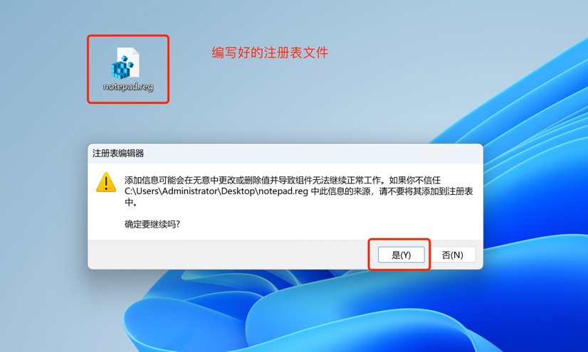
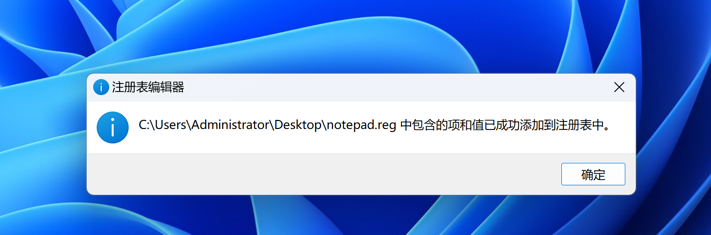
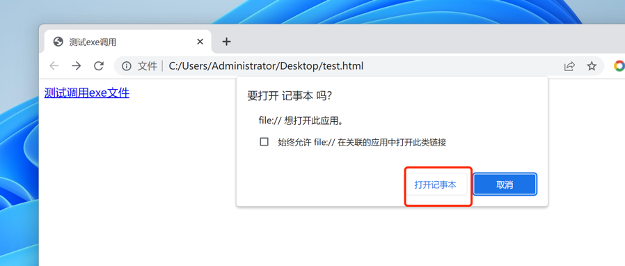

# 网页调用本地exe文件

# 一、描述
本文介绍在网页里通过url protocol方式调用本地exe文件的方法，主要分为两步，首先，编写注册表，然后页面里调用。

# 第一步，编写注册表，注册url protocol
这里以打开记事本为例

1. 首先创建注册表文件。创建一个文本文件，命名为`note.reg`，名字随意，后缀为`reg`，用记事本打开该文件，添加内容如下：
```
Windows Registry Editor Version 5.00

[HKEY_CLASSES_ROOT\MyNotePad]
@="MyNotePad Protocol"
"URL Protocol"=""

[HKEY_CLASSES_ROOT\MyNotePad\DefaultIcon]
@="C:\\WINDOWS\\NOTEPAD.EXE"

[HKEY_CLASSES_ROOT\MyNotePad\shell]
@=""

[HKEY_CLASSES_ROOT\MyNotePad\shell\open]
@=""

[HKEY_CLASSES_ROOT\MyNotePad\shell\open\command]
@="\"C:\\WINDOWS\\NOTEPAD.EXE\""
```

- 内容里6处`MyNotePad`名字，为注册的名称，可以随意，改为自己的想要的名字，页面调用时采用该名字。
- 内容里2处`C:\\WINDOWS\\NOTEPAD.EXE`为exe文件的全路径，替换为自己的exe文件路径。


2. 双击运行编写的注册表文件，添加到系统注册表，运行时会弹出以下提示框，点击是。



3. 点击是后，提示以下内容，表示注册表添加成功。



# 第二步，页面调用
编写测试页面test.html，内容如下：

```html
<!DOCTYPE html>
<html lang="en">
<head>
    <meta charset="UTF-8">
    <title>测试exe调用</title>
</head>
<body>
    <a href="MyNotePad://">测试调用exe文件</a>
</body>
</html>

```

然后浏览器访问该html文件，弹出以下提示框，点击打开记事本按钮，便可以打开记事本。




