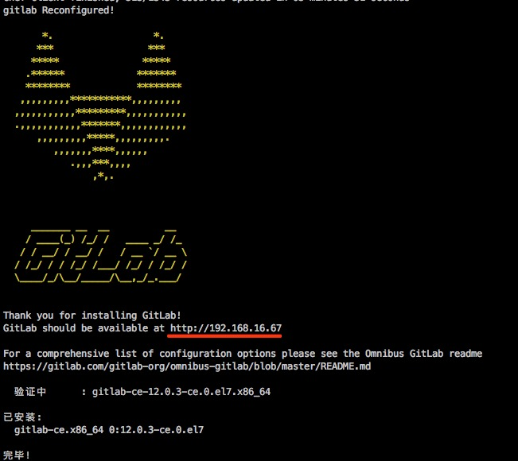
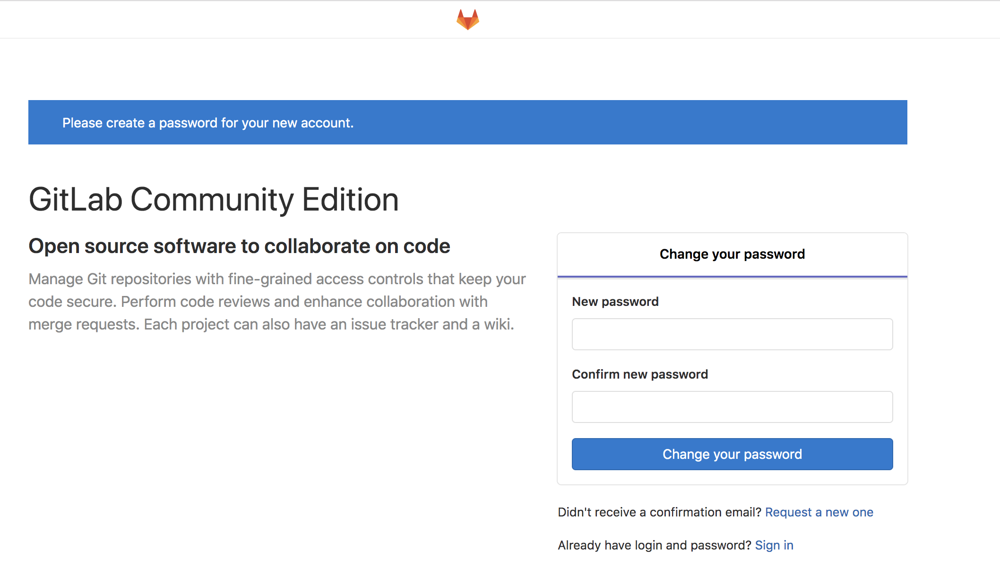
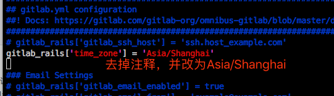
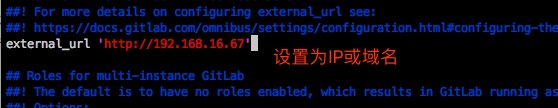
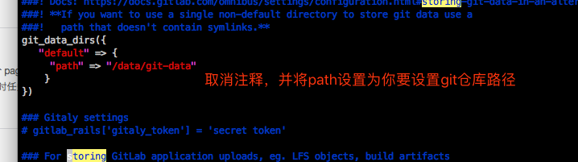
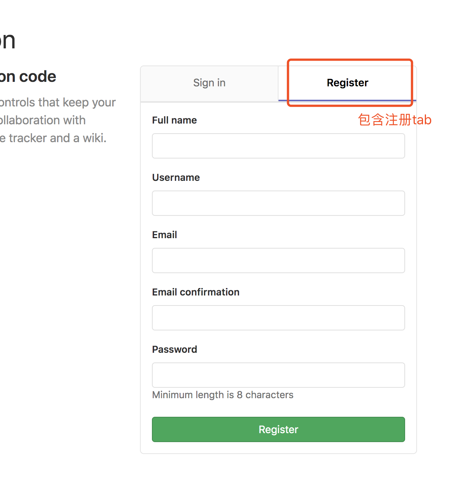
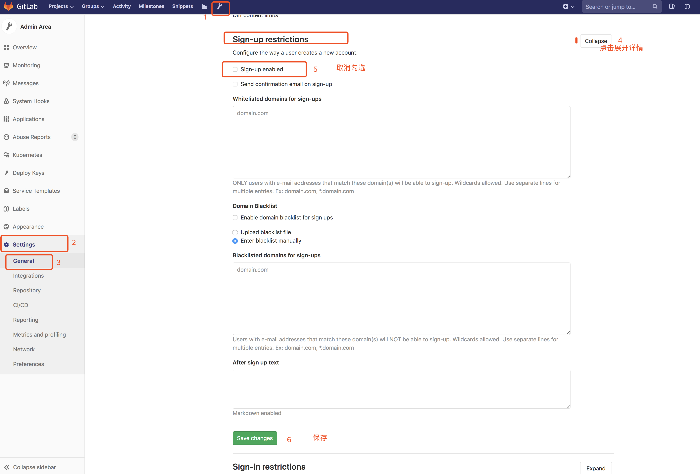
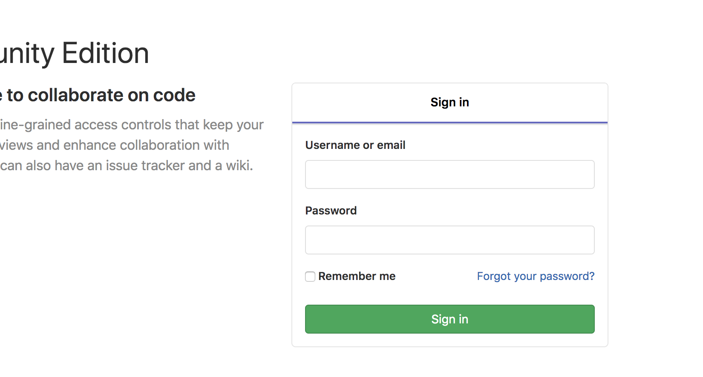

# CentOS7安装git仓库管理平台GitLab教程

# 一、环境
系统：CentOS Linux release 7.6.1810 (Core)
GitLab:12.0.3

# 二、安装

## 安装配置必须的依赖

1、安装依赖

```

[sgl@localhost ~]$ sudo yum install -y curl policycoreutils-python openssh-server openssh-clients

```

2、启动ssh服务并设置为开机启动

```
[sgl@localhost ~]$ sudo systemctl enable sshd
[sgl@localhost ~]$ sudo systemctl start sshd
[sgl@localhost ~]$

```

3、(防火墙未开启的可以忽略)开放http服务，并重启防火墙服务

```
[sgl@localhost ~]$ sudo firewall-cmd --permanent --add-service=http
success
[sgl@localhost ~]$ sudo systemctl reload firewalld
[sgl@localhost ~]$
```

4、安装Postfix以发送通知电子邮件，并设置为开机启动。如果要使用其他解决方案发送电子邮件，请跳过此步骤并在安装GitLab后配置外部SMTP服务器。

```
[sgl@localhost ~]$ sudo yum install postfix
[sgl@localhost ~]$ sudo systemctl enable postfix
[sgl@localhost ~]$ sudo systemctl start postfix
[sgl@localhost ~]$

```

5、添加GitLab包存储库

注：此处我安装的是社区版，如需安装商业版将gitlib-ce换成gitlib-ee

```
[sgl@localhost ~]$ curl -sS https://packages.gitlab.com/install/repositories/gitlab/gitlab-ce/script.rpm.sh | sudo bash

```

6、安装gitlab-ce

注：EXTERNAL_URL设置为你自己的ip或域名，该ip或域名将作为访问gitlab的url

```
[sgl@localhost ~]$ sudo EXTERNAL_URL="http://192.168.16.67" yum install -y gitlab-ce

```

安装完成后显示以下界面:




7、浏览器输入`http://192.168.16.67`，显示设置密码界面(设置gitlab管理员账号root的密码)



至此gitlab已安装成功，下面是一些设置，仅供参考


# 三、常用设置


## 禁用创建组权限

默认情况下，所有注册用户都可以创建用户组，一般情况下，只需要管理员、项目Leader拥有创建组的权限，这里通过配置禁用创建用户组权限(管理员可以在控制台启用、禁用某个用户的创建用户组权限)

1、修改配置文件/etc/gitlab/gitlab.rb

```
[sgl@localhost ~]$ sudo vim /etc/gitlab/gitlab.rb

```

2、将参数`gitlab_rails['gitlab_default_can_create_group']`取消注释并设置为false

```
gitlab_rails['gitlab_default_can_create_group'] = false

```


3、重新配置gitlab

```
[sgl@localhost ~]$ sudo gitlab-ctl reconfigure
[sgl@localhost ~]$ sudo gitlab-ctl restart

```

## 修改gitlab时区

gitlab默认时区是UTC，提交代码之后，log里显示的提交时间会有时差，为了避免时差，我这里改为`Asia/Shanghai`


1、修改配置文件/etc/gitlab/gitlab.rb

```
[sgl@localhost ~]$ sudo vim /etc/gitlab/gitlab.rb

```

2、将参数`gitlab_rails['time_zone'] = 'UTC'`取消注释并设置为`Asia/Shanghai`

```
gitlab_rails['time_zone'] = 'Asia/Shanghai'

```



3、重新配置gitlab

```
[sgl@localhost ~]$ sudo gitlab-ctl reconfigure
[sgl@localhost ~]$ sudo gitlab-ctl restart

```


## 配置GitLab站点Url

gitlab默认的访问URL是external_url 'https://gitlab.example.com',在前面安装时，我们已经指定了访问URl，后期如果有变更可以通过修改配置文件进行修改

1、修改配置文件/etc/gitlab/gitlab.rb

```
[sgl@localhost ~]$ sudo vim /etc/gitlab/gitlab.rb

```

2、将参数`external_url`取消注释并设置为你的IP或者域名

```
external_url 'http://192.168.16.67'

```



3、重新配置gitlab

```
[sgl@localhost ~]$ sudo gitlab-ctl reconfigure
[sgl@localhost ~]$ sudo gitlab-ctl restart

```

## 修改gitlab仓库默认存放路径

gitlab默认的仓库存储位置在/var/opt/gitlab/git-data/repositories，一般情况我们会给git仓库单独一个分区，来存储仓库数据。

1、修改配置文件/etc/gitlab/gitlab.rb

```
[sgl@localhost ~]$ sudo mkdir -p /data/git-data   #创建git仓库路径

[sgl@localhost ~]$ sudo vim /etc/gitlab/gitlab.rb

```

2、将参数`git_data_dirs`取消注释并设置path为你的仓库路径

```
git_data_dirs({
   "default" => {
     "path" => "/data/git-data"
    }
})

```



3、重新配置gitlab

```
[sgl@localhost ~]$ sudo gitlab-ctl reconfigure
[sgl@localhost ~]$ sudo gitlab-ctl restart

```

注意：gitlab不会将之前仓库路径下的数据移动到新的路径里，需要手动将历史仓库数据移动到新的路径


## 关闭注册功能

默认情况下，用户是可以自行注册的，如下：



一般情况由管理员或项目Leader分配账号即可，关闭注册功能可以直接由管理员通过界面设置

管理员登录，点击顶部`admin area`按钮-->点击左侧`Settings`-->`General`-->点击`Sign-up restrictions`右侧的Expand展开详情-->取消勾选Sign-up enabled-->保存修改



保存之后，再次打开登录界面，就不显示注册功能了




# 四、gitlab-ctl常用命令

- check-config：检查在gitlab中是否有任何配置。在指定版本中删除的rb
- deploy-page	：安装部署页面
- diff-config：将用户配置与包可用配置进行比较
- remove-accounts：删除所有用户和组
- upgrade：升级
- service-list：查看所有服务
- once：如果GitLab服务停止了就启动服务，如果已启动就不做任何操作
- restart：重启GitLab服务
- start：如果GitLab服务停止了就启动服务，如果已启动就重启服务
- stop：停止GitLab服务
- status：查看GitLab服务状态
- reconfigure：reconfigure重新配置GitLab并启动


<br/><br/><br/><br/>

参考地址：https://about.gitlab.com/install/#centos-7


