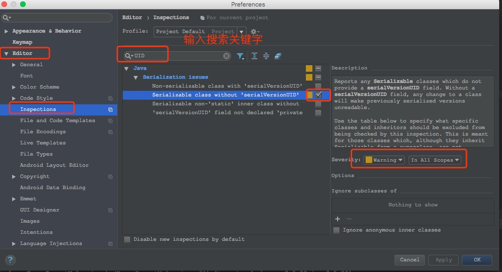
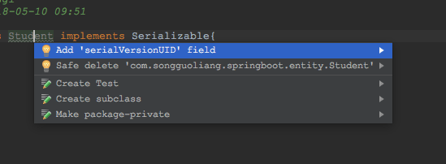
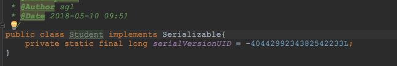

# 使用IntelliJ IDEA自动生成serialVersionUID

实体对象实现了`java.io.Serializable`接口后，一般都会提供一个`serialVersionUID`以做版本区分。在idea里，可以通过设置来快速生成`serialVersionUID`。

# 设置方法

1、打开Preferences-->Editor-->Inspections，然后在右侧输入`UID`进行搜索(搜索方式比较快，也可以在java-->Serialization issues里找)。然后勾选`Serializable class without 'serialVersionUID'`后面的复选框。右侧`Severity`默认`Warning`即可。如下图：

2、测试，新建一个实体`Student`，实现`java.io.Serializable`接口，然后将光标放到类名`Student`上，按`option+return`(window按`alt+enter`，快捷键可能不一样，根据自己的设置来)打开提示框，选择`Add 'serialVersionUID' field`确定即可，如下图：

生成的`serialVersionUID `如下：
