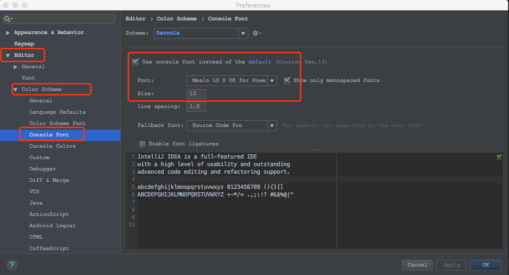
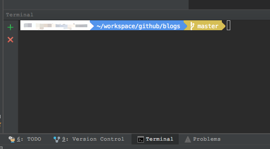

# IDEA设置终端Terminal窗口字体和大小

要设置idea里`Terminal`终端的字体，只需要设置`Console Font`即可，设置方法如下：

1、 打开属性对话框，选择`Editor-->Color Scheme-->Console Font`，在右侧面板修改Font为自己想要的字体，如下图：

2、 关闭Terminal终端重启开启，上面的设置对已经打开的终端窗口不会生效，需要重新打开，效果如下：

