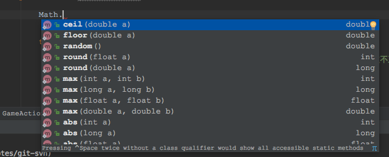
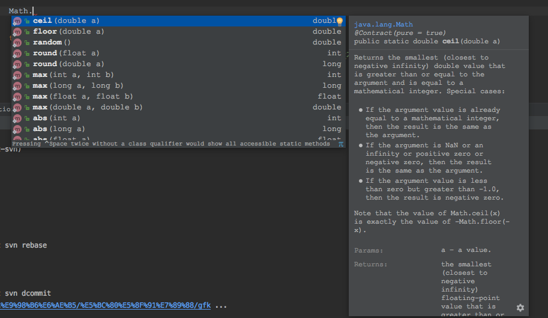
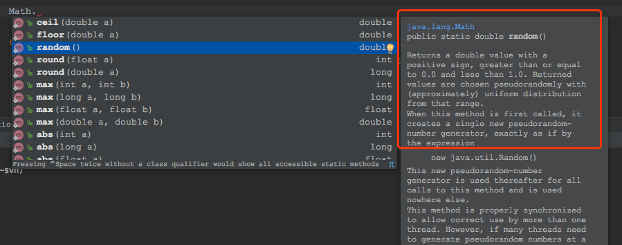
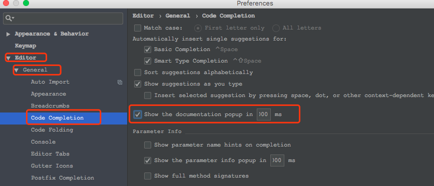

# IDEA配置快速文档和自动完成一起弹出

注：适用于IDEA2018.2版本以后，之前版本不适用，这是2018.2版本新加的功能。

# 一、IDEA 2018.2以前的版本
在idea2018.2版本以前，查看自动完成方法时，方法的文档注释不能即时显示，非常不方便，如下图(以Match类示例),当打开Match类的自动完成提示时，方法的文档注释不显示，想看方法的文档注释非常不方便。

# 二、IDEA 2018.2支持文档注释即时显示

先看效果图：

和之前一样，调出自动完成方法提示，不同的是，右侧会把对应方法的文档注释即时显示出来，改变所选方法时，文档注释也会随之改变，如下：

对于喜欢看文档注释的同学来说，既省时又方便。

默认情况下，该功能是没有开启的，开启方法见下面。

# 三、配置方法

打开`Preferences-->Editor-->General-->Code Completion`，右侧勾选上`Show the domcumentation popup in 1000 ms`，默认是延迟1秒，可以自行修改。如下图：

