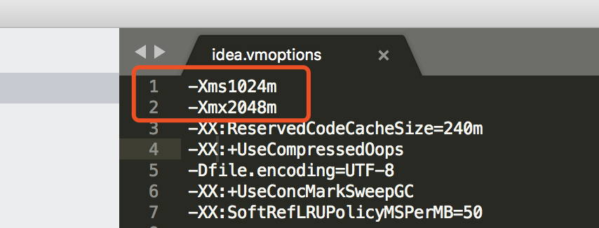

# IntelliJ IDEA设置显示内存指示器和设置内存大小

## 一、设置显示内存指示器

idea默认情况下，是不显示当前内存使用情况的，可以通过设置让其显示，方法如下：
打开`Preferences-->Appearance & Behavior-->Appearance`，右侧勾选`Window Options`下面的`Show memory indicator`即可。如下图：

设置好之后，在idea右下角会出现展示内存信息指示器，显示当前使用的内存和最大可以使用的内存，如下图，另外点击该指示器，可以进行内存回收。

## 二、设置IDEA内存大小

idea默认的最小内存为128m，最大内存750m。当单个项目比较大时，idea就会有些卡了，如果你硬件允许，可以把idea内存调大一些。我的电脑内存16G，把idea的最大内存设置2048m，最小内存1024m。设置方法，打开idea安装目录bin目录里的`idea.vmoptions`配置文件，如mac下路径`/Applications/IntelliJ IDEA.app/Contents/bin/idea.vmoptions`。修改`-Xms`和`-Xmx`参数，如下：

- `-Xms`:最小内存
- `-Xmx`:最大内存

设置完成后，重启idea，然后idea右下角看到的最大内存便是新设置的`-Xmx`内存大小。

这里的内存设置是指单个窗口的内存，开多个项目打开多个窗口是占用多个这样的内存。

