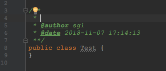

# IntelliJ IDEA设置类注释和方法注释

默认情况下，idea生成`javadoc`注释时，类上面使用时内容为空，方法上使用时会生成参数、返回值和抛出的异常，如果想显示`@author`、`@date`等信息时，则需要自己配置了。

# 一、类注释

## 方法一：创建类时自动生成注释

1、打开`Preferences-->Editor-->File and Code Templates`，右侧选择`Files`tab页，找到`Class`、`Interface`，可以看到右侧模板里引用了一个`File Header.java`模板，如下图：


2、所以我们只需要修改`File Header.java`里的内容，对应的`Class`、`Interface`等模板内容也会随着改变。

3、`File Header.java`是在Includes里面的，切换到Includes，点击File Header，修改右侧模板内容如下：

```
/**
 * 
 * @author ${USER}
 * @date ${YEAR}-${MONTH}-${DAY} ${TIME}
 *
 */
```


4、这里我只是添加了@author和@date，你可以根据自己的需求添加，配置好之后，再新建类时便会自动生成注释，如下:


## 方法二：通过Live Templates方式生成

方法一适用于新建文件，如果类文件已经创建了好再想加注释，需要使用Live Templates方式了，设置方法如下：

1、打开`Preferences-->Editor-->Live Templates`，为了方便管理，新建一个分组来管理自己添加的Live Template，如下：


2、选择刚创建的分组，然后创建Live Template


3、填写live Template的缩写名字、描述和内容，**注意内容的开头没有`/`**，如下：


4、点击Edit variables,给变量关联表达式

**注意：该步骤必须在步骤3之后才会显示变量。另外，输入表达式后直接按回车键，如果不按回车直接鼠标点击其他空白处，自定义表达式不会填充进去**

```
**
 * $END$
 * @author $user$
 * @date $date$
 **/
```


4、此时模板下面会有个警告，点击后面的define，然后勾选Java即可。


5、配置完成后，在类上面输入`/*c`，然后按`tab`键，便会自动生成注释：



6、如果想修改默认的`tab`键，可以在刚才模板配置界面选择默认的按键：


# 二、方法注释

方法注释需要使用live Template来设置，和类注释的方法二类似，这里不再详细每一步，只列出关键步骤，方法如下：

1、在上面创建好的sgl分组里新建live Template,方法注释使用频繁，为了保持`/**`的习惯，这里直接命名为`*`,如下：

```
*
 * $END$
 * @author $user$
 * @date $date$ $param$
 * @return
 **/
```


2、为变量关联表达式


其中，param变量比较麻烦，因为参数不固定，需要使用groovyScript来动态显示，param表达式的内容如下：

```
groovyScript("if(\"${_1}\".length() == 2) {return '';} else {def result='\\n'; def params=\"${_1}\".replaceAll('[\\\\[|\\\\]|\\\\s]', '').split(',').toList(); for(i = 0; i < params.size(); i++) {result+=' * @param ' + params[i] + ((i < params.size() - 1) ? '\\n' : '')}; return result}", methodParameters())
```

直接复制粘贴进去按回车即可。

3、配置完成以后，在方法上面输入`/**`，然后按`tab`键便自动生成注释：


注：对于方法上抛出的异常，还不知道怎么自动生成，如有哪位童鞋知道方法希望能在评论里共享一下。


