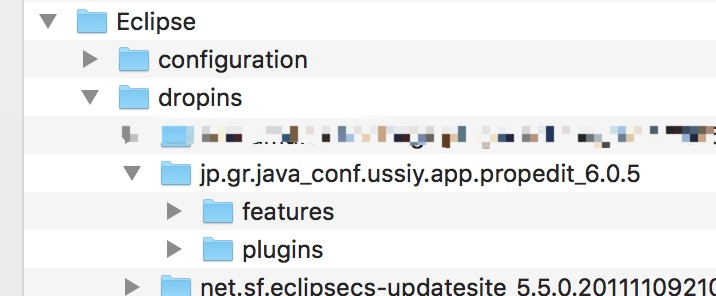
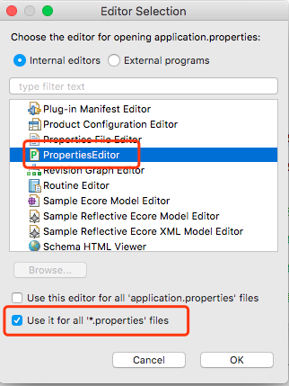

# eclipse中通过Properties Editor插件查看配置文件中Unicode内容

有时配置文件中的中文为了防止乱码，会以Unicode来表示。这样如果使用eclipse默认的Text Editor打开，查看起来非常不方便，Properties Editor插件，解决了这一麻烦。

# 一、安装插件

这里主要说离线安装，喜欢通过eclipse来安装插件的，安装url为：`http://propedit.sourceforge.jp/eclipse/updates/`

1、下载插件

[PropertiesEditor 6.0.5](https://zh.osdn.net/projects/propedit/downloads/68691/jp.gr.java_conf.ussiy.app.propedit_6.0.5.zip)

2、将下载文件解压，然后复制到`eclipse安装目录`里的`dropins`目录下，如下：

3、重启eclipse。

4、eclipse会自动修改properties文件默认的打开方式为PropertiesEditor，打开文件，之前的Unicode码都显示成中文了。

5、如果eclipse没有自动切换默认打开方式，选中properties文件，右键-->open with,可以看到多了个PropertiesEditor选项，通过该方式打开即可。
6、将PropertiesEditor设置为默认的打开方法，以便直接双击properties文件便能打开，右键properties配置文件，`open with-->other`，然后

官网地址：http://propedit.osdn.jp/index_en.html

下载地址：https://zh.osdn.net/projects/propedit/

参考地址：http://www.cnblogs.com/zdz8207/p/java-eclipse-properties.html