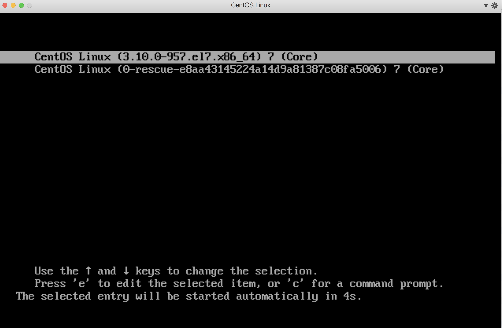
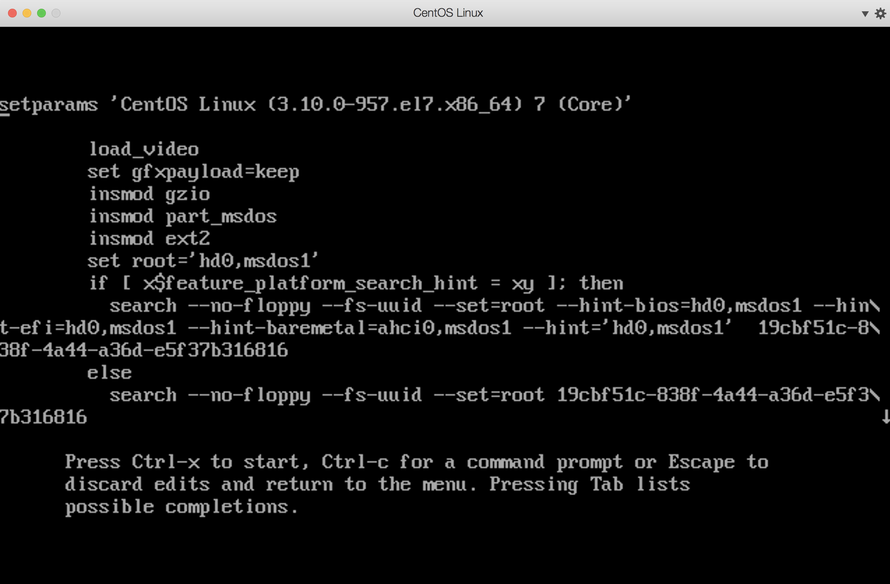
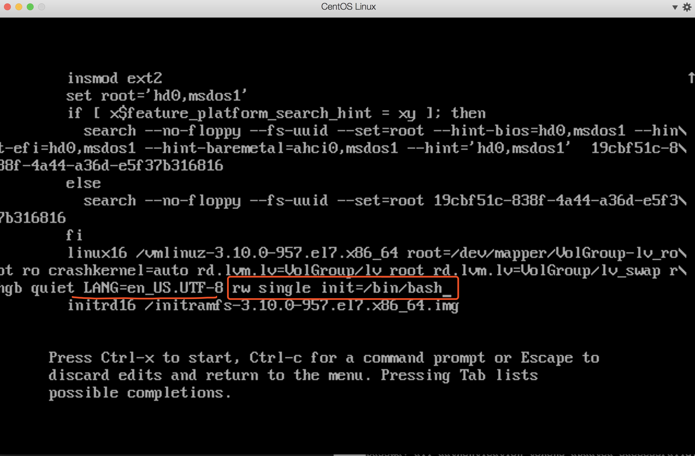
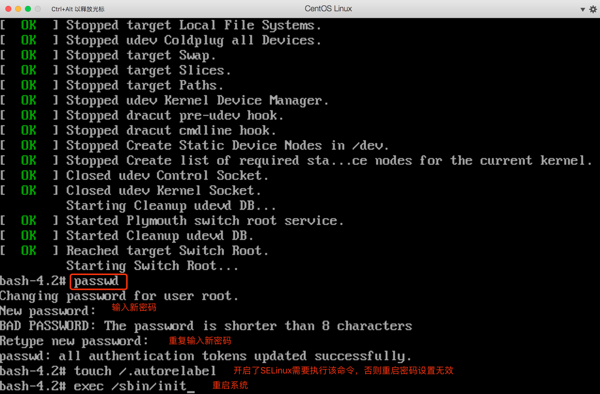
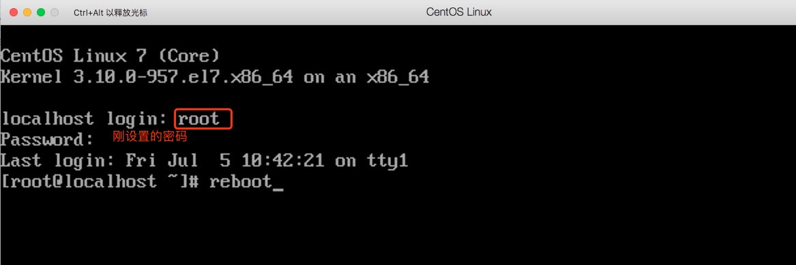

# CentOS7忘记root密码，重置root密码

# 描述

当root密码忘了之后，可以通过重启系统，在开机时重新设置密码。

注：测试版本为CentOS Linux release 7.6.1810 (Core)，其他版本可能有些区别。

# 重置密码

1、重启系统，在开机过程中，出现以下界面时按`e`键，进入编辑界面。

按`e`键之后进入如下界面：

2、按方向键下键`↓`，找到设置语言的地方，如`LANG=en_US.UTF-8`，在后面追加`rw single init=/bin/bash`,然后按`ctrl+x`重启系统

3、进入bash界面后，可以输入`passwd`命令重新设置root密码

4、如果开启了SELinux，执行命令`touch /.autorelabel`命令

5、输入`exec /sbin/init`命令重启系统

6、使用新设置的密码进入系统之后，为了安全起见，可以输入`reboot`重新启动一次系统。

