#Spring Boot教程(一)：体验Spring Boot


# 一、概述

Spring Boot并不是一门新的技术，它是一个集成框架，本质上就是Spring，用于简化Spring项目的各种繁琐的配置。它的目的是帮助开发人员很容易的创建出独立运行和产品级别的基于 Spring 框架的应用。大部分 Spring Boot 应用只需要非常少的配置就可以快速运行起来。

Spring Boot的特性：

- 创建可以独立运行的 Spring 应用。
- 直接嵌入 Tomcat 或 Jetty 服务器，不需要部署 WAR 文件。
- 提供推荐的基础 POM 文件来简化 Apache Maven 配置。
- 尽可能的根据项目依赖来自动配置 Spring 框架。
- 提供可以直接在生产环境中使用的功能，如性能指标、应用信息和应用健康检查。
- 没有代码生成，也没有 XML 配置文件。

# 二、创建Spring Boot项目

## 方式一，通过Spring官网生成
1、在浏览器上直接输入`https://start.spring.io/` ，在Dependencies中输入Web添加web依赖(也可以什么依赖也不加，只创建最简单的Spring Boot 项目)，然后点击生成项目。
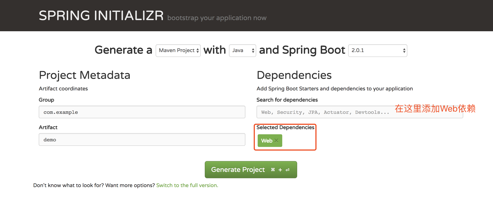

2、用eclipse、idea等工具打开项目，如下图：
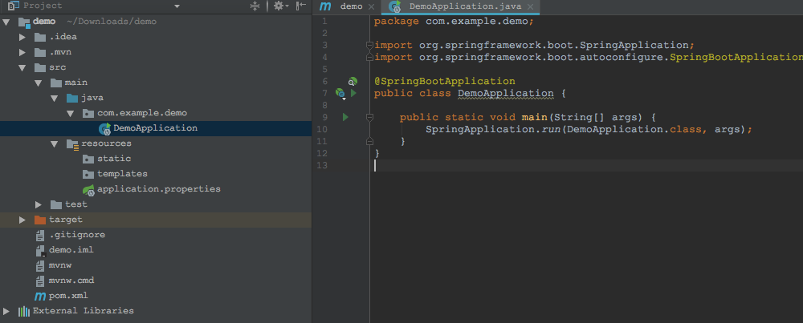

3、直接运行DemoApplication里的main方法，浏览器输入`http://localhost:8080/` ，便可以看到以下页面(Spring Boot默认错误页面)：
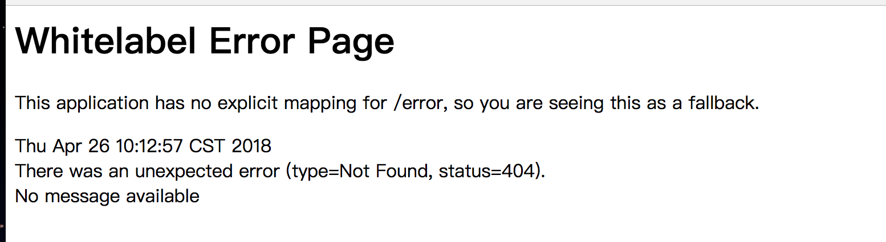

至此，一个简单Spring Boot项目已经搞定，很简单吧。如果想进一步体验，可以继续下面步骤。

4、创建一个controller包，然后再创建一个控制类HelloController，如下：
```
package com.example.demo.controller;

import org.springframework.web.bind.annotation.GetMapping;
import org.springframework.web.bind.annotation.RestController;

/**
 * @Description
 * @Author sgl
 * @Date 2018-04-26 14:19
 */
@RestController
public class HelloController {

    @GetMapping("/hello")
    public String hello() {
        return "hello,Spring Boot!";
    }
}

```

5、重新运行DemoApplication的main方法，浏览器输入`http://localhost:8080/hello` ，便可以看到如下内容：
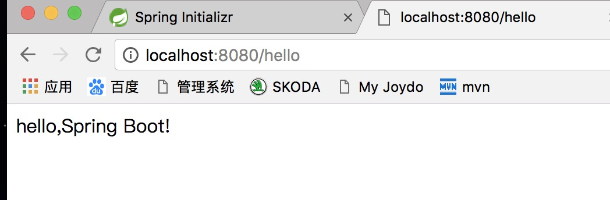

给力吧，只需要几分钟，一个简单的web项目就完成了，而且不需要像自己手动搭建SpringMVC项目那样添加配置文件。约定优于配置，按照约定，Spring Boot可以号称零配置。

# 方式二、通过IDE带的Spring Initializr创建

1、打开idea，点击新建，选择Spring Initializr，如下：
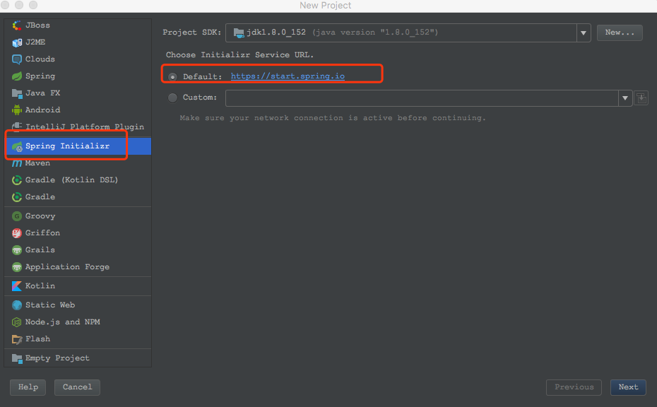

2、默认即可，直接点击next进行下一步
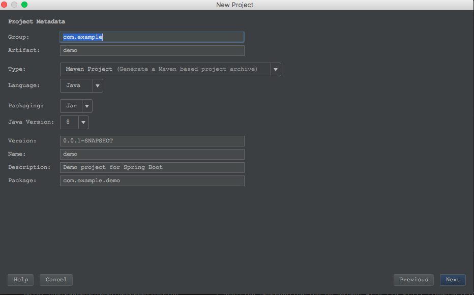

3、和方式一样，我们还是只添加Web依赖
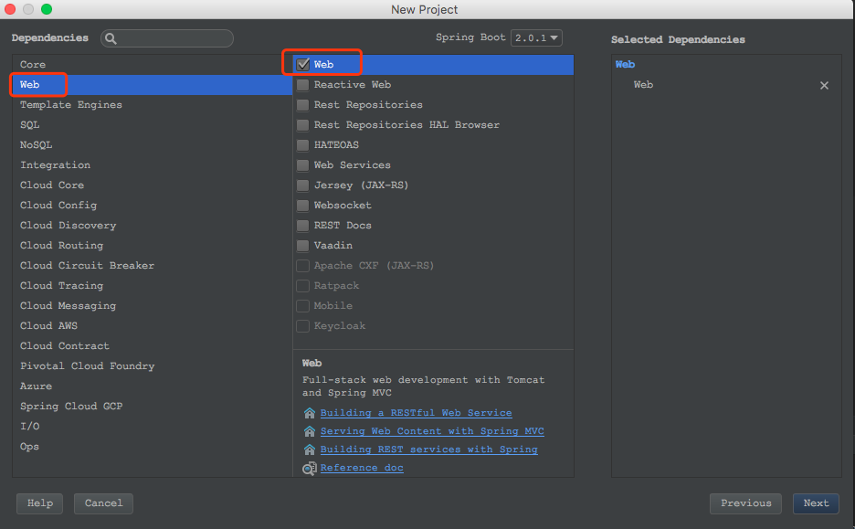

4、默认，点击finish完成。
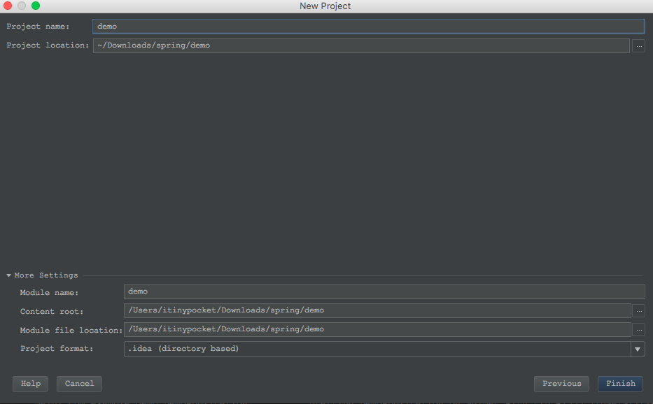

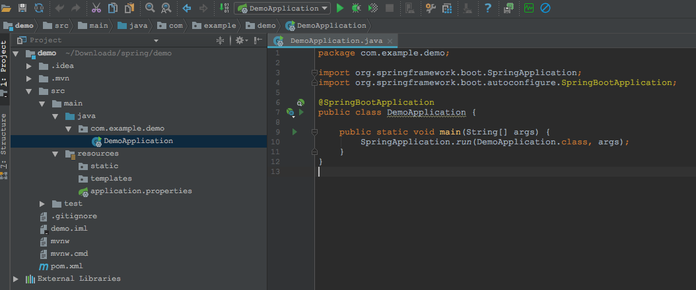

5、至此已完成项目的创建，和方式一导入的项目一样，后续步骤参考方式一即可。


## 方式三、通过普通的maven项目创建

1、创建一个普通的maven项目，
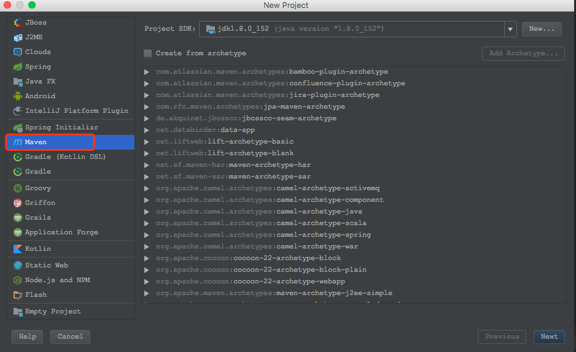

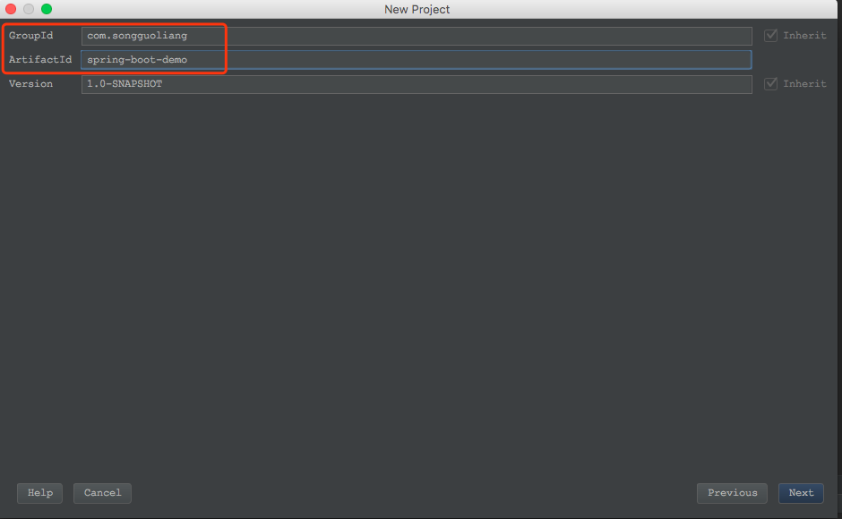
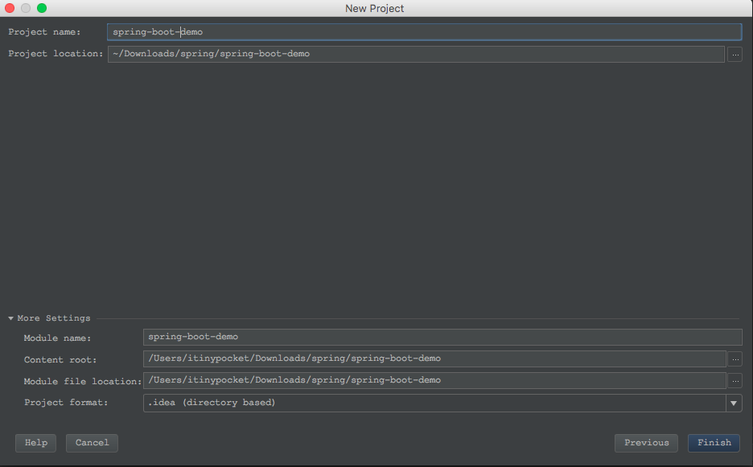

2、然后在pom.xml文件中添加以下内容：
```
<!-- Spring Boot启动器父类 -->
<parent>
    <groupId>org.springframework.boot</groupId>
    <artifactId>spring-boot-starter-parent</artifactId>
    <version>2.0.1.RELEASE</version>
    <relativePath/> <!-- lookup parent from repository -->
</parent>

<properties>
    <project.build.sourceEncoding>UTF-8</project.build.sourceEncoding>
    <project.reporting.outputEncoding>UTF-8</project.reporting.outputEncoding>
    <java.version>1.8</java.version>
</properties>

<dependencies>
    <!-- Spring Boot web启动器 -->
    <dependency>
        <groupId>org.springframework.boot</groupId>
        <artifactId>spring-boot-starter-web</artifactId>
    </dependency>

</dependencies>

<build>
    <plugins>
        <plugin>
            <groupId>org.springframework.boot</groupId>
            <artifactId>spring-boot-maven-plugin</artifactId>
        </plugin>
    </plugins>
</build>
```
3、创建启动类Application，如下：
```
package com.songguoliang;

import org.springframework.boot.SpringApplication;
import org.springframework.boot.autoconfigure.SpringBootApplication;

/**
 * @Description
 * @Author sgl
 * @Date 2018-04-26 14:46
 */
@SpringBootApplication
public class Application {
    public static void main(String[] args) {
        SpringApplication.run(Application.class, args);
    }
}

```
4、一个简单的Spring Boot项目已经完成，后续测试可以参考方式一或方式二。


# 代码简析

上面示例项目主要分为两步：引入依赖包和创建启动类。

1、引入依赖，主要maven父类：
```
<!-- Spring Boot启动器父类 -->
<parent>
    <groupId>org.springframework.boot</groupId>
    <artifactId>spring-boot-starter-parent</artifactId>
    <version>2.0.1.RELEASE</version>
    <relativePath/> <!-- lookup parent from repository -->
</parent>
```
和web启动类：
```
<!-- Spring Boot web启动器 -->
<dependency>
    <groupId>org.springframework.boot</groupId>
    <artifactId>spring-boot-starter-web</artifactId>
</dependency>
```

2、启动类，主要是注解：`@SpringBootApplication`
```
@SpringBootApplication 
public class Application {
    public static void main(String[] args) {
        SpringApplication.run(Application.class, args);
    }
}

```


