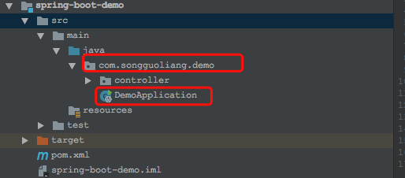
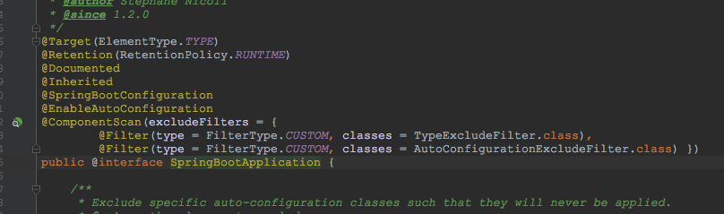

# Spring Boot教程(二)：Spring Boot初体验Demo说明


上面一篇我们体验了一下Spring Boot,这一篇我们简单对上一篇的例子说明一下。

# 一、代码结构



Spring Boot项目结构是maven的基本结构，启动类一般放到代码的根包里，如`com.songguoliang.demo`，官方推荐根包为反向域名。

resources为资源包，里面放置所需要的配置文件

test里面存放测试相关的内容


# 二、pom.xml

```
<!-- Spring Boot启动器父类 -->
<parent>
    <groupId>org.springframework.boot</groupId>
    <artifactId>spring-boot-starter-parent</artifactId>
    <version>2.0.1.RELEASE</version>
    <relativePath/> <!-- lookup parent from repository -->
</parent>
<dependencies>
    <!-- Spring Boot web启动器 -->
    <dependency>
        <groupId>org.springframework.boot</groupId>
        <artifactId>spring-boot-starter-web</artifactId>
    </dependency>

</dependencies>
    
```

在`pom.xml`里，和以前普通maven项目不同的是，多了个`<parent>` , 它是所有Spring Boot启动器的基础，定义了很多常用的依赖和版本。
Spring Boot定义好了很多启动器，在项目中需要使用某个功能时，把该功能的启动器引入即可，无需单独管理各个jar的依赖。

Spring Boot官方的启动器可以参考: [Spring Boot官方启动器](https://docs.spring.io/spring-boot/docs/2.0.1.RELEASE/reference/htmlsingle/#using-boot-starter)

Spring Boot启动器的命名方式一般为`spring-boot-starter`开头，后面为相关的技术。
`

# 三、入口类和@SpringBootApplication

Spring Boot通常会有一个`*Application`的入口类，里面有一个`main`方法`,说白了就是标准的java应用的入口方法。
```
@SpringBootApplication
public class DemoApplication {
    public static void main(String[] args) {
        SpringApplication.run(DemoApplication.class, args);
    }
}
```

入口类最主要的就是注解`@SpringBootApplication`，它是一个组合注解，如下图


也就是说`@SpringBootApplication`等价于`@SpringBootConfiguration`、`@EnableAutoConfiguration`和`@ComponentScan`这三个注解。
`@SpringBootApplication`开启了spring的组件扫描和自动配置功能。


