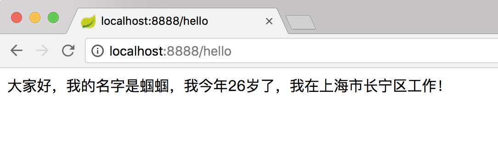
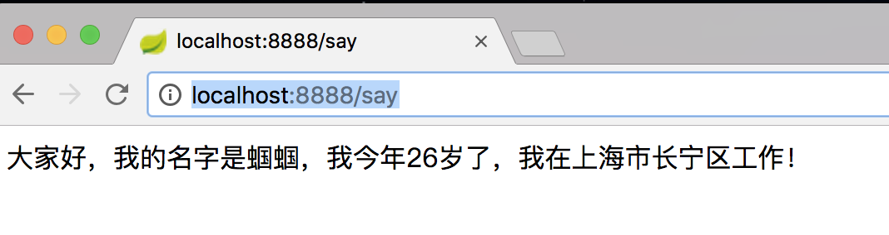
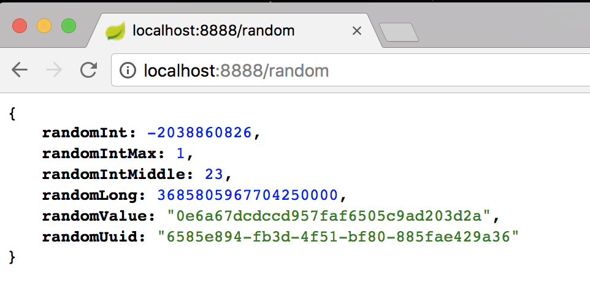
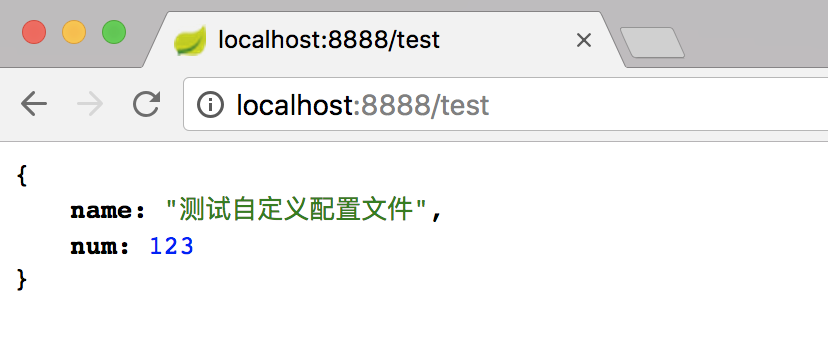

# Spring Boot教程(三)：配置文件

# 一、外部化配置

Spring Boot允许外化（externalize）你的配置，这样你能够在不同的环境下使用相同的代码。你可以使用properties文件，YAML文件，环境变量和命令行参数来外化配置。使用@Value注解，可以直接将属性值注入到你的beans中，并通过Spring的Environment抽象或绑定到结构化对象来访问。

Spring Boot使用一个非常特别的PropertySource次序来允许对值进行合理的覆盖，需要以下面的次序考虑属性：

1. 在主目录上开发Devtools全局设置属性（`~/.spring-boot-devtools.properties`当devtools处于活动状态时）。
2. `@TestPropertySource` 您的测试中的注释。
3. `@SpringBootTest#properties` 您的测试中的注释属性。
4. 命令行参数
5. 从属性`SPRING_APPLICATION_JSON`（嵌入在环境变量或系统属性直列JSON）。
6. `ServletConfig` 初始化参数。
7. `ServletContext` 初始化参数。
8. 来自于`java:comp/env`的JNDI属性
9. Java系统属性（`System.getProperties()`）
10. 操作系统环境变量
11. 只有在`random.*`里包含的属性会产生一个`RandomValuePropertySource`
12. 在打包的jar外的应用程序配置文件（`application-{profile}.properties`和YAML变体）
13. 在打包的jar内的应用程序配置文件（`application-{profile}.properties` 和YAML变体）
14. 在打包的jar外的应用程序配置文件（`application.properties`，包含YAML和profile变量）
15. 在打包的jar内的应用程序配置文件（`application.properties`，包含YAML和profile变量）
16. 在`@Configuration`类上的`@PropertySource`注解
17. 默认属性（使用`SpringApplication.setDefaultProperties`指定）

在Spring Boot中，原来自己整合Spring应用时繁多的XML配置内容，由在pom.xml中引入模块化的Starter POMs替代，其中各个模块都有自己的默认配置，所以如果不是特殊应用场景，就只需要在application.properties中完成一些属性配置就能开启各模块的应用。


# 二、自定义属性

## 使用@Value()注解方式

1、在`application.properties`添加自定义属性。配置文件中也可以通过`${}`获取文件中的其他配置属性

```
# 修改服务端口号
server.port=8888

# 自定义属性
pocket.name=蝈蝈
pocket.age=26
pocket.county=长宁区
# 配置文件也可以通过${}引用其他变量
pocket.address=上海市${pocket.county}

```

2、通过`@Value()`注解获取自定义属性

```
package com.songguoliang.properties.controller;

import org.springframework.beans.factory.annotation.Value;
import org.springframework.web.bind.annotation.GetMapping;
import org.springframework.web.bind.annotation.RestController;

/**
 * @Description 通过@Value使用自定义属性
 * @Author sgl
 * @Date 2018-04-27 14:41
 */
@RestController
public class HelloController {
	/**
     * 通过${}获取application.properties里的自定义属性
     */
    @Value("${pocket.name}")
    private String name;

    @Value("${pocket.age}")
    private Integer age;

    @Value("${pocket.address}")
    private String address;

    @GetMapping("/hello")
    public String hello() {
        return "大家好，我的名字是" + name + "，我今年" + age + "岁了，我在" + address+"工作！";
    }
}

```

3、重新启动服务，浏览器输入：`http://localhost:8888/hello` ,可以看到如下内容：



## 使用前缀方式

Spring Boot支持通过前缀自动将属性封装的对象中，非常适合属性比较多的情况，其实在各种启动器中也是通过这种方式获取自定义属性的，比如http编码相关的配置用前缀`spring.http.encoding`（可以参考org.springframework.boot.autoconfigure.http.HttpEncodingProperties）

1、通过注解`@ConfigurationProperties`指定给实体前缀，如下：
创建实体类User：

```
package com.songguoliang.properties.model;

import org.springframework.boot.context.properties.ConfigurationProperties;
import org.springframework.stereotype.Component;

/**
 * @Description 由Spring根据ConfigurationProperties自动注入属性的值
 * @Author sgl
 * @Date 2018-04-27 15:29
 */
@Component
@ConfigurationProperties(prefix = "pocket")
public class User {
    private String name;
    private Integer age;
    private String address;

    //省略了get、set方法
}

```
2、添加Action供页面访问：

```
package com.songguoliang.properties.controller;

import com.songguoliang.properties.model.User;
import org.springframework.beans.factory.annotation.Autowired;
import org.springframework.web.bind.annotation.GetMapping;
import org.springframework.web.bind.annotation.RestController;

/**
 * @Description
 * @Author sgl
 * @Date 2018-04-27 15:31
 */
@RestController
public class ModelController {
    /**
     * 注入user
     */
    @Autowired
    private User user;

    @GetMapping("/say")
    public String hello() {
        return "大家好，我的名字是" + user.getName() + "，我今年" + user.getAge() + "岁了，我在" + user.getAddress() + "工作！";
    }
}

```

3、重启服务，浏览器输入`http://localhost:8888/say` ，可以看到：



## 随机数

在配置文件中也可以通过random.*来调用RandomValuePropertySource#getRandomValue(String type)方法来随机生成一个值，注意：随机的key不能以random开头，如random.a是有问题的

1、配置文件添加以下配置：

```
# 随机数
# 随机int
test.randomInt=${random.int}
# 随机10以内
test.randomIntMax=${random.int(10)}
# 随机20-50
test.randomIntMiddle=${random.int(20,50)}
# 随机Long
test.randomLong=${random.long}
# 字符串
test.randomValue=${random.value}
# uuid
test.randomUuid=${random.uuid}

# key不能random开头，使用时会有问题
#random.num=${random.int}
```

2、创建RandomData实体类：

```
package com.songguoliang.properties.model;

import org.springframework.boot.context.properties.ConfigurationProperties;
import org.springframework.stereotype.Component;

/**
 * @Description
 * @Author sgl
 * @Date 2018-04-27 15:50
 */
@Component
@ConfigurationProperties(prefix = "test")
public class RandomData {
    private Integer randomInt;
    private Integer randomIntMax;
    private Integer randomIntMiddle;
    private Long randomLong;
    private String randomValue;
    private String randomUuid;

    //省略get、set方法
}

```

3、ModelController类里添加方法：

```
@Autowired
private RandomData randomData;
    
@GetMapping("/random")
public RandomData random() {
    return randomData;
}
```

4、浏览器输入：`http://localhost:8888/random` ，浏览器看到：



# 自定义配置文件

application.properties虽然也可以定义非starter中的配置，即定义自己的配置，如果把自己的配置也放到这个文件中可能会使得文件很臃肿，可以将自己的配置放在其他属性文件中，这样配置更加集中

1、在resources中的根目录创建一个test.properties文件

```
test.name=测试自定义配置文件
test.num=123

```

2、创建TestEntity实体：

```
package com.songguoliang.properties.model;

import org.springframework.boot.context.properties.ConfigurationProperties;
import org.springframework.context.annotation.PropertySource;
import org.springframework.stereotype.Component;

/**
 * @Description
 * @Author sgl
 * @Date 2018-04-27 17:01
 */
@ConfigurationProperties("test")
@Component
@PropertySource("classpath:test.properties")
public class TestEntity {
    private String name;
    private Integer num;

    public String getName() {
        return name;
    }

    public void setName(String name) {
        this.name = name;
    }

    public Integer getNum() {
        return num;
    }

    public void setNum(Integer num) {
        this.num = num;
    }
}

```

3、ModelController中添加url映射：

```
@Autowired
private TestEntity testEntity;

@GetMapping("/test")
public TestEntity getTestEntity() {
    return testEntity;
}
```

4、浏览器输入：`http://localhost:8888/test` ，看到：



<br><br><br><br>

源码： 
[github](https://github.com/itinypocket/spring-boot-study/tree/master/spring-boot-properties) 
[码云](https://gitee.com/itinypocket/spring-boot-study/tree/master/spring-boot-properties)


