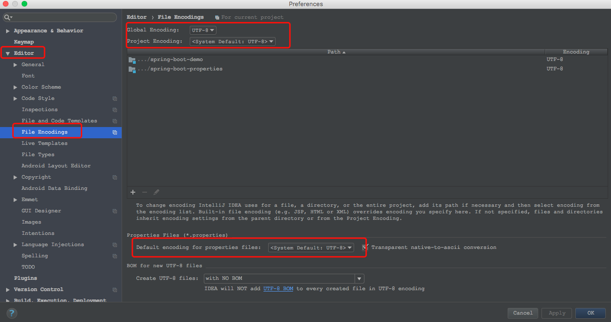
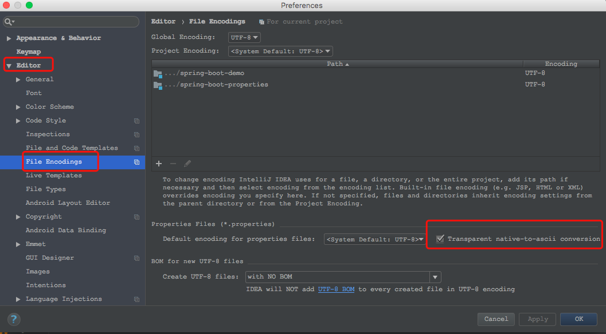

# SpringBoot自定义属性乱码

当在application.properties的配置文件中有中文时，读取出来的是乱码。需要进行下面一些操作。

原则：约定优越配置，统一所有编码为utf-8

1、修改开发工具的编码为utf-8，如我的idea编码配置，



2、将application.properites的文件类型修改为UTF-8的编码类型。

3、修改application.properties配置文件，添加以下编码设置：

```
# 设置编码格式
server.tomcat.uri-encoding=UTF-8
spring.http.encoding.charset=UTF-8
spring.http.encoding.enabled=true
spring.http.encoding.force=true
spring.messages.encoding=UTF-8
```
其实上面参数有的已经默认无需明确设置，明确设置了也没什么坏处。

4、如果还是乱码，搞ascii。

idea如下：

打开idea的`Preferences-->Editor-->File Encodings`，将`Default encoding for properties files`后面的`Transparent native-to-ascii conversion`勾选上，如下图：

**设置完成后，需要随意修改一下application.properties的内容，然后重新启动服务器**




eclipse：

eclipse我这里没测试，可参考网上的方法设置：
参考[在eclipse中安装properties插件PropertiesEditor及设置(附图)，ASCII码转换成中文](http://www.cnblogs.com/zdz8207/p/java-eclipse-properties.html)

安装完成PropertiesEditor 插件后，使用该编辑器重新编辑属性文件中的中文，然后重新运行程序。