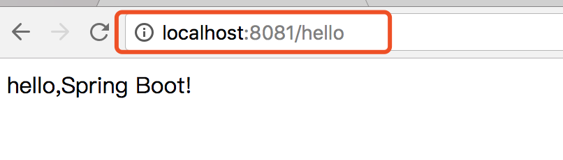

# Spring Boot教程(四)：多环境配置


# 一、多环境配置方法

在项目开发、测试、生产环境中，一些配置参数不尽相同，比如log级别、数据库连接参数等，每次切换环境时都要修改这些参数，参数多了很容易出错，而且不利于通过命令行等设置参数方式切换环境。为了方便环境之间的切换，可以通过`profile`来实现，Spring Boot中多环境配置文件名需要满足`application-{profile}.properties`的格式，其中`{profile}对`应你的环境标识，比如：

- `application-dev.properties`：开发环境 
- `application-test.properties`：测试环境
- `application-prod.properties`：生产环境

多个配置文件，spring boot究竟会加载哪个文件，取决于`application.properties`配置文件中的`spring.profiles.active`属性，该属性的值是对应的`{profile}`值。 如`spring.profile.active=dev`时，会加载配置文件`application-dev.properties`。


如果生产环境参数安全性要求高、不便于让开发人员看到，则生产环境配置文件可以采用外部文件方式。关于加载顺序，可以参考上一篇内容：[Spring Boot教程(三)：配置文件](springboot_003.md)


# 二、测试

下面以修改端口号和log日志级别作为示例：

这里我们直接以教程一的demo示例为基础(代码：[github](https://github.com/itinypocket/spring-boot-study/tree/master/spring-boot-demo) 或
[码云](https://gitee.com/itinypocket/spring-boot-study/tree/master/spring-boot-demo) ）
，创建配置文件：

1、创建application.properties

```
spring.profiles.active=dev
```

2、创建application-dev.properties

```
server.port=8081

logging.level.root=debug

```

3、创建application-prod.properties

```
server.port=8082

logging.level.root=info
```

4、启动服务，这时我们的端口号是`application-dev.properties`配置文件里配置的`8081`，浏览器输入`http://localhost:8081/hello` ,可以看到：


5、我们把`spring.profiles.active=dev`改成`spring.profiles.active=prod` ，重启服务，这是端口号就是`application-prod.properties`里配置的`8082`了。


<br><br><br><br>

源码： 
[github](https://github.com/itinypocket/spring-boot-study/tree/master/spring-boot-env) 
[码云](https://gitee.com/itinypocket/spring-boot-study/tree/master/spring-boot-env)


