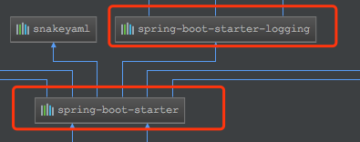
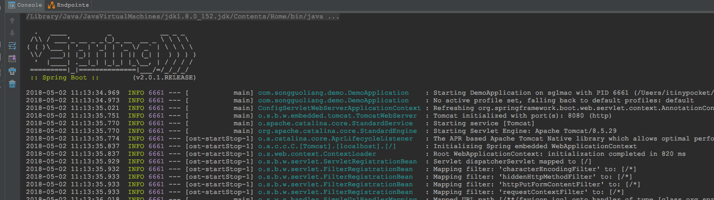

# Spring Boot教程(五)：默认日志logback

# 一、简述 

Spring Boot内部日志系统使用的是Commons Logging，但开放底层的日志实现。默认为会Java Util Logging, Log4J, Log4J2和Logback提供配置。每种情况下都会预先配置使用控制台输出，也可以使用可选的文件输出。

默认情况下，如果你使用’Starter POMs’，那么就会使用Logback记录日志。为了确保那些使用Java Util Logging, Commons Logging, Log4J或SLF4J的依赖库能够正常工作，正确的Logback路由也被包含进来。

[官方文档](https://docs.spring.io/spring-boot/docs/2.0.1.RELEASE/reference/htmlsingle/#boot-features-logging)


Spring Boot 集成logback需要添加`spring-boot-starter-logging`依赖，而此依赖已经在`spring-boot-starter`中添加过了，所以不用再添加此依赖了(如下图)



默认情况下，Spring Boot会用Logback来记录日志，并用INFO级别输出到控制台。


# 二、日志格式

[官方日志输出示例](https://docs.spring.io/spring-boot/docs/2.0.1.RELEASE/reference/htmlsingle/#boot-features-logging-format)

```
2014-03-05 10:57:51.112  INFO 45469 --- [           main] org.apache.catalina.core.StandardEngine  : Starting Servlet Engine: Apache Tomcat/7.0.52
2014-03-05 10:57:51.253  INFO 45469 --- [ost-startStop-1] o.a.c.c.C.[Tomcat].[localhost].[/]       : Initializing Spring embedded WebApplicationContext
2014-03-05 10:57:51.253  INFO 45469 --- [ost-startStop-1] o.s.web.context.ContextLoader            : Root WebApplicationContext: initialization completed in 1358 ms
2014-03-05 10:57:51.698  INFO 45469 --- [ost-startStop-1] o.s.b.c.e.ServletRegistrationBean        : Mapping servlet: 'dispatcherServlet' to [/]
2014-03-05 10:57:51.702  INFO 45469 --- [ost-startStop-1] o.s.b.c.embedded.FilterRegistrationBean  : Mapping filter: 'hiddenHttpMethodFilter' to: [/*]
```

输出内容元素具体如下：

- 时间日期： 精确到毫秒，可轻松排序。
- 日志级别： ERROR, WARN, INFO, DEBUG or TRACE
- 进程ID
- 分隔符： --- 标识实际日志的开始
- 线程名： 方括号括起来（可能会截断控制台输出）
- Logger名： 通常使用源代码的类名
- 日志内容

注：Logback没有`FATAL`级别。它被映射到`ERROR`级别。


# 三、文件输出

[官方文档](https://docs.spring.io/spring-boot/docs/2.0.1.RELEASE/reference/htmlsingle/#boot-features-logging-file-output)

Spring Boot默认配置只会输出到控制台，并不会记录到文件中，但是我们通常生产环境使用时都需要以文件方式记录。若要增加文件输出，需要在application.properties中配置logging.file或logging.path属性。 

下面的表格将说明使用`logging.file`和`logging.path`两个属性时的规则：

|loggin.file|logging.path|示例|描述
| ---------- | ------------- | ------- | ------ |
| 未配置     |  未配置         |          | 仅输出到控制台|
| 指定文件   |  未配置          |my.log    | 输出到指定的日志文件。可以是相对路径也可以是绝对路径|
| 未指定    |   指定目录     | /var/log  | 输出到指定的目录，日志文件名默认为`spring.log`，可以是相对路径也可以是绝对路径|

注意：`logging.file`和`logging.path`不要同时使用，如果同时使用只有`logging.file`会生效。

默认情况下，日志文件的大小达到10MB时会切分一次，产生新的日志文件。如果要修改大小可以通过`logging.file.max-size`来配置。
如果要限制日志文件个数，可以通过`logging.file.max-history`设置。


# 四、多环境日志配置

开发环境和生产环境的日志级别一般都不一样，开发时为了得到更多日志信息一般会设置到debug级别，而生产环境为了提高效率一般会设置到info或error级别。对于这些不同的日志配置只需要放到不同的文件即可，把相同的配置放到application.properties里。具体可以参考
[Spring Boot教程(四)：多环境配置](springboot_005.md)


# 五、自定义日志配置

[官方文档](https://docs.spring.io/spring-boot/docs/2.0.1.RELEASE/reference/htmlsingle/#boot-features-custom-log-configuration)

由于日志服务一般都在ApplicationContext创建前就初始化了，它并不是必须通过Spring的配置文件控制。因此通过系统属性和传统的Spring Boot外部配置文件依然可以很好的支持日志控制和管理。

根据不同的日志系统，你可以按如下规则组织配置文件名，就能被正确加载：

| 日志  | 规则|
| ------ | ------ |
| logback|`logback-spring.xml`, `logback-spring.groovy`, `logback.xml`, 或者 `logback.groovy`|
| log4j| `log4j-spring.properties`, `log4j-spring.xml`, `log4j.properties`, `log4j.xml` |
| log4j2 | `log4j2-spring.xml` 或者 `log4j2.xml` |
| JDK (Java Util Logging)|logging.properties|

SpringBoot官方建议您使用`-spring`的文件名进行日志配置（例如，logback-spring.xml而不是logback.xml）

自定义配置文件参考：
logback-spring.xml

```
<?xml version="1.0" encoding="UTF-8"?>
<configuration  scan="true" scanPeriod="60 seconds" debug="false">
    <contextName>demo</contextName>
    <property name="log.path" value="/Users/mengday/Documents/logs" />
    <property name="log.name" value="demo" />

    <!--输出到控制台-->
    <appender name="console" class="ch.qos.logback.core.ConsoleAppender">
        <!-- <filter class="ch.qos.logback.classic.filter.ThresholdFilter">
             <level>ERROR</level>
         </filter>-->
        <encoder>
            <pattern>%d{HH:mm:ss.SSS} %contextName [%thread] %-5level %logger{36} - %msg%n</pattern>
        </encoder>
    </appender>

    <!--输出到文件-->
    <appender name="file" class="ch.qos.logback.core.rolling.RollingFileAppender">
        <rollingPolicy class="ch.qos.logback.core.rolling.SizeAndTimeBasedRollingPolicy">
            <fileNamePattern>${log.path}/${log.name}.%d{yyyy-MM-dd}.%i.log</fileNamePattern>
            <maxFileSize>1MB</maxFileSize>
            <maxHistory>30</maxHistory>
        </rollingPolicy>
        <encoder>
            <pattern>%d{HH:mm:ss.SSS} %contextName [%thread] %-5level %logger{36} - %msg%n</pattern>
        </encoder>
    </appender>

    <root level="INFO">
        <appender-ref ref="console" />
        <appender-ref ref="file" />
    </root>

    <logger name="com.example.demo.mapper" level="DEBUG" additivity="false">
        <appender-ref ref="console" />
    </logger>

    <!-- 测试环境+开发环境. -->
    <springProfile name="test,dev">
        <logger name="com.example.demo" level="INFO" />
    </springProfile>
    <!-- 生产环境 -->
    <springProfile name="prod">
        <logger name="com.example.demo" level="ERROR"/>
    </springProfile>
</configuration>
```


<br><br><br><br>
参考： 

https://blog.csdn.net/vbirdbest/article/details/79669545 

https://docs.spring.io/spring-boot/docs/2.0.1.RELEASE/reference/htmlsingle/#boot-features-logging 


