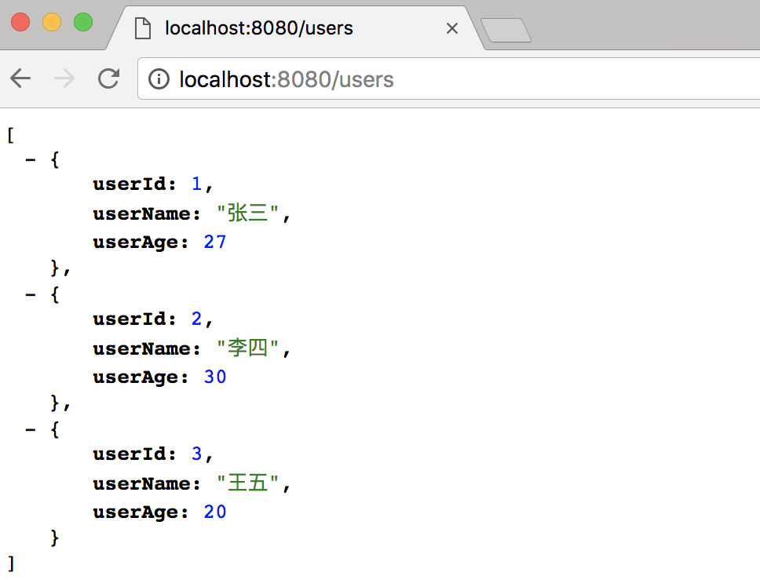

# Spring Boot教程(六)：Spring Boot集成mybatis


# 一、前置条件

先创建好一个最简单的spring boot项目，可参考之前章节的源代码或直接自己创建一个。

# 二、创建数据库

创建数据库

```
create database springboot;
```
创建用户表`tbl_user`并插入测试数据

```
CREATE TABLE `tbl_user` (
  `user_id` bigint(20) NOT NULL,
  `user_name` varchar(50) DEFAULT NULL,
  `user_age` int(11) DEFAULT NULL,
  PRIMARY KEY (`user_id`)
) ENGINE=InnoDB DEFAULT CHARSET=utf8;

INSERT INTO `tbl_user` VALUES (1, '张三', 27);
INSERT INTO `tbl_user` VALUES (2, '李四', 30);
INSERT INTO `tbl_user` VALUES (3, '王五', 20);
```

脚本sql在源码的db文件夹中。


# 三、引入mybatis依赖

```
<!-- mybatis -->
<dependency>
    <groupId>org.mybatis.spring.boot</groupId>
    <artifactId>mybatis-spring-boot-starter</artifactId>
    <version>1.3.2</version>
</dependency>

<!-- mysql -->
<dependency>
    <groupId>mysql</groupId>
    <artifactId>mysql-connector-java</artifactId>
</dependency>


```

# 四、编写代码

1、创建实体

```
package com.songguoliang.mybatis.entity;

/**
 * @Description
 * @Author sgl
 * @Date 2018-05-02 14:59
 */
public class User {
    private Long userId;
    private String userName;
    private Integer userAge;

    public Long getUserId() {
        return userId;
    }

    public void setUserId(Long userId) {
        this.userId = userId;
    }

    public String getUserName() {
        return userName;
    }

    public void setUserName(String userName) {
        this.userName = userName;
    }

    public Integer getUserAge() {
        return userAge;
    }

    public void setUserAge(Integer userAge) {
        this.userAge = userAge;
    }
}

```

2、创建Mapper文件

在`resources`文件夹下创建`mapper`文件夹，然后在`mapper`文件夹里创建`UserMapper.xml`，内容如下：

```
<?xml version="1.0" encoding="UTF-8" ?>
<!DOCTYPE mapper PUBLIC "-//mybatis.org//DTD Mapper 3.0//EN" "http://mybatis.org/dtd/mybatis-3-mapper.dtd" >
<mapper namespace="com.songguoliang.mybatis.mapper.UserMapper">

    <select id="getUsers" resultType="User">
        SELECT * FROM tbl_user
    </select>

</mapper>
```

3、创建Mapper(Dao)接口

```
package com.songguoliang.mybatis.mapper;

import com.songguoliang.mybatis.entity.User;

import java.util.List;

/**
 * @Description
 * @Author sgl
 * @Date 2018-05-02 15:02
 */
public interface UserMapper {

    List<User> getUsers();
}

```

4、创建Service

```
package com.songguoliang.mybatis.service;

import com.songguoliang.mybatis.entity.User;
import com.songguoliang.mybatis.mapper.UserMapper;
import org.springframework.beans.factory.annotation.Autowired;
import org.springframework.stereotype.Service;

import java.util.List;

/**
 * @Description
 * @Author sgl
 * @Date 2018-05-02 15:01
 */
@Service
public class UserService {

    @Autowired
    private UserMapper userMapper;

    public List<User> getUsers() {
        return userMapper.getUsers();
    }
}

```

5、创建controller

```
package com.songguoliang.mybatis.controller;

import com.songguoliang.mybatis.entity.User;
import com.songguoliang.mybatis.service.UserService;
import org.springframework.beans.factory.annotation.Autowired;
import org.springframework.web.bind.annotation.GetMapping;
import org.springframework.web.bind.annotation.RestController;

import java.util.List;

/**
 * @Description
 * @Author sgl
 * @Date 2018-05-02 14:59
 */
@RestController
public class UserController {

    @Autowired
    private UserService userService;

    @GetMapping("/users")
    public List<User> lists() {
        return userService.getUsers();
    }

}

```

# 五、配置mybatis

1、配置数据源

在`application.properties`配置文件中添加如下代码：

```
## 数据源配置
spring.datasource.url=jdbc:mysql://localhost:3306/springboot?useUnicode=true&characterEncoding=utf-8&useSSL=false
spring.datasource.username=root
spring.datasource.password=root
spring.datasource.driver-class-name=com.mysql.jdbc.Driver
```

2、添加mybatis配置

在`application.properties`配置文件中添加mybatis的配置，如下代码：

```
# mybatis
mybatis.type-aliases-package=com.songguoliang.mybatis.entity
mybatis.mapper-locations=classpath:mapper/*.xml
mybatis.configuration.map-underscore-to-camel-case=true
```

- `mybatis.type-aliases-package`：别名类(实体类)所在包
- `mybatis.mapper-locations`：mapper文件所在文件夹
- `mybatis.configuration.map-underscore-to-camel-case`：采用驼峰命名方式转换


3、扫描Mapper接口

在启动类上添加注解`@MapperScan("com.songguoliang.mybatis.mapper")` ，注意`MapperScan`的包路径(`org.mybatis.spring.annotation.MapperScan`)，后面章节和Mapper4集成时会修改导入的包。

```
package com.songguoliang.mybatis;

import org.mybatis.spring.annotation.MapperScan;
import org.springframework.boot.SpringApplication;
import org.springframework.boot.autoconfigure.SpringBootApplication;

/**
 * @Description
 * @Author sgl
 * @Date 2018-05-02 14:51
 */
@SpringBootApplication
@MapperScan("com.songguoliang.mybatis.mapper")
public class MybatisApplication {
    public static void main(String[] args) {
        SpringApplication.run(MybatisApplication.class, args);
    }
}

```


# 六、测试

启动服务，浏览器输入`http://localhost:8080/users` ,可看到如下内容：



<br><br><br><br>

源码： 
[github](https://github.com/itinypocket/spring-boot-study/tree/master/spring-boot-mybatis) 
[码云](https://gitee.com/itinypocket/spring-boot-study/tree/master/spring-boot-mybatis)


