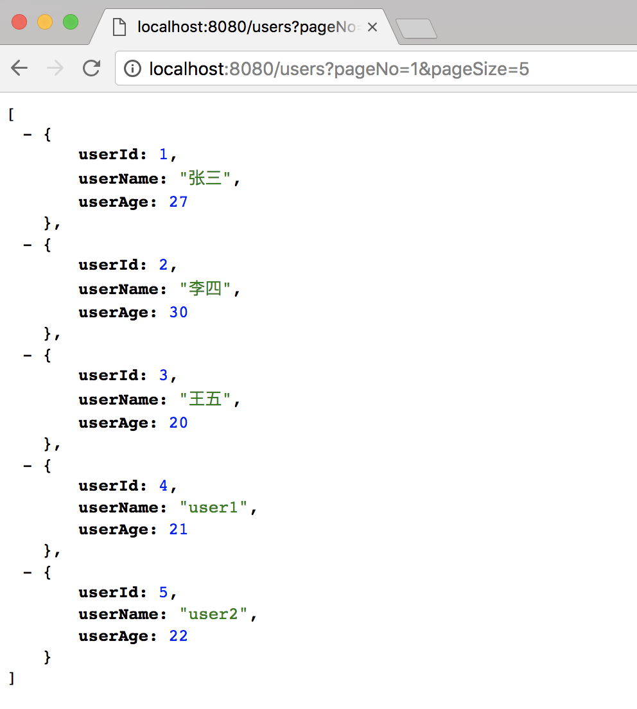
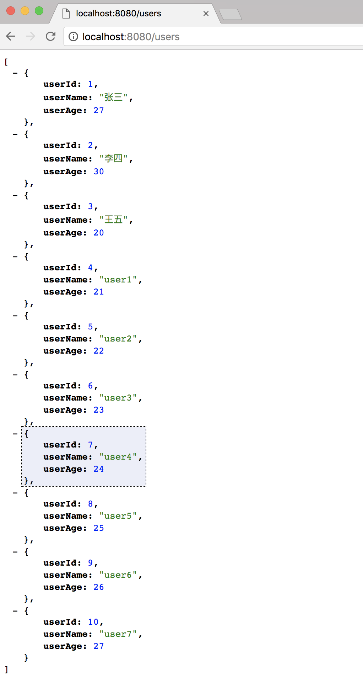
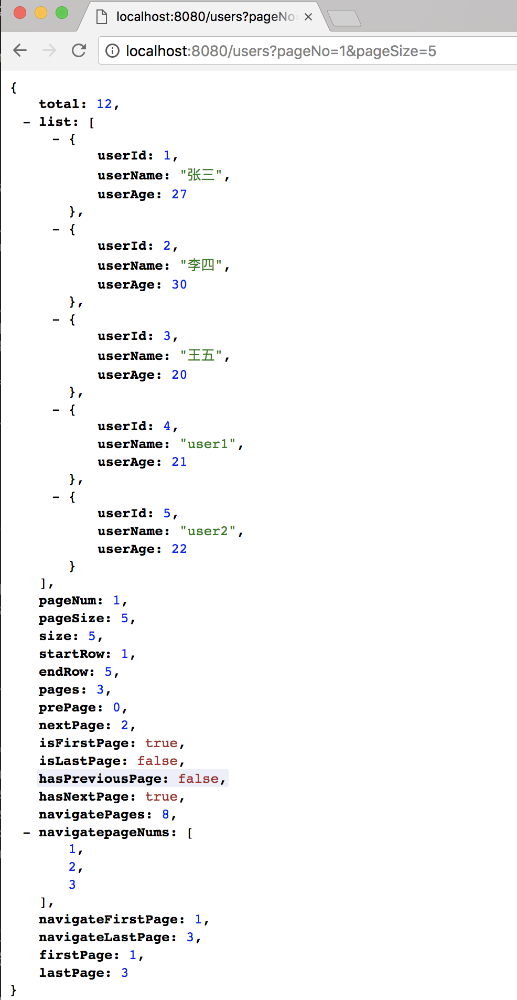

# Spring Boot教程(八)：Spring Boot集成pagehelper分页插件

# 一、项目准备

直接使用上个章节的源码，[Spring Boot教程(七)：Spring Boot集成druid连接池](springboot_008.md)

为了方便，后面章节不再根据章节内容修改包名和启动类名，所以先对上节源码做以下修改：

1、包名修改

将包名`com.songguoliang.mybatis`修改为`com.songguoliang.springboot`。

2、修改启动类

将启动类`DruidApplication`修改为`Application`，并且将注解`@MapperScan("com.songguoliang.mybatis.mapper")`扫描包改为`@MapperScan("com.songguoliang.springboot.mapper")`

```
package com.songguoliang.springboot;

import org.mybatis.spring.annotation.MapperScan;
import org.springframework.boot.SpringApplication;
import org.springframework.boot.autoconfigure.SpringBootApplication;

/**
 * @Description
 * @Author sgl
 * @Date 2018-05-02 14:51
 */
@SpringBootApplication
@MapperScan("com.songguoliang.springboot.mapper")
public class Application {
    public static void main(String[] args) {
        SpringApplication.run(Application.class, args);
    }
}

```

3、将application.properties配置文件中的`mybatis.type-aliases-package=com.songguoliang.mybatis.entity`改为`mybatis.type-aliases-package=com.songguoliang.springboot.entity`


# 二、添加pagehelper依赖

```
<!-- pagehelper -->
<dependency>
    <groupId>com.github.pagehelper</groupId>
    <artifactId>pagehelper-spring-boot-starter</artifactId>
    <version>1.2.5</version>
</dependency>
```

# 三、配置文件修改

在application.properties配置文件中添加以下配置：

```
#pagehelper分页插件配置
pagehelper.helperDialect=mysql
pagehelper.reasonable=true
pagehelper.supportMethodsArguments=true
pagehelper.params=count=countSql
```

# 四、修改Controller

修改`UserController`里的`lists`方法:

```
@GetMapping("/users")
public List<User> lists(@RequestParam(defaultValue = "1") int pageNo, @RequestParam(defaultValue = "10") int pageSize) {
    PageHelper.startPage(pageNo,pageSize);
    return userService.getUsers();
}
```

- `pageNo`和`pageSize`两个参数是为了接收前台传过来的值，并且通过`defaultValue`为这两个参数提供了默认值。
- 分页主要代码：`PageHelper.startPage(pageNo,pageSize);`

**需要注意的是，分页代码`PageHelper.startPage(pageNo,pageSize);`只对其后的第一个查询有效。如把代码改为下面这样，添加一个查询，则第二个查询并没有分页**

```
@GetMapping("/users")
public List<User> lists(@RequestParam(defaultValue = "1") int pageNo, @RequestParam(defaultValue = "10") int pageSize) {
    PageHelper.startPage(pageNo,pageSize);
    userService.getUsers();//这个查询会分页
    return userService.getUsers();//这个查询不会分页
}
```

# 五、测试

启动服务，浏览器输入`http://localhost:8080/users?pageNo=1&pageSize=5`,可以看到只查询了第一页5条数据：


浏览器输入`http://localhost:8080/users`,这是因为没有传参数，后台取默认值，查询第一页的10条数据。


# 六、返回分页信息

上面我们返回的只是数据，而总页数、当前页数、每页条数等分页相关的信息并没有返回。

下面我们对controller、service、mapper里的方法的返回值做一下修改，将`List<User>`改为`Page<User>`,`Page`是`com.github.pagehelper`包里的类，它是`java.util.ArrayList`的子类。

1、`UserMapper`里将返回值修改为`Page<User>`

```
package com.songguoliang.springboot.mapper;

import com.github.pagehelper.Page;
import com.songguoliang.springboot.entity.User;

/**
 * @Description
 * @Author sgl
 * @Date 2018-05-02 15:02
 */
public interface UserMapper {

    Page<User> getUsers();
}

```

2、`UserService`里将返回值修改为`Page<User>`

```
public Page<User> getUsers() {
    return userMapper.getUsers();
}
```

3、用`com.github.pagehelper.PageInfo`类封装`Page<User>`数据

```
@GetMapping("/users")
public PageInfo<User> lists(@RequestParam(defaultValue = "1") int pageNo,@RequestParam(defaultValue = "10") int pageSize) {
    PageHelper.startPage(pageNo,pageSize);
    PageInfo<User> pageInfo = new PageInfo<>(userService.getUsers());
    return pageInfo;
}
```

4、重启服务，浏览器输入`http://localhost:8080/users?pageNo=1&pageSize=5`,可以看到只查询了第一页5条数据，并且包含了分页相关的信息：



<br><br><br><br>

源码： 
[github](https://github.com/itinypocket/spring-boot-study/tree/master/spring-boot-pagehelper) 
[码云](https://gitee.com/itinypocket/spring-boot-study/tree/master/spring-boot-pagehelper)

