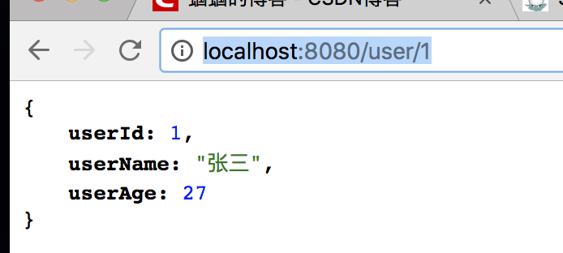

# Spring Boot教程(九)：Spring Boot集成Mapper4

# 一、项目准备

直接使用上个章节的源码，[Spring Boot教程(八)：Spring Boot集成pagehelper分页插件](springboot_009.md)


# 二、添加mapper4依赖

```
<!-- mapper4 -->
<dependency>
    <groupId>tk.mybatis</groupId>
    <artifactId>mapper-spring-boot-starter</artifactId>
    <version>2.0.2</version>
</dependency>
```

# 三、修改启动类上`@MapperScan`所在包，注意包路径!!!

**不再采用mybatis的`org.mybatis.spring.annotation.MapperScan`，而是使用Mapper4的：`tk.mybatis.spring.annotation.MapperScan`，注意包路径!!!**

```
package com.songguoliang.springboot;

import org.springframework.boot.SpringApplication;
import org.springframework.boot.autoconfigure.SpringBootApplication;
import tk.mybatis.spring.annotation.MapperScan;

/**
 * @Description
 * @Author sgl
 * @Date 2018-05-02 14:51
 */
@SpringBootApplication
@MapperScan("com.songguoliang.springboot.mapper")
public class Application {
    public static void main(String[] args) {
        SpringApplication.run(Application.class, args);
    }
}

```


# 四、创建自己的Mapper基类

建议创建自己的Mapper基类，在自己的Mapper基类里，我们可以根据我们的项目需要定义适合我们的公共方法。如果不想使用自己创建的，可以直接继承`tk.mybatis.mapper.common.Mapper`。

```
package com.songguoliang.springboot.base;

import tk.mybatis.mapper.common.Mapper;
import tk.mybatis.mapper.common.MySqlMapper;

/**
 * @Description 自己的Mapper基类，主要不能放到mapper下
 * @Author sgl
 * @Date 2018-05-07 16:57
 */
public interface BaseMapper<T> extends Mapper<T>,MySqlMapper<T>{
}

```

**注意：这个接口不能和表对应的Mapper在同一个表下，即不能在`@MapperScan`扫描的包里**


# 五、配置文件修改

在`application.properties`配置文件中，添加以下配置：

```
mapper.mappers=com.songguoliang.springboot.base.BaseMapper
mapper.not-empty=false
mapper.identity=MYSQL
```

# 六、修改`UserMapper`

使`UserMapper`继承我们创建的父Mapper:`com.songguoliang.springboot.base.BaseMapper`

```
package com.songguoliang.springboot.mapper;

import com.github.pagehelper.Page;
import com.songguoliang.springboot.base.BaseMapper;
import com.songguoliang.springboot.entity.User;

/**
 * @Description
 * @Author sgl
 * @Date 2018-05-02 15:02
 */
public interface UserMapper extends BaseMapper<User> {

    Page<User> getUsers();
}

```

# 七、修改`UserService`

在`UserService`里添加一个根据主键获取对象的方法：

```
public User selectById(long id){
    return userMapper.selectByPrimaryKey(id);
}
```

这里我们直接调用Mapper4自带的`selectByPrimaryKey()`方法，所以不需要在mapper文件中写sql，也不需要在UserMapper中定义方法，这些任务都由Mapper4来做。

可以抽象出来一个`BaseService`来作为`UserService`的父类，定义一些我们常用的方法。


# 八、修改`UserController`

添加一个服务，用来根据id获取用户

```
@GetMapping("/user/{id}")
public User selectUserById(@PathVariable("id") Long id){
    return userService.selectById(id);
}
```

# 九、修改实体类

- 实体上面添加`@Table`注解以指定表名，如果表名和实体名一样，不需要设置，由于我们的表名是`tbl_user`，所以需要指定。
- 主键上添加`@Id`注解，联合主键需要主键的每个属性上都加`@Id`。如果不加该注解，在使用`xxxByPrimaryKey`方法时，会把所有字段当成主键，即会出现`where user_id=? and user_name=? and user_age=?`这种条件。


```
package com.songguoliang.springboot.entity;

import javax.persistence.Id;
import javax.persistence.Table;

/**
 * @Description
 * @Author sgl
 * @Date 2018-05-02 14:59
 */
@Table(name = "tbl_user")
public class User {
    @Id
    private Long userId;
    private String userName;
    private Integer userAge;

    //省略getter、setter方法
}

```


# 十、启动服务，测试

浏览器输入`http://localhost:8080/user/1`，得到如下内容：




本文主要是为了说明如何集成Mapper4，对Mapper4的使用，请参考Mapper4作者的[GitHub](https://github.com/abel533/Mapper/wiki)


<br><br><br><br>

源码： 
[github](https://github.com/itinypocket/spring-boot-study/tree/master/spring-boot-mapper4) 
[码云](https://gitee.com/itinypocket/spring-boot-study/tree/master/spring-boot-mapper4)

