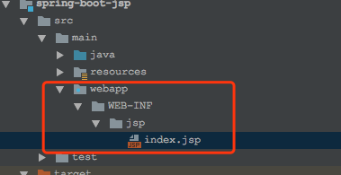
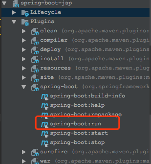
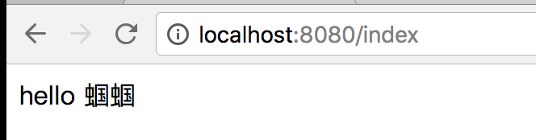

# Spring Boot教程(十)：Spring Boot集成jsp

# 一、项目准备

直接使用上个章节的源码，[Spring Boot教程(九)：Spring Boot集成Mapper4](springboot_010.md)


# 二、添加依赖

```
<!-- jsp -->
<dependency>
    <groupId>javax.servlet</groupId>
    <artifactId>jstl</artifactId>
</dependency>
<dependency>
    <groupId>org.apache.tomcat.embed</groupId>
    <artifactId>tomcat-embed-jasper</artifactId>
    <scope>provided</scope>
</dependency>
```

# 三、修改配置文件

在`application.properties`配置文件中添加jsp相关配置:

```
## jsp
spring.mvc.view.prefix=/WEB-INF/jsp/
spring.mvc.view.suffix=.jsp
# 配置Tomcat编码
server.tomcat.uri-encoding=UTF-8
```

# 四、创建jsp文件

1. 在`src/main`下创建`webapp/WEB-INF/jsp`文件夹。
2. 在`jsp`文件夹下创建`index.jsp`

index.jsp内容：

```
<%@ page contentType="text/html;charset=UTF-8" pageEncoding="UTF-8" %>
<!DOCTYPE html>
<html>
<head>
    <meta http-equiv="Content-type" content="text/html; charset=UTF-8">
    <meta http-equiv="X-UA-Compatible" content="IE=edge,chrome=1"/>
    <title>首页</title>
</head>
<body>
    hello ${userName}
</body>
</html>

```



# 五、创建Controller

添加一个`IndexController`，内容如下：

```
package com.songguoliang.springboot.controller;

import org.springframework.stereotype.Controller;
import org.springframework.web.bind.annotation.GetMapping;
import org.springframework.web.servlet.ModelAndView;

/**
 * @Description
 * @Author sgl
 * @Date 2018-05-08 10:47
 */
@Controller
public class IndexController {

    @GetMapping("/index")
    public ModelAndView index() {
        ModelAndView view = new ModelAndView("index");
        view.addObject("userName", "蝈蝈");
        return view;
    }
}

```

# 六、启动服务

通过spring-boot:run启动服务,idea里直接双击即可:



浏览器输入：`http://localhost:8080/index`，页面显示：


# 七、注意

springboot官方不推荐使用jsp，而是推荐`Thymeleaf`。


<br><br><br><br>

源码： 
[github](https://github.com/itinypocket/spring-boot-study/tree/master/spring-boot-jsp) 
[码云](https://gitee.com/itinypocket/spring-boot-study/tree/master/spring-boot-jsp)


