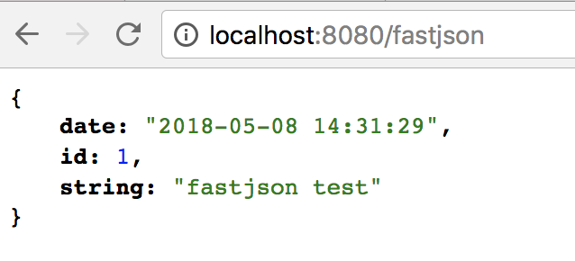

# Spring Boot教程(十一)：Spring Boot集成fastjson

# 一、项目准备

直接使用上个章节的源码，[Spring Boot教程(十)：Spring Boot集成jsp](springboot_011.md)


# 二、添加依赖

从`spring-boot-starter-web`里去除`spring-boot-starter-json`依赖，添加fastjson依赖：

```
<!-- Spring Boot web启动器 -->
<dependency>
    <groupId>org.springframework.boot</groupId>
    <artifactId>spring-boot-starter-web</artifactId>
    <exclusions>
        <exclusion>
            <groupId>org.springframework.boot</groupId>
            <artifactId>spring-boot-starter-json</artifactId>
        </exclusion>
    </exclusions>
</dependency>
<!-- fastjson -->
<dependency>
    <groupId>com.alibaba</groupId>
    <artifactId>fastjson</artifactId>
    <version>1.2.47</version>
</dependency>
```


# 三、配置fastjson

## 方法一：注入bean方式

在启动类Application里添加`public HttpMessageConverters fastJsonHttpMessageConverters()`方法：

```
package com.songguoliang.springboot;

import com.alibaba.fastjson.serializer.SerializerFeature;
import com.alibaba.fastjson.support.config.FastJsonConfig;
import com.alibaba.fastjson.support.spring.FastJsonHttpMessageConverter;
import org.springframework.boot.SpringApplication;
import org.springframework.boot.autoconfigure.SpringBootApplication;
import org.springframework.boot.autoconfigure.http.HttpMessageConverters;
import org.springframework.context.annotation.Bean;
import org.springframework.http.converter.HttpMessageConverter;
import tk.mybatis.spring.annotation.MapperScan;

/**
 * @Description
 * @Author sgl
 * @Date 2018-05-02 14:51
 */
@SpringBootApplication
@MapperScan("com.songguoliang.springboot.mapper")
public class Application{
    public static void main(String[] args) {
        SpringApplication.run(Application.class, args);
    }
    /**
     * 覆盖方法configureMessageConverters，使用fastJson
     * @return
     */
    @Bean
    public HttpMessageConverters fastJsonHttpMessageConverters() {
        //1、定义一个convert转换消息的对象
        FastJsonHttpMessageConverter fastConverter = new FastJsonHttpMessageConverter();
        //2、添加fastjson的配置信息
        FastJsonConfig fastJsonConfig = new FastJsonConfig();
        fastJsonConfig.setSerializerFeatures(SerializerFeature.PrettyFormat);
        //3、在convert中添加配置信息
        fastConverter.setFastJsonConfig(fastJsonConfig);
        //4、将convert添加到converters中
        HttpMessageConverter<?> converter = fastConverter;
        return new HttpMessageConverters(converter);
    }

}

```


## 方法二：重写`configureMessageConverters()`方法的方式

1. 启动类实现`org.springframework.web.servlet.config.annotation.WebMvcConfigurer`接口
2. 重写`public void configureMessageConverters(List<HttpMessageConverter<?>> converters)`方法。

```
package com.songguoliang.springboot;

import com.alibaba.fastjson.serializer.SerializerFeature;
import com.alibaba.fastjson.support.config.FastJsonConfig;
import com.alibaba.fastjson.support.spring.FastJsonHttpMessageConverter;
import org.springframework.boot.SpringApplication;
import org.springframework.boot.autoconfigure.SpringBootApplication;
import org.springframework.http.converter.HttpMessageConverter;
import org.springframework.web.servlet.config.annotation.WebMvcConfigurer;
import tk.mybatis.spring.annotation.MapperScan;

import java.util.List;

/**
 * @Description
 * @Author sgl
 * @Date 2018-05-02 14:51
 */
@SpringBootApplication
@MapperScan("com.songguoliang.springboot.mapper")
public class Application implements WebMvcConfigurer {
    public static void main(String[] args) {
        SpringApplication.run(Application.class, args);
    }

    @Override
    public void configureMessageConverters(List<HttpMessageConverter<?>> converters) {
        //1、定义一个convert转换消息的对象
        FastJsonHttpMessageConverter fastConverter = new FastJsonHttpMessageConverter();
        //2、添加fastjson的配置信息
        FastJsonConfig fastJsonConfig = new FastJsonConfig();
        fastJsonConfig.setSerializerFeatures(SerializerFeature.PrettyFormat);
        //3、在convert中添加配置信息
        fastConverter.setFastJsonConfig(fastJsonConfig);
        //4、将convert添加到converters中
        converters.add(fastConverter);
    }
}

```


# 四、创建测试对象

创建一个`model`包，然后在该包里创建一个`FastjsonTest`实体，这个实体里，通过`@JSONField`注解，格式化`date`字段的值，并且不把`ignore`字段返回到前台，内容如下：

```
package com.songguoliang.springboot.model;

import com.alibaba.fastjson.annotation.JSONField;

import java.util.Date;

/**
 * @Description
 * @Author sgl
 * @Date 2018-05-08 13:50
 */
public class FastjsonTest {
    private Integer id;
    private String string;
    /**
     * 格式化日期
     */
    @JSONField(format = "yyyy-MM-dd HH:mm:ss")
    private Date date;

    /**
     * 转换为json时不包括该属性
     */
    @JSONField(serialize = false)
    private String ignore;

    //省略getter、setter
}

```


# 五、创建Controller

创建一个`TestController `，内容如下：

```
package com.songguoliang.springboot.controller;

import com.songguoliang.springboot.model.FastjsonTest;
import org.springframework.web.bind.annotation.GetMapping;
import org.springframework.web.bind.annotation.RestController;

import java.util.Date;

/**
 * @Description
 * @Author sgl
 * @Date 2018-05-08 13:55
 */
@RestController
public class TestController {

    @GetMapping("/fastjson")
    public FastjsonTest getFastJson() {
        FastjsonTest fastjsonTest = new FastjsonTest();
        fastjsonTest.setId(1);
        fastjsonTest.setString("fastjson test");
        fastjsonTest.setIgnore("ignore field");
        fastjsonTest.setDate(new Date());
        return fastjsonTest;
    }
}
```

# 六、启动服务查看测试结果

启动结果，在浏览器上输入：`http://localhost:8080/fastjson`，结果如下：



可以看到，`date`字段值的格式是我们设置好的`yyyy-MM-dd HH:mm:ss`,而且`ignore`字段没有显示出来。


<br><br><br><br>

源码： 
[github](https://github.com/itinypocket/spring-boot-study/tree/master/spring-boot-fastjson) 
[码云](https://gitee.com/itinypocket/spring-boot-study/tree/master/spring-boot-fastjson)


