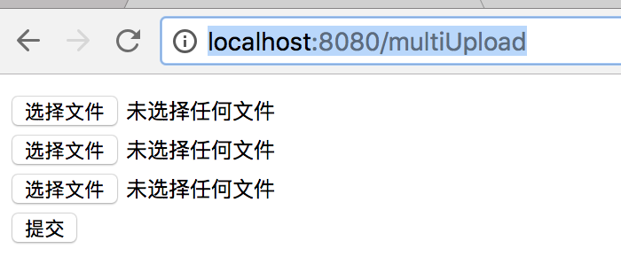

# Spring Boot教程(十三)：Spring Boot文件上传


# 一、创建一个简单的包含WEB依赖的SpringBoot项目

`pom.xml`内容：

```
<!-- Spring Boot web启动器 -->
<dependency>
    <groupId>org.springframework.boot</groupId>
    <artifactId>spring-boot-starter-web</artifactId>
</dependency>

<!-- jsp -->
<dependency>
    <groupId>javax.servlet</groupId>
    <artifactId>jstl</artifactId>
</dependency>
<dependency>
    <groupId>org.apache.tomcat.embed</groupId>
    <artifactId>tomcat-embed-jasper</artifactId>
    <!--<scope>provided</scope>-->
</dependency>
```


# 二、配置文件上传的文件大小限制

`application.properties`配置文件添加：

```
# 上传文件总的最大值
spring.servlet.multipart.max-request-size=10MB
# 单个文件的最大值
spring.servlet.multipart.max-file-size=10MB

## jsp
spring.mvc.view.prefix=/WEB-INF/jsp/
spring.mvc.view.suffix=.jsp

```

- `spring.servlet.multipart.max-file-size`限制单个文件的最大值
- `spring.servlet.multipart.max-request-size`限制上传的多个文件的总大小

# 三、单文件上传示例

1、创建Controller控制类，内容如下：

```
package com.songguoliang.springboot.controller;

import org.slf4j.Logger;
import org.slf4j.LoggerFactory;
import org.springframework.stereotype.Controller;
import org.springframework.web.bind.annotation.GetMapping;
import org.springframework.web.bind.annotation.PostMapping;
import org.springframework.web.bind.annotation.RequestParam;
import org.springframework.web.bind.annotation.ResponseBody;
import org.springframework.web.multipart.MultipartFile;
import org.springframework.web.multipart.MultipartHttpServletRequest;

import javax.servlet.http.HttpServletRequest;
import java.io.File;
import java.io.IOException;
import java.util.List;

/**
 * @Description
 * @Author sgl
 * @Date 2018-05-15 14:04
 */
@Controller
public class UploadController {
    private static final Logger LOGGER = LoggerFactory.getLogger(UploadController.class);

    @GetMapping("/upload")
    public String upload() {
        return "upload";
    }

    @PostMapping("/upload")
    @ResponseBody
    public String upload(@RequestParam("file") MultipartFile file) {
        if (file.isEmpty()) {
            return "上传失败，请选择文件";
        }

        String fileName = file.getOriginalFilename();
        String filePath = "/Users/itinypocket/workspace/temp/";
        File dest = new File(filePath + fileName);
        try {
            file.transferTo(dest);
            LOGGER.info("上传成功");
            return "上传成功";
        } catch (IOException e) {
            LOGGER.error(e.toString(), e);
        }
        return "上传失败！";
    }

    
}

```

2、创建`upload.jsp`文件

只有一个表单，选择文件，form的`enctype `为`multipart/form-data`:

```
<%@ page contentType="text/html;charset=UTF-8" pageEncoding="UTF-8" %>
<!DOCTYPE html>
<html>
<head>
    <meta http-equiv="Content-type" content="text/html; charset=UTF-8">
    <meta http-equiv="X-UA-Compatible" content="IE=edge,chrome=1"/>
    <title>单文件上传</title>
</head>
<body>
<form method="post" action="/upload" enctype="multipart/form-data">
    <input type="file" name="file"><br>
    <input type="submit" value="提交">
</form>
</body>
</html>

```

3、通过springboot插件启动项目，浏览器输入`http://localhost:8080/upload`：


选择文件点击提交按钮返回成功信息，我们上传的文件保存在`/Users/itinypocket/workspace/temp`路径下：


# 四、多文件上传

1、创建多文件上传的jsp页面，多文件上传页面只是比单文件上传多了file选择的input而已，`multiUpload.jsp`内容如下：

```
<%@ page contentType="text/html;charset=UTF-8" pageEncoding="UTF-8" %>
<!DOCTYPE html>
<html>
<head>
    <meta http-equiv="Content-type" content="text/html; charset=UTF-8">
    <meta http-equiv="X-UA-Compatible" content="IE=edge,chrome=1"/>
    <title>多文件上传</title>
</head>
<body>
<form method="post" action="/multiUpload" enctype="multipart/form-data">
    <input type="file" name="file"><br>
    <input type="file" name="file"><br>
    <input type="file" name="file"><br>
    <input type="submit" value="提交">
</form>
</body>
</html>

```

2、在`UploadController`里添加多文件上传的方法

```
@GetMapping("/multiUpload")
public String multiUpload() {
    return "multiUpload";
}

@PostMapping("/multiUpload")
@ResponseBody
public String multiUpload(HttpServletRequest request) {
    List<MultipartFile> files = ((MultipartHttpServletRequest) request).getFiles("file");
    String filePath = "/Users/itinypocket/workspace/temp/";
    for (int i = 0; i < files.size(); i++) {
        MultipartFile file = files.get(i);
        if (file.isEmpty()) {
            return "上传第" + (i++) + "个文件失败";
        }
        String fileName = file.getOriginalFilename();

        File dest = new File(filePath + fileName);
        try {
            file.transferTo(dest);
            LOGGER.info("第" + (i + 1) + "个文件上传成功");
        } catch (IOException e) {
            LOGGER.error(e.toString(), e);
            return "上传第" + (i++) + "个文件失败";
        }
    }

    return "上传成功";

}
```

3、重启服务，浏览器输入`http://localhost:8080/multiUpload`:



4、然后选择要上传的文件，点击提交按钮，得到成功信息：


我们选择的三个文件已被成功上传到`/Users/itinypocket/workspace/temp`路径下。


<br><br><br><br>

源码： 
[github](https://github.com/itinypocket/spring-boot-study/tree/master/spring-boot-upload) 
[码云](https://gitee.com/itinypocket/spring-boot-study/tree/master/spring-boot-upload)


