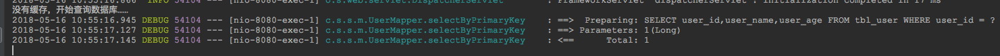

# Spring Boot教程(十四)：Spring Boot集成ehcache缓存


Spring Boot的cache支持多种缓存,参考[缓存支持](https://docs.spring.io/spring-boot/docs/2.0.2.RELEASE/reference/htmlsingle/#_supported_cache_providers)，其中常用的有EhCache和Redis，Redis需要安装redis服务器，而EhCache不依赖任何第三方软件，只需引入jar即可。下面主要介绍ehcache的集成方法。


# 一、项目准备

直接使用[Spring Boot教程(十一)：Spring Boot集成fastjson](springboot_012.md)章节的源码。


# 二、添加依赖

在pom.xml里添加ehcache相关的依赖

```
<!-- cache -->
<dependency>
    <groupId>org.springframework.boot</groupId>
    <artifactId>spring-boot-starter-cache</artifactId>
</dependency>
<dependency>
    <groupId>net.sf.ehcache</groupId>
    <artifactId>ehcache</artifactId>
</dependency>
```

# 三、创建ehcache.xml配置文件，内容如下：

```
<?xml version="1.0" encoding="UTF-8"?>
<ehcache updateCheck="false" dynamicConfig="false">
    <diskStore path="java.io.tmpdir"/>

    <cache name="users" timeToLiveSeconds="300"/>

</ehcache>
```

cache的属性说明：

- name:缓存的名称。
- maxElementsInMemory：缓存中最大元素个数。0表示不限制
- eternal:对象是否永久有效，一但设置了，timeout将不起作用，元素永久存在。
- clearOnFlush：内存数量最大时是否清除。
- timeToIdleSeconds ： 设置对象在失效前的允许闲置时间（单位：秒）。仅当eternal=false对象不是永久有效时使用，可选属性，默认值是0，也就是可闲置时间无穷大。
- timeToLiveSeconds：设置对象在失效前允许存活时间（单位：秒）。最大时间介于创建时间和失效时间之间。仅当eternal=false对象不是永久有效时使用，默认是0.，也就是对象存活时间无穷大。
- diskExpiryThreadIntervalSeconds：磁盘失效线程运行时间间隔，默认是120秒。
- diskPersistent：是否在VM重启时存储硬盘的缓存数据。默认值是false。
- maxElementsOnDisk：硬盘最大缓存个数。
- overflowToDisk：当内存中对象数量达到maxElementsInMemory时，Ehcache将会对象写到磁盘中。
- diskSpoolBufferSizeMB：这个参数设置DiskStore（磁盘缓存）的缓存区大小。默认是30MB。每个Cache都应该有自己的一个缓冲区。
- maxEntriesLocalDisk：当内存中对象数量达到maxElementsInMemory时，Ehcache将会对象写到磁盘中。
- memoryStoreEvictionPolicy：当达到maxElementsInMemory限制时，Ehcache将会根据指定的策略去清理内存。默认策略是LRU（最近最少使用）。你可以设置为FIFO（先进先出）或是LFU（较少使用）。


# 四、在application.properties配置文件中指定ehcache配置

添加以下内容：

```
# ehcache
spring.cache.ehcache.config=classpath:config/ehcache.xml
```

# 五、开启缓存支持

在启动类上添加注解`@EnableCaching`以开启缓存支持。

```
@EnableCaching
@SpringBootApplication
@MapperScan("com.songguoliang.springboot.mapper")
public class Application{
    public static void main(String[] args) {
        SpringApplication.run(Application.class, args);
    }
}
```


# 六、代码中使用缓存

Spring提供了4个声明式缓存注解：

| 注解 | 解释|
| ---  | --- |
| `@Cacheable` | 在方法执行前Spring先查看缓存中是否存在，如果存在，则直接返回缓存数据，若不存在则调用方法并将方法返回值放进缓存|
| `@CachePut` | 无论怎样，都会将方法的返回值放到缓存中。`@CachePut`的属性与`@Cacheable`保持一致 |
| `@CacheEvict` | 将一条或多条数据从缓存中删除。 |
| `@Caching` | 可以通过`@Caching`注解组合多个注解策略在一个方法上。|
 
1、添加缓存

添加缓存只需要在方法上面添加缓存注解即可，我们对`com.songguoliang.springboot.service.UserService#selectById`方法做如下修改：

```
/**
 * 使用ehcache.xml配置users缓存，用用户id作为缓存主键
 * @param id
 * @return
 */
@Cacheable(cacheNames = "users",key = "#id")
public User selectById(long id) {
    System.out.println("没有缓存，开始查询数据库……");
    return userMapper.selectByPrimaryKey(id);
}
```

然后我们启动服务，浏览器输入`http://localhost:8080/user/1`,可以看到控制台信息显示向数据库查询了数据，如下：



界面结果：


再次访问`http://localhost:8080/user/1`，可以看到控制台并没有信息输出，即并没有向数据库查询数据。

由于我们缓存设置的是300秒，超过这个时间我们再次访问，控制台又可以看到类似上面的信息，说明第一次查询时添加的缓存已经失效并清除，重新添加了缓存。


2、删除缓存
当我们删除用户、修改用户等操作时，需要把缓存也更新。下面例子使用`@CacheEvict`注解来删除缓存。

`UserService`里添加以下内容：

```
@CacheEvict(value = "users",key = "#id")
public void evictUser(Long id) {
    System.out.println("evict user:" + id);
}
```

`UserController`里添加一个方法：

```
@GetMapping("/user/del/{id}")
public String delUser(@PathVariable("id") Long id){
    userService.evictUser(id);
    return "删除成功";
}
```

重启服务，然后我们先访问`http://localhost:8080/user/1`添加缓存，之后再访问`http://localhost:8080/user/del/1`来删除缓存：


控制台信息：


再次查询用户，又会从数据库查询，说明成功删除了之前的缓存。


<br><br><br><br>

源码： 
[github](https://github.com/itinypocket/spring-boot-study/tree/master/spring-boot-ehcache) 
[码云](https://gitee.com/itinypocket/spring-boot-study/tree/master/spring-boot-ehcache)


