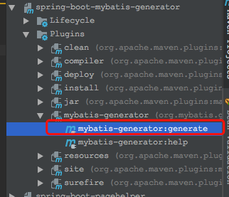

# Spring Boot教程(十五)：Spring Boot集成mybatis generator自动生成代码插件


其实MyBatis Generator并不需要spring boot环境，只需要自己写一个main方法运行即可。本文主要介绍使用maven插件的方式。

注：本文采用的MyBatis Generator版本为：`1.3.6`


# 一、MyBatis Generator介绍

MyBatis Generator，缩写MBG，是一个Mybatis和iBatis的代码生成器。它支持Mybatis的所有版本，支持iBatis 2.2.0以后的版本。通过MyBatis Generator可以根据数据库表生成相应的实体、sql映射文件、Dao等，能应付简单的`CRUD`（`Create`, `Retrieve`, `Update`, `Delete`），对于连接查询或存储过程等还是要手动编写sql和对象。


MyBatis Generator将生成以下内容：

- 与表结构匹配的Java POJO。这可能包括： 

	- 一个关于表主键的类(如果表有主键)
	- 一个关于表非主键字段的类（BLOB字段除外）
	- 一个包含表BLOB字段的类(如果表有BLOB字段)
	- 一个支持动态查询、修改和删除的类 
	
- MyBatis或iBATIS兼容的SQL映射XML文件。MBG为配置中指定的每个表的简单CRUD函数生成SQL，生成的SQL语句包括：

	- 插入
	- 通过主键更新
	- 通过动态where子句更新
	- 通过主键删除
	- 通过动态where子句删除
	- 通过主键查询
	- 通过动态where子句查询
	- 通过动态where子句查询条数
	
	注意：上面的内容并不一定全部生成，比如：如果表没有主键，则不会生成通过主键删除等sql。
	
- 适合使用上述对象的Java类，Java类的生成是可选的。MBG将为MyBatis 3.X生成以下类型的Java类：

	- 与MyBatis 3.x映射器基础结构配合使用的映射器接口

   MBG将为iBATIS 2.x生成以下类型的Java类：
   
   - 符合Spring框架的DAO
   - 只使用iBATIS SQL映射API的DAO。这些DAO可以通过两种方式生成：通过构造函数或setter注入来提供SqlMapClient。
   - 符合iBATIS DAO框架的DAO（这是iBATIS的一个可选部分，此框架已被弃用，所以建议改用Spring框架）


在迭代开发过程中使用MyBatis Generator的注意事项：

1. 如果存在与新生成的XML文件具有相同名称的现有文件，MBG将自动合并XML文件，合并时，MBG不会覆盖你在XML文件中添加的任何内容。你可以重复生成而不用担心丢失XML文件中你添加的内容，MBG只替换通过MBG生成的任何XML元素。
2. MBG不会合并Java文件，它可以覆盖现有文件或使用不同的唯一名称保存新生成的文件(文件名后加1、2、3等序号)。如果重复生成可以选择自动覆盖替换或手动合并更改。


# 二、引入MyBatis Generator的maven插件

在pom.xml里添加以下内容：

```
<build>
    <plugins>
        <!--mybatis自动生成代码插件-->
        <plugin>
            <groupId>org.mybatis.generator</groupId>
            <artifactId>mybatis-generator-maven-plugin</artifactId>
            <version>1.3.6</version>
            <configuration>
                <!-- 是否覆盖，true表示会替换生成的JAVA文件，false则不覆盖 -->
                <overwrite>true</overwrite>
            </configuration>
            <dependencies>
                <!--mysql驱动包-->
                <dependency>
                    <groupId>mysql</groupId>
                    <artifactId>mysql-connector-java</artifactId>
                    <version>5.1.45</version>
                </dependency>
            </dependencies>
        </plugin>
    </plugins>
</build>
```

# 三、最小的MyBatis Generator配置文件

MyBatis Generator为我们默认好很多配置，我们只需要很少量的配置即可，下面展示一下最小量的配置(只生成POJO)。

既然要根据表来生成，所以肯定要连数据库，所以传说中的四个参数必不可少，我们需要通过`jdbcConnection`来告诉MBG数据库连接地址，另外表名也是必不可少的，MBG至少需要知道这两个信息才能为我们干活。所以，最小的配置如下所示：

`generatorConfig.xml`内容如下：


```
<?xml version="1.0" encoding="UTF-8"?>
<!DOCTYPE generatorConfiguration
        PUBLIC "-//mybatis.org//DTD MyBatis Generator Configuration 1.0//EN"
        "http://mybatis.org/dtd/mybatis-generator-config_1_0.dtd">
<generatorConfiguration>
    <context id="MySql">
        <jdbcConnection
                driverClass="com.mysql.jdbc.Driver"
                connectionURL="jdbc:mysql://localhost:3306/springboot"
                userId="root"
                password="root"/>
        <javaModelGenerator targetPackage="com.songguoliang.springboot.entity" targetProject="src/main/java"></javaModelGenerator>
        <table tableName="tbl_user"></table>
    </context>
</generatorConfiguration>

```

这里只生成POJO实体，并且放到`com.songguoliang.springboot.entity`包下，运行maven插件：



可以看到，我们的实体已经生成：


# 四、MyBatis Generator常规配置

上面我们了解怎么用MyBatis Generator的maven插件来生成代码，上面只是生成了POJO，我们可能还想生成映射文件，dao接口文件等，先把`generatorConfig.xml`配置文件复制备份为`generatorConfig-min.xml`。

修改后的配置文件内容：

```
<?xml version="1.0" encoding="UTF-8"?>
<!DOCTYPE generatorConfiguration
        PUBLIC "-//mybatis.org//DTD MyBatis Generator Configuration 1.0//EN"
        "http://mybatis.org/dtd/mybatis-generator-config_1_0.dtd">
<generatorConfiguration>

    <!-- defaultModelType="flat" 设置复合主键时不单独为主键创建实体 -->
    <context id="MySql" defaultModelType="flat">
        <!-- 生成的POJO实现java.io.Serializable接口 -->
        <plugin type="org.mybatis.generator.plugins.SerializablePlugin" />

        <!--注释-->
        <commentGenerator>
            <!-- 将数据库中表的字段描述信息添加到注释 -->
            <property name="addRemarkComments" value="true"/>
            <!-- 注释里不添加日期 -->
            <property name="suppressDate" value="true"/>
        </commentGenerator>
        <!-- 数据库连接 -->
        <jdbcConnection
                driverClass="com.mysql.jdbc.Driver"
                connectionURL="jdbc:mysql://localhost:3306/springboot"
                userId="root"
                password="root"/>

        <!-- 生成POJO对象，并将类放到com.songguoliang.springboot.entity包下 -->
        <javaModelGenerator targetPackage="com.songguoliang.springboot.entity" targetProject="src/main/java"></javaModelGenerator>
        <!-- 生成mapper xml文件，并放到resources下的mapper文件夹下 -->
        <sqlMapGenerator targetPackage="mapper"  targetProject="src/main/resources"></sqlMapGenerator>


        <!-- 生成mapper xml对应dao接口，放到com.songguoliang.springboot.mapper包下-->
        <javaClientGenerator targetPackage="com.songguoliang.springboot.mapper" targetProject="src/main/java" type="XMLMAPPER"></javaClientGenerator>

        <!-- table标签可以有多个，至少一个，tableName指定表名，可以使用_和%通配符 -->
        <table tableName="tbl_user">
            <!-- 是否只生成POJO对象 -->
            <property name="modelOnly" value="false"/>
            <!-- 数据库中表名有时我们都会带个前缀，而实体又不想带前缀，这个配置可以把实体的前缀去掉 -->
            <domainObjectRenamingRule searchString="^Tbl" replaceString=""/>

        </table>
    </context>
</generatorConfiguration>

```

重新运行MyBatis Generator的maven插件，生成如下内容：


在实际项目中，我们的数据库连接已经在配置文件里配置过了，如果在`generatorConfig.xml`配置文件再配一次，比较麻烦，通常可以直接引入数据库的配置文件，如下：

application.properties内容：

```
## 数据源配置
spring.datasource.url=jdbc:mysql://localhost:3306/springboot?useUnicode=true&characterEncoding=utf-8&useSSL=false
spring.datasource.username=root
spring.datasource.password=root
spring.datasource.driver-class-name=com.mysql.jdbc.Driver
```

generatorConfig.xml配置如下：

```
<?xml version="1.0" encoding="UTF-8"?>
<!DOCTYPE generatorConfiguration
        PUBLIC "-//mybatis.org//DTD MyBatis Generator Configuration 1.0//EN"
        "http://mybatis.org/dtd/mybatis-generator-config_1_0.dtd">
<generatorConfiguration>
	 <!-- 导入配置文件 -->
    <properties resource="application.properties"/>

    <!-- defaultModelType="flat" 设置复合主键时不单独为主键创建实体 -->
    <context id="MySql" defaultModelType="flat">

        <!-- 生成的POJO实现java.io.Serializable接口 -->
        <plugin type="org.mybatis.generator.plugins.SerializablePlugin" />

        <!--注释-->
        <commentGenerator>
            <!-- 将数据库中表的字段描述信息添加到注释 -->
            <property name="addRemarkComments" value="true"/>
            <!-- 注释里不添加日期 -->
            <property name="suppressDate" value="true"/>
        </commentGenerator>
        <!-- 数据库连接，直接通过${}读取application.properties里的配置 -->
        <jdbcConnection
                driverClass="${spring.datasource.driver-class-name}"
                connectionURL="${spring.datasource.url}"
                userId="${spring.datasource.username}"
                password="${spring.datasource.password}"/>

        <!-- 生成POJO对象，并将类放到com.songguoliang.springboot.entity包下 -->
        <javaModelGenerator targetPackage="com.songguoliang.springboot.entity" targetProject="src/main/java"></javaModelGenerator>
        <!-- 生成mapper xml文件，并放到resources下的mapper文件夹下 -->
        <sqlMapGenerator targetPackage="mapper"  targetProject="src/main/resources"></sqlMapGenerator>


        <!-- 生成mapper xml对应dao接口，放到com.songguoliang.springboot.mapper包下-->
        <javaClientGenerator targetPackage="com.songguoliang.springboot.mapper" targetProject="src/main/java" type="XMLMAPPER"></javaClientGenerator>

        <!-- table标签可以有多个，至少一个，tableName指定表名，可以使用_和%通配符 -->
        <table tableName="tbl_user">
            <!-- 是否只生成POJO对象 -->
            <property name="modelOnly" value="false"/>
            <!-- 数据库中表名有时我们都会带个前缀，而实体又不想带前缀，这个配置可以把实体的前缀去掉 -->
            <domainObjectRenamingRule searchString="^Tbl" replaceString=""/>

        </table>
    </context>
</generatorConfiguration>
```

更多关于`generatorConfig.xml`配置可以参考[官方文档](http://www.mybatis.org/generator/)


<br><br><br><br>

源码： 
[github](https://github.com/itinypocket/spring-boot-study/tree/master/spring-boot-mybatis-generator) 
[码云](https://gitee.com/itinypocket/spring-boot-study/tree/master/spring-boot-mybatis-generator)


