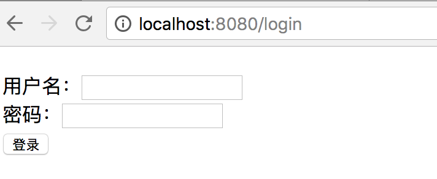
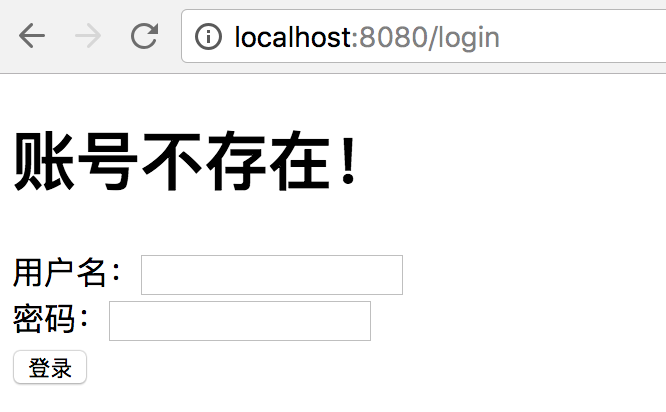
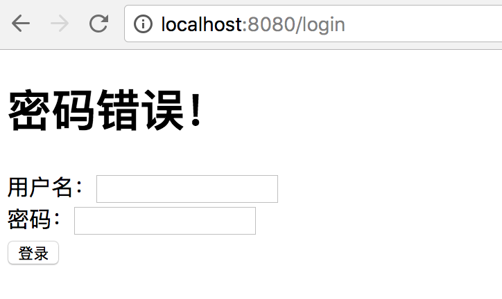
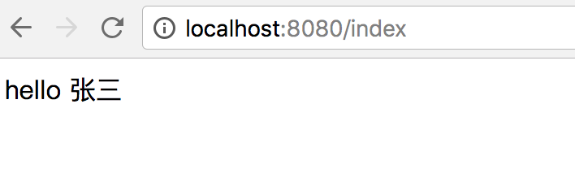
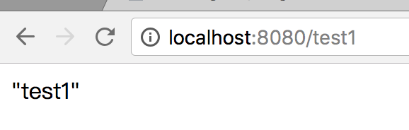
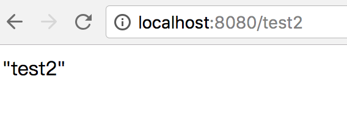
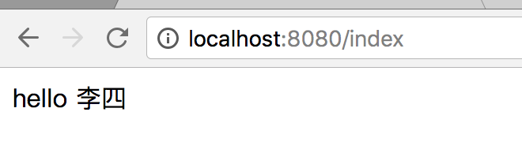
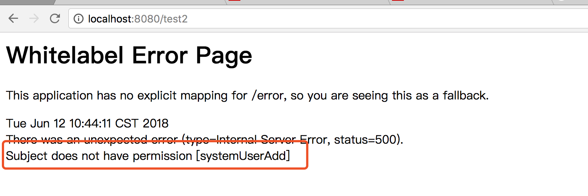

# Spring Boot教程(十六)：Spring Boot集成shiro

`Apache Shiro™`是一个功能强大且易于使用的Java安全框架，可执行身份验证，授权，加密和会话管理。借助Shiro易于理解的API，您可以快速轻松地保护任何应用程序 - 从最小的移动应用程序到最大的Web和企业应用程序。更多内容请查看[官网](https://shiro.apache.org/)


# 一、项目准备

为了方便，这里直接使用[Spring Boot教程(十一)：Spring Boot集成fastjson](springboot_012.md)章节的源码。


# 二、添加依赖

```xml
<!-- shiro -->
<dependency>
    <groupId>org.apache.shiro</groupId>
    <artifactId>shiro-spring-boot-starter</artifactId>
    <version>1.4.0</version>
</dependency>
```

# 三、创建用户资源权限相关的表

sql文件放在db目录下。

```sql

SET NAMES utf8mb4;
SET FOREIGN_KEY_CHECKS = 0;

-- ----------------------------
-- Table structure for sys_permission
-- ----------------------------
DROP TABLE IF EXISTS `sys_permission`;
CREATE TABLE `sys_permission` (
  `id` bigint(20) NOT NULL,
  `parent_id` bigint(20) DEFAULT NULL,
  `res_name` varchar(50) DEFAULT NULL,
  `res_type` varchar(10) DEFAULT NULL,
  `permission` varchar(20) DEFAULT NULL,
  `url` varchar(100) DEFAULT NULL,
  PRIMARY KEY (`id`)
) ENGINE=InnoDB DEFAULT CHARSET=utf8;

-- ----------------------------
-- Records of sys_permission
-- ----------------------------
BEGIN;
INSERT INTO `sys_permission` VALUES (1, NULL, '系统管理', 'menu', 'system', NULL);
INSERT INTO `sys_permission` VALUES (2, 1, '用户管理', 'menu', 'systemUserList', '/user/userList');
INSERT INTO `sys_permission` VALUES (3, 1, '角色管理', 'menu', 'systemRole', '/roles');
INSERT INTO `sys_permission` VALUES (4, NULL, '一级菜单', 'menu', 'menu', NULL);
INSERT INTO `sys_permission` VALUES (5, 4, '二级菜单1', 'menu', 'menuXxx', '/xxx');
INSERT INTO `sys_permission` VALUES (6, 4, '二级菜单2', 'menu', 'menuYyy', '/yyy');
INSERT INTO `sys_permission` VALUES (7, 2, '用户添加', 'button', 'systemUserAdd', NULL);
COMMIT;

-- ----------------------------
-- Table structure for sys_role
-- ----------------------------
DROP TABLE IF EXISTS `sys_role`;
CREATE TABLE `sys_role` (
  `role_id` bigint(20) NOT NULL,
  `role_name` varchar(30) DEFAULT NULL,
  PRIMARY KEY (`role_id`)
) ENGINE=InnoDB DEFAULT CHARSET=utf8;

-- ----------------------------
-- Records of sys_role
-- ----------------------------
BEGIN;
INSERT INTO `sys_role` VALUES (1, '用户管理员');
INSERT INTO `sys_role` VALUES (2, '普通用户');
COMMIT;

-- ----------------------------
-- Table structure for sys_role_permission
-- ----------------------------
DROP TABLE IF EXISTS `sys_role_permission`;
CREATE TABLE `sys_role_permission` (
  `role_id` bigint(20) NOT NULL,
  `permission_id` bigint(20) NOT NULL,
  PRIMARY KEY (`role_id`,`permission_id`)
) ENGINE=InnoDB DEFAULT CHARSET=utf8;

-- ----------------------------
-- Records of sys_role_permission
-- ----------------------------
BEGIN;
INSERT INTO `sys_role_permission` VALUES (1, 1);
INSERT INTO `sys_role_permission` VALUES (1, 2);
INSERT INTO `sys_role_permission` VALUES (1, 3);
INSERT INTO `sys_role_permission` VALUES (1, 4);
INSERT INTO `sys_role_permission` VALUES (1, 5);
INSERT INTO `sys_role_permission` VALUES (1, 6);
INSERT INTO `sys_role_permission` VALUES (1, 7);
INSERT INTO `sys_role_permission` VALUES (2, 1);
INSERT INTO `sys_role_permission` VALUES (2, 2);
COMMIT;

-- ----------------------------
-- Table structure for sys_user
-- ----------------------------
DROP TABLE IF EXISTS `sys_user`;
CREATE TABLE `sys_user` (
  `user_id` bigint(20) NOT NULL,
  `user_name` varchar(50) DEFAULT NULL,
  `full_name` varchar(20) DEFAULT NULL,
  `password` varchar(32) DEFAULT NULL,
  `salt` varchar(20) DEFAULT NULL,
  PRIMARY KEY (`user_id`)
) ENGINE=InnoDB DEFAULT CHARSET=utf8;

-- ----------------------------
-- Records of sys_user
-- ----------------------------
BEGIN;
INSERT INTO `sys_user` VALUES (1, 'zhangsan', '张三', '86fb1b048301461bdc71d021d2af3f97', '1');
INSERT INTO `sys_user` VALUES (2, 'lisi', '李四', 'c9351e5cf153923f052ebe1462cca93a', '2');
INSERT INTO `sys_user` VALUES (3, 'wangwu', '王五', '92262648696eae1b0a321cbd2b238bf2', '3');
INSERT INTO `sys_user` VALUES (4, 'user1', '用户1', '86fb1b048301461bdc71d021d2af3f97', '4');
INSERT INTO `sys_user` VALUES (5, 'user2', '用户2', '86fb1b048301461bdc71d021d2af3f97', '5');
INSERT INTO `sys_user` VALUES (6, 'user3', '用户3', '86fb1b048301461bdc71d021d2af3f97', '5');
INSERT INTO `sys_user` VALUES (7, 'user4', '用户4', '86fb1b048301461bdc71d021d2af3f97', '4');
INSERT INTO `sys_user` VALUES (8, 'user5', '用户5', '86fb1b048301461bdc71d021d2af3f97', '4');
INSERT INTO `sys_user` VALUES (9, 'user6', '用户6', '86fb1b048301461bdc71d021d2af3f97', '4');
INSERT INTO `sys_user` VALUES (10, 'user7', '用户7', '86fb1b048301461bdc71d021d2af3f97', '4');
INSERT INTO `sys_user` VALUES (11, 'user8', '用户8', '86fb1b048301461bdc71d021d2af3f97', '4');
INSERT INTO `sys_user` VALUES (12, 'user9', '用户9', '86fb1b048301461bdc71d021d2af3f97', '4');
INSERT INTO `sys_user` VALUES (13, 'user10', '用户10', '86fb1b048301461bdc71d021d2af3f97', '4');
COMMIT;

-- ----------------------------
-- Table structure for sys_user_role
-- ----------------------------
DROP TABLE IF EXISTS `sys_user_role`;
CREATE TABLE `sys_user_role` (
  `user_id` bigint(20) NOT NULL,
  `role_id` bigint(20) NOT NULL,
  PRIMARY KEY (`user_id`,`role_id`)
) ENGINE=InnoDB DEFAULT CHARSET=utf8;

-- ----------------------------
-- Records of sys_user_role
-- ----------------------------
BEGIN;
INSERT INTO `sys_user_role` VALUES (1, 1);
INSERT INTO `sys_user_role` VALUES (2, 2);
COMMIT;

SET FOREIGN_KEY_CHECKS = 1;

```

# 四、创建或反向生成实体

生成`SysPermission`和`SysUser`等实体,并在实体的id字段上添加`@Id`注解(Mapper4使用，不了解的可以查看之前的文章)，为了节省篇幅，这里不贴出实体内容了，具体内容参考文章底部配套源码。


# 五、创建service、dao等

这些内容和shiro没有关系，普通的查询，只是用来提供数据，所以不详细说了，参考源码。

根据用户id查询权限字符串(给shiro提供授权数据信息)：

```
List<String> SysPermissionService.selectPermissionByUserId(long userId)
```
根据用户名查询用户信息(给shiro提供登录认证信息)：

```
SysUser SysUserService findByUserName(String userName)
```

# 六、创建自定义Realm

创建一个`UserRealm`类，并继承`AuthorizingRealm`，用来给`shiro`注入认证信息和授权信息。


```
package com.songguoliang.springboot.shiro;

import com.songguoliang.springboot.entity.SysUser;
import com.songguoliang.springboot.service.SysPermissionService;
import com.songguoliang.springboot.service.SysUserService;
import org.apache.shiro.authc.AuthenticationException;
import org.apache.shiro.authc.AuthenticationInfo;
import org.apache.shiro.authc.AuthenticationToken;
import org.apache.shiro.authc.SimpleAuthenticationInfo;
import org.apache.shiro.authc.UsernamePasswordToken;
import org.apache.shiro.authz.AuthorizationInfo;
import org.apache.shiro.authz.SimpleAuthorizationInfo;
import org.apache.shiro.realm.AuthorizingRealm;
import org.apache.shiro.subject.PrincipalCollection;
import org.apache.shiro.util.ByteSource;
import org.slf4j.Logger;
import org.slf4j.LoggerFactory;
import org.springframework.beans.factory.annotation.Autowired;

import java.util.List;

/**
 * @Description
 * @Author sgl
 * @Date 2018-06-11 17:07
 */
public class UserRealm extends AuthorizingRealm {
    private static final Logger LOGGER = LoggerFactory.getLogger(UserRealm.class);
    @Autowired
    private SysUserService sysUserService;

    @Autowired
    private SysPermissionService sysPermissionService;

    /**
     * 授权
     *
     * @param principals
     * @return
     */
    @Override
    protected AuthorizationInfo doGetAuthorizationInfo(PrincipalCollection principals) {
        SysUser sysUser = (SysUser) principals.getPrimaryPrincipal();
        List<String> sysPermissions = sysPermissionService.selectPermissionByUserId(sysUser.getUserId());

        SimpleAuthorizationInfo info = new SimpleAuthorizationInfo();
        info.addStringPermissions(sysPermissions);
        LOGGER.info("doGetAuthorizationInfo");
        return info;
    }

    /**
     * 认证
     *
     * @param authenticationToken
     * @return
     * @throws AuthenticationException
     */
    @Override
    protected AuthenticationInfo doGetAuthenticationInfo(AuthenticationToken authenticationToken) throws AuthenticationException {
        UsernamePasswordToken token = (UsernamePasswordToken) authenticationToken;
        SysUser sysUser = sysUserService.findByUserName(token.getUsername());
        if (sysUser == null) {
            return null;
        }
        LOGGER.info("doGetAuthenticationInfo");
        return new SimpleAuthenticationInfo(sysUser, sysUser.getPassword().toCharArray(), ByteSource.Util.bytes(sysUser.getSalt()), getName());
    }
}

```

# 七、创建ShiroConfig配置类

```
package com.songguoliang.springboot.shiro;

import org.apache.shiro.authc.credential.HashedCredentialsMatcher;
import org.apache.shiro.mgt.SecurityManager;
import org.apache.shiro.spring.web.ShiroFilterFactoryBean;
import org.apache.shiro.web.mgt.DefaultWebSecurityManager;
import org.springframework.context.annotation.Bean;
import org.springframework.context.annotation.Configuration;

import java.util.LinkedHashMap;
import java.util.Map;

/**
 * @Description
 * @Author sgl
 * @Date 2018-06-11 17:23
 */
@Configuration
public class ShiroConfig {

    /**
     * 凭证匹配器
     *
     * @return
     */
    @Bean
    public HashedCredentialsMatcher hashedCredentialsMatcher() {
        HashedCredentialsMatcher hashedCredentialsMatcher = new HashedCredentialsMatcher();
        //md5加密1次
        hashedCredentialsMatcher.setHashAlgorithmName("md5");
        hashedCredentialsMatcher.setHashIterations(1);
        return hashedCredentialsMatcher;
    }

    /**
     * 自定义realm
     *
     * @return
     */
    @Bean
    public UserRealm userRealm() {
        UserRealm userRealm = new UserRealm();
        userRealm.setCredentialsMatcher(hashedCredentialsMatcher());
        return userRealm;
    }

    /**
     * 安全管理器
     * 注：使用shiro-spring-boot-starter 1.4时，返回类型是SecurityManager会报错，直接引用shiro-spring则不报错
     *
     * @return
     */
    @Bean
    public DefaultWebSecurityManager securityManager() {
        DefaultWebSecurityManager securityManager = new DefaultWebSecurityManager();
        securityManager.setRealm(userRealm());
        return securityManager;
    }


    /**
     * 设置过滤规则
     *
     * @param securityManager
     * @return
     */
    @Bean
    public ShiroFilterFactoryBean shiroFilter(SecurityManager securityManager) {
        ShiroFilterFactoryBean shiroFilterFactoryBean = new ShiroFilterFactoryBean();
        shiroFilterFactoryBean.setSecurityManager(securityManager);
        shiroFilterFactoryBean.setLoginUrl("/login");
        shiroFilterFactoryBean.setSuccessUrl("/");
        shiroFilterFactoryBean.setUnauthorizedUrl("/unauth");
        
        //注意此处使用的是LinkedHashMap，是有顺序的，shiro会按从上到下的顺序匹配验证，匹配了就不再继续验证
        //所以上面的url要苛刻，宽松的url要放在下面，尤其是"/**"要放到最下面，如果放前面的话其后的验证规则就没作用了。
        Map<String, String> filterChainDefinitionMap = new LinkedHashMap<>();
        filterChainDefinitionMap.put("/static/**", "anon");
        filterChainDefinitionMap.put("/login", "anon");
        filterChainDefinitionMap.put("/captcha.jpg", "anon");
        filterChainDefinitionMap.put("/favicon.ico", "anon");
        filterChainDefinitionMap.put("/**", "authc");

        shiroFilterFactoryBean.setFilterChainDefinitionMap(filterChainDefinitionMap);
        return shiroFilterFactoryBean;
    }


}

```


# 八、创建登录Action

登录时，我们只需要将用户输入的用户名和密码交给shiro即可，用户名和密码是否正确完全交给shiro来验证。


```
package com.songguoliang.springboot.controller;

import org.apache.shiro.SecurityUtils;
import org.apache.shiro.authc.DisabledAccountException;
import org.apache.shiro.authc.IncorrectCredentialsException;
import org.apache.shiro.authc.UnknownAccountException;
import org.apache.shiro.authc.UsernamePasswordToken;
import org.apache.shiro.subject.Subject;
import org.springframework.stereotype.Controller;
import org.springframework.ui.Model;
import org.springframework.web.bind.annotation.GetMapping;
import org.springframework.web.bind.annotation.PostMapping;
import org.springframework.web.bind.annotation.RequestMapping;

/**
 * @Description
 * @Author sgl
 * @Date 2018-06-11 17:51
 */
@Controller
public class LoginController {

    /**
     * get请求，登录页面跳转
     * @return
     */
    @GetMapping("/login")
    public String login() {
        //如果已经认证通过，直接跳转到首页
        if (SecurityUtils.getSubject().isAuthenticated()) {
            return "redirect:/index";
        }
        return "login";
    }

    /**
     * post表单提交，登录
     * @param username
     * @param password
     * @param model
     * @return
     */
    @PostMapping("/login")
    public Object login(String username, String password, Model model) {
        Subject user = SecurityUtils.getSubject();
        UsernamePasswordToken token = new UsernamePasswordToken(username, password);
        try {
            //shiro帮我们匹配密码什么的，我们只需要把东西传给它，它会根据我们在UserRealm里认证方法设置的来验证
            user.login(token);
            return "redirect:/index";
        } catch (UnknownAccountException e) {
            //账号不存在和下面密码错误一般都合并为一个账号或密码错误，这样可以增加暴力破解难度
            model.addAttribute("message", "账号不存在！");
        } catch (DisabledAccountException e) {
            model.addAttribute("message", "账号未启用！");
        } catch (IncorrectCredentialsException e) {
            model.addAttribute("message", "密码错误！");
        } catch (Throwable e) {
            model.addAttribute("message", "未知错误！");
        }
        return "login";
    }

    /**
     * 退出
     * @return
     */
    @RequestMapping("/logout")
    public String logout() {
        SecurityUtils.getSubject().logout();
        return "login";
    }
}


```

# 九、修改IndexController

```
package com.songguoliang.springboot.controller;

import com.songguoliang.springboot.entity.SysUser;
import org.apache.shiro.SecurityUtils;
import org.springframework.stereotype.Controller;
import org.springframework.ui.Model;
import org.springframework.web.bind.annotation.RequestMapping;

/**
 * @Description
 * @Author sgl
 * @Date 2018-05-08 10:47
 */
@Controller
public class IndexController {

	/**
     * 首页，并将登录用户的全名返回前台
     * @param model
     * @return
     */
    @RequestMapping(value = {"/", "/index"})
    public String index(Model model) {
        SysUser sysUser = (SysUser) SecurityUtils.getSubject().getPrincipal();
        model.addAttribute("userName", sysUser.getFullName());
        return "index";
    }
}

```

# 十、修改TestController

在TestController里添加以下两个方法，用来验证shiro权限注解，

```
/**
 * 没有加shiro权限注解
 * @return
 */
@RequestMapping("/test1")
public String test1(){
    return "test1";
}

/**
 * 添加了shiro权限注解，需要用户有"systemUserAdd"权限
 * @return
 */
@RequestMapping("/test2")
@RequiresPermissions("systemUserAdd")
public String test2(){
    return "test2";
}

```

# 十一、添加页面

由于代码里已经集成了jsp支持，所以这里延续用jsp，你也可以用其他的方法。

在webapp/WEB-INF/jsp下创建login.jsp

```
<%@ page contentType="text/html;charset=UTF-8" pageEncoding="UTF-8" %>
<!DOCTYPE html>
<html>
<head>
    <meta http-equiv="Content-type" content="text/html; charset=UTF-8">
    <meta http-equiv="X-UA-Compatible" content="IE=edge,chrome=1"/>
    <title>登录</title>
</head>
<body>
<h1>${message}</h1>
<form method="post" action="/login">
    用户名：<input name="username"><br>
    密码：<input name="password"><br>
    <input type="submit" value="登录">
</form>

</body>
</html>
```

# 十二、通过springboot的maven插件启动服务进行测试

1、输入`http://localhost:8080/`页面不再直接显示首页，而是跳转到了登录页面：



2、用户名、密码随意输入，比如`test/test`，点击登录，页面显示账号不存在。



3、用户名输入`zhangsan`，密码随意输入，提示密码错误



4、输入`zhangsan/zhangsan`,登录验证通过，直接跳转到首页

)


下面继续进行测试权限注解：

5、当前张三已经登录，访问`http://localhost:8080/test1`,显示test1



6、然后再访问`http://localhost:8080/test2`,显示test2



7、退出张三用户的登录,访问`http://localhost:8080/logout`,此时再访问`http://localhost:8080/test1`或`http://localhost:8080/test2`都会跳转到登录页面。

8、再用`lisi/lisi`登录，首页如下：



9、然后访问`http://localhost:8080/test1`,同样可以显示test1


10、然后访问`http://localhost:8080/test2`,由于lisi没有systemUserAdd权限，所以他不能访问，显示如下(这是默认的错误处理页面，实际项目中一般都会自定义错误处理)：




<br><br><br><br>

源码： 
[github](https://github.com/itinypocket/spring-boot-study/tree/master/spring-boot-shiro) 
[码云](https://gitee.com/itinypocket/spring-boot-study/tree/master/spring-boot-shiro)


