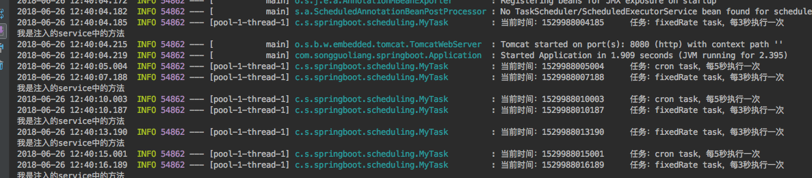

# Spring Boot教程(二十)：Spring Boot使用String Task定时任务


# 一、JAVA常见的几种定时任务比较

- Timer：jdk自带的java.util.Timer类，这个类允许你调度一个java.util.TimerTask任务。使用这种方式可以让程序按照某一个频度执行，但不能在指定时间运行，一般很少使用，主要用于非Spring项目简单的任务调度。
- Spring Task：Spring3.0以后自带的Task，可以将它看成一个轻量级的Quartz，使用起来比Quartz简单很多，在Spring应用中，直接使用@Scheduled注解即可，但对于集群项目比较麻烦，需要避免集群环境下任务被多次调用的情况，而且不能动态维护，任务启动以后不能修改、暂停等。
- Quartz：好用的第三方任务调度工具，可谓是企业级应用系统任务调度工具的老大。可以方便的在集群下使用、可以动态增加、删除、暂停等维护任务，动态定时任务更加灵活。而且，和Spring Boot集成非常方便。


# 二、在Spring Boot中使用Spring Task定时任务

## 1、首先创建一个简单的Spring Boot项目

pom.xml如下：

```
<?xml version="1.0" encoding="UTF-8"?>
<project xmlns="http://maven.apache.org/POM/4.0.0"
         xmlns:xsi="http://www.w3.org/2001/XMLSchema-instance"
         xsi:schemaLocation="http://maven.apache.org/POM/4.0.0 http://maven.apache.org/xsd/maven-4.0.0.xsd">
    <modelVersion>4.0.0</modelVersion>

    <groupId>com.songguoliang</groupId>
    <artifactId>spring-boot-scheduling</artifactId>
    <version>1.0-SNAPSHOT</version>

    <name>spring-boot-scheduling</name>
    <description>Spring Boot教程(二十)：Spring Boot使用String Task定时任务</description>

    <!-- Spring Boot启动器父类 -->
    <parent>
        <groupId>org.springframework.boot</groupId>
        <artifactId>spring-boot-starter-parent</artifactId>
        <version>2.0.1.RELEASE</version>
        <relativePath/> <!-- lookup parent from repository -->
    </parent>

    <properties>
        <project.build.sourceEncoding>UTF-8</project.build.sourceEncoding>
        <project.reporting.outputEncoding>UTF-8</project.reporting.outputEncoding>
        <java.version>1.8</java.version>
    </properties>

    <dependencies>
        <!-- Spring Boot web启动器 -->
        <dependency>
            <groupId>org.springframework.boot</groupId>
            <artifactId>spring-boot-starter-web</artifactId>
        </dependency>

    </dependencies>

    <build>
        <plugins>
            <plugin>
                <groupId>org.springframework.boot</groupId>
                <artifactId>spring-boot-maven-plugin</artifactId>
            </plugin>
        </plugins>
    </build>

    
</project>
```

## 2、通过注解开启任务调度功能

在启动类上添加`@EnableScheduling`注解，开启Spring的定时任务功能

```
package com.songguoliang.springboot;

import org.springframework.boot.SpringApplication;
import org.springframework.boot.autoconfigure.SpringBootApplication;
import org.springframework.scheduling.annotation.EnableScheduling;

/**
 * @Description
 * @Author sgl
 * @Date 2018-06-26 10:02
 */
@EnableScheduling
@SpringBootApplication
public class Application {
    public static void main(String[] args) {
        SpringApplication.run(Application.class);
    }
}

```

## 3、配置定时任务

创建一个类来配置任务，该类需要添加`@Component`注解以便能被Spring管理，我创建了一个MyTask类：

```
package com.songguoliang.springboot.scheduling;

import com.songguoliang.springboot.service.UserService;
import org.slf4j.Logger;
import org.slf4j.LoggerFactory;
import org.springframework.beans.factory.annotation.Autowired;
import org.springframework.scheduling.annotation.Scheduled;
import org.springframework.stereotype.Component;

/**
 * @Description
 * @Author sgl
 * @Date 2018-06-26 10:07
 */
@Component
public class MyTask {
    private static final Logger LOGGER = LoggerFactory.getLogger(MyTask.class);

    private static final long SECOND = 1000;

    /**
     * 注入service
     */
    @Autowired
    private UserService userService;

    /**
     * 固定间隔3秒，可以引用变量
     * fixedRate：以每次开始时间作为测量，间隔固定时间
     */
    @Scheduled(fixedRate = 3 * SECOND)
    public void task1() {
        LOGGER.info("当前时间：{}\t\t任务：fixedRate task，每3秒执行一次", System.currentTimeMillis());
        userService.test();
    }

    /**
     * 固定延迟3秒，从前一次任务结束开始计算，延迟3秒执行
     */
    @Scheduled(fixedDelay = 3000)
    public void task3(){
        //do something
    }

    /**
     * cron表达式，每5秒执行
     */
    @Scheduled(cron = "*/5 * * * * ?")
    public void task2() {
        LOGGER.info("当前时间：{}\t\t任务：cron task，每5秒执行一次", System.currentTimeMillis());
    }


}

```

**请注意，计划任务的方法的返回值应该为void，并且不能有任何参数。如果该方法需要与应用程序上下文中的其他对象进行交互，那么通常会通过依赖注入来提供这些对象。**

为了展示调用service，这里创建了一个UserService:

```
package com.songguoliang.springboot.service;

import org.springframework.stereotype.Service;

/**
 * @Description
 * @Author sgl
 * @Date 2018-06-26 11:52
 */
@Service
public class UserService {

    public void test(){
        System.out.println("我是注入的service中的方法");
    }

}

```

## 4、测试

启动服务，控制台可以看到如下信息：




# 三、cron表达式

注：下面内容主要参考Quartz的文档，对于Spring Task基本都适用。

cron表达式是由7个域组成的字符串，它们描述了任务计划的各个细节，这些域用空格分隔，每个域代表的含义如下：

1. Seconds(秒)
1. Minutes(分)
1. Hours(时)
1. Day-of-Month(日)
1. Month(月)
1. Day-of-Week(星期)
1. Year(可选字段)(年)

示例：`0 0 10 ？ * WED`表示`每个星期三的10:00:00`

|表达式| {秒} | {分} | {时} | {日} | {月} |{周}|{年}(可选)|
|-----|------|------|-----|------|------|---|---------|
|允许值| 0~59 | 0~59 |0~23 | 1~31 |1~12<br/>JAN~DEC|1~7<br/>SUN~SAT|1970~2099|
|特殊值|`, - * /`|`, - * /`|`, - * /`|`, - * /`<br/>` ? L W C`|`, - * /`|`, - * /`<br/>`? L C #`|`, - * /`|

说明：下面描述中，XX域则表示cron表达式相应的位置，如`秒`域表示cron中第1个值，`日`域则表示cron表达式第4个值等等。

- 月份简称：`JAN`，`FEB`，`MAR`，`APR`，`MAY`，`JUN`，`JUL`，`AUG`，`SEP`，`OCT`，`NOV`和`DEC`。
- 星期简称：`SUN`，`MON`，`TUE`，`WED`，`THU`，`FRI`和`SAT`。其中，1表示`SUN`。
- `,`：用来分割在域上指定的多个值。如：`MON,WED,FRI`在星期域里表示`星期一、星期三、星期五`。
- `/`：用于指定增量值。如分钟上使用`0/15`，表示从零开始，每隔15分钟，等价于`0,15,30,45`。如分钟上使用`3/15`，表示从第3分钟开始，每隔15分钟，等价于`3,18,33,48`，`x/y`中x表示开始值，y表示步长。
- `*`：表示匹配该域的任意值。如秒上使用*表示每秒触发一次。
- `-`：表示指定一个范围，如分钟域上`10-13`，表示`10分、11分、12分、13分`。
- `?`：表示不关心的域，可用于`日`和`周`两个域上，主要用来解决`日`和`周`两个域的冲突。和`*`类似，区别在于`*`关心域，只是域的值可以任意,`?`则表示对该域不关心，不需要看该域的内容，直接忽略。
- `L`：表示最后，是单词`last`的首字母，可用于`日`和`周`两个域上，用在`日`和`周`上含义不同：
	- `日`域上表示月份中日期的最后一天，如一月的第31天、非闰年二月的第28天。
	- `周`域上单独使用仅表示`7`或`SAT`，即仅表示周六。但是如果跟在其他值后，如`6L`或`FRIL`则表示该月中最后一个星期五。
	- `L`还可以指定偏移量，如`日`域指定`L-3`，表示该月倒数第3天。当使用`L`时其值尽量不要指定列表或范围，以免令人困惑。
- `W`：用于`日`域，表示距离指定日最近的星期几(周一至周五中的一个)，如：`日`域上值为`15W`则表示距离本月第15日最近的工作日。
- `#`：用于`周`域，表示该月的第n个星期几。如：`周`域值为`6#3`或`FRI#3`表示该月的第3个星期五。


# 四、常用表达式示例

- `0 0 10，14，16 * * ？`每天上午10点、下午两点、下午4点整触发
- `0 0/30 9-17 * * ?` 每天朝九晚五内每隔半小时触发
- `0 15 10 ? * MON-FRI` 周一至周五的上午10:15触发
- `0 0/5 * * * ?`每5分钟触发
- `10 0/5 * * * ？`每隔5分钟的第10秒触发(即10:00:10、10:05:10、10:10:10等)
- `30 * * * * ?` 每半分钟触发
- `30 10 * * * ?` 每小时的10分30秒触发
- `30 10 1 * * ?` 每天1点10分30秒触发
- `30 10 1 20 * ?` 每月20号1点10分30秒触发
- `30 10 1 20 10 ? *` 每年10月20号1点10分30秒触发
- `30 10 1 20 10 ? 2011` 2011年10月20号1点10分30秒触发
- `30 10 1 ? 10 * 2011` 2011年10月每天1点10分30秒触发
- `30 10 1 ? 10 SUN 2011` 2011年10月每周日1点10分30秒触发
- `15,30,45 * * * * ?` 每15秒，30秒，45秒时触发
- `15-45 * * * * ?` 15到45秒内，每秒都触发
- `15/5 * * * * ?` 每分钟的每15秒开始触发，每隔5秒触发一次
- `15-30/5 * * * * ?` 每分钟的15秒到30秒之间开始触发，每隔5秒触发一次
- `0 0/3 * * * ?` 每小时的第0分0秒开始，每三分钟触发一次
- `0 15 10 ? * MON-FRI` 星期一到星期五的10点15分0秒触发
- `0 15 10 L * ?` 每个月最后一天的10点15分0秒触发
- `0 15 10 LW * ?` 每个月最后一个工作日的10点15分0秒触发
- `0 15 10 ? * 5L` 每个月最后一个星期四的10点15分0秒触发
- `0 15 10 ? * 5#3` 每个月第三周的星期四的10点15分0秒触发


<br><br><br><br>

源码： 
[github](https://github.com/itinypocket/spring-boot-study/tree/master/spring-boot-scheduling) 
[码云](https://gitee.com/itinypocket/spring-boot-study/tree/master/spring-boot-scheduling)


