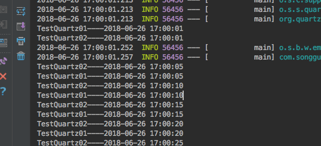

# Spring Boot教程(二十一)：Spring Boot使用Quartz定时任务


上一篇讲了Spring自带的任务调度，这篇介绍Quartz任务调度。Quartz可以将信息放到内存里，也可以放到数据库中，下面分别介绍这两种方式。

# 一、采用内存方式使用Quartz

## 1、新建一个简单的Spring Boot项目

pom.xml内容如下：

```
<?xml version="1.0" encoding="UTF-8"?>
<project xmlns="http://maven.apache.org/POM/4.0.0"
         xmlns:xsi="http://www.w3.org/2001/XMLSchema-instance"
         xsi:schemaLocation="http://maven.apache.org/POM/4.0.0 http://maven.apache.org/xsd/maven-4.0.0.xsd">
    <modelVersion>4.0.0</modelVersion>

    <groupId>com.songguoliang</groupId>
    <artifactId>spring-boot-quartz</artifactId>
    <version>1.0-SNAPSHOT</version>

    <name>spring-boot-quartz</name>
    <description>Spring Boot教程(二十一)：Spring Boot使用Quartz定时任务</description>

    <!-- Spring Boot启动器父类 -->
    <parent>
        <groupId>org.springframework.boot</groupId>
        <artifactId>spring-boot-starter-parent</artifactId>
        <version>2.0.1.RELEASE</version>
        <relativePath/> <!-- lookup parent from repository -->
    </parent>

    <properties>
        <project.build.sourceEncoding>UTF-8</project.build.sourceEncoding>
        <project.reporting.outputEncoding>UTF-8</project.reporting.outputEncoding>
        <java.version>1.8</java.version>
    </properties>

    <dependencies>
        <!-- Spring Boot web启动器 -->
        <dependency>
            <groupId>org.springframework.boot</groupId>
            <artifactId>spring-boot-starter-web</artifactId>
        </dependency>
        <!-- quartz -->
        <dependency>
            <groupId>org.springframework.boot</groupId>
            <artifactId>spring-boot-starter-quartz</artifactId>
        </dependency>

    </dependencies>

    <build>
        <plugins>
            <plugin>
                <groupId>org.springframework.boot</groupId>
                <artifactId>spring-boot-maven-plugin</artifactId>
            </plugin>
        </plugins>
    </build>
</project>
```

## 2、创建任务

这里为了展示固定间隔和cron表达式，创建了两个任务

TestTask1内容如下：

```
package com.songguoliang.springboot.quartz;

import org.quartz.JobExecutionContext;
import org.quartz.JobExecutionException;
import org.springframework.scheduling.quartz.QuartzJobBean;

import java.text.SimpleDateFormat;
import java.util.Date;

/**
 * @Description
 * @Author sgl
 * @Date 2018-06-26 16:43
 */
public class TestTask1 extends QuartzJobBean{

    @Override
    protected void executeInternal(JobExecutionContext context) throws JobExecutionException {
        SimpleDateFormat sdf=new SimpleDateFormat("yyyy-MM-dd HH:mm:ss");
        System.out.println("TestQuartz01----" + sdf.format(new Date()));
    }
}

```

TestTask2内容如下：

```
package com.songguoliang.springboot.quartz;

import org.quartz.JobExecutionContext;
import org.quartz.JobExecutionException;
import org.springframework.scheduling.quartz.QuartzJobBean;

import java.text.SimpleDateFormat;
import java.util.Date;

/**
 * @Description
 * @Author sgl
 * @Date 2018-06-26 16:52
 */
public class TestTask2 extends QuartzJobBean{
    @Override
    protected void executeInternal(JobExecutionContext context) throws JobExecutionException {
        SimpleDateFormat sdf=new SimpleDateFormat("yyyy-MM-dd HH:mm:ss");
        System.out.println("TestQuartz02----" + sdf.format(new Date()));
    }
}

```

## 3、配置定时任务

创建一个`QuartzConfig`类，并添加`@Configuration`注解，内容如下：

```
package com.songguoliang.springboot.quartz;

import org.quartz.CronScheduleBuilder;
import org.quartz.JobBuilder;
import org.quartz.JobDetail;
import org.quartz.SimpleScheduleBuilder;
import org.quartz.Trigger;
import org.quartz.TriggerBuilder;
import org.springframework.context.annotation.Bean;
import org.springframework.context.annotation.Configuration;

/**
 * @Description
 * @Author sgl
 * @Date 2018-06-26 16:45
 */
@Configuration
public class QuartzConfig {

    @Bean
    public JobDetail testQuartz1() {
        return JobBuilder.newJob(TestTask1.class).withIdentity("testTask1").storeDurably().build();
    }

    @Bean
    public Trigger testQuartzTrigger1() {
        //5秒执行一次
        SimpleScheduleBuilder scheduleBuilder = SimpleScheduleBuilder.simpleSchedule()
                .withIntervalInSeconds(5)
                .repeatForever();
        return TriggerBuilder.newTrigger().forJob(testQuartz1())
                .withIdentity("testTask1")
                .withSchedule(scheduleBuilder)
                .build();
    }

    @Bean
    public JobDetail testQuartz2() {
        return JobBuilder.newJob(TestTask2.class).withIdentity("testTask2").storeDurably().build();
    }

    @Bean
    public Trigger testQuartzTrigger2() {
        //cron方式，每隔5秒执行一次
        return TriggerBuilder.newTrigger().forJob(testQuartz2())
                .withIdentity("testTask2")
                .withSchedule(CronScheduleBuilder.cronSchedule("*/5 * * * * ?"))
                .build();
    }


}

```

testTask1使用的固定间隔方式，testTask2使用的是cron表达式方式。

## 4、测试

启动服务，控制台打印出如下信息：




<br>

源码： 
[github](https://github.com/itinypocket/spring-boot-study/tree/master/spring-boot-quartz) 
[码云](https://gitee.com/itinypocket/spring-boot-study/tree/master/spring-boot-quartz)

<br><br>


# 二、Quartz相关信息存数据库的方式

由于要将信息存放到数据库，所以要和数据库打交道了，可以直接在上面代码的基础上集成mybatis等和数据库打交道的功能，这里为了方便，我直接使用[Spring Boot教程(九)：Spring Boot集成Mapper4](springboot_010.md)的源码，在此基础上添加Quartz相关内容。

## 1、添加Quartz依赖

```
<!-- quartz -->
<dependency>
    <groupId>org.springframework.boot</groupId>
    <artifactId>spring-boot-starter-quartz</artifactId>
</dependency>
```

## 2、创建和配置定时任务

由于在上面内存方式时已经贴过代码，这里不再重复，直接将之前`com.songguoliang.springboot.quartz`包复制过来，详细内容参考源码。

## 3、添加schema

注：如果不需要每次启动服务重新初始化创建Quartz相关的表则不需要放schema文件，只需要事先在数据库中创建好相关表即可，直接进入下一步。

在resources目录下创建schema文件夹，并将mysql的脚本文件放到该目录下，如果使用的不是mysql数据库，可以直接在Quartz官网下载(下载文件docs/dbTables文件内)，下载地址:[http://d2zwv9pap9ylyd.cloudfront.net/quartz-2.2.3-distribution.tar.gz](http://d2zwv9pap9ylyd.cloudfront.net/quartz-2.2.3-distribution.tar.gz)

schema文件下下tables_mysql.sql内容如下：

```sql

DROP TABLE IF EXISTS QRTZ_FIRED_TRIGGERS;
DROP TABLE IF EXISTS QRTZ_PAUSED_TRIGGER_GRPS;
DROP TABLE IF EXISTS QRTZ_SCHEDULER_STATE;
DROP TABLE IF EXISTS QRTZ_LOCKS;
DROP TABLE IF EXISTS QRTZ_SIMPLE_TRIGGERS;
DROP TABLE IF EXISTS QRTZ_SIMPROP_TRIGGERS;
DROP TABLE IF EXISTS QRTZ_CRON_TRIGGERS;
DROP TABLE IF EXISTS QRTZ_BLOB_TRIGGERS;
DROP TABLE IF EXISTS QRTZ_TRIGGERS;
DROP TABLE IF EXISTS QRTZ_JOB_DETAILS;
DROP TABLE IF EXISTS QRTZ_CALENDARS;


CREATE TABLE QRTZ_JOB_DETAILS
  (
    SCHED_NAME VARCHAR(120) NOT NULL,
    JOB_NAME  VARCHAR(200) NOT NULL,
    JOB_GROUP VARCHAR(200) NOT NULL,
    DESCRIPTION VARCHAR(250) NULL,
    JOB_CLASS_NAME   VARCHAR(250) NOT NULL,
    IS_DURABLE VARCHAR(1) NOT NULL,
    IS_NONCONCURRENT VARCHAR(1) NOT NULL,
    IS_UPDATE_DATA VARCHAR(1) NOT NULL,
    REQUESTS_RECOVERY VARCHAR(1) NOT NULL,
    JOB_DATA BLOB NULL,
    PRIMARY KEY (SCHED_NAME,JOB_NAME,JOB_GROUP)
);

CREATE TABLE QRTZ_TRIGGERS
  (
    SCHED_NAME VARCHAR(120) NOT NULL,
    TRIGGER_NAME VARCHAR(200) NOT NULL,
    TRIGGER_GROUP VARCHAR(200) NOT NULL,
    JOB_NAME  VARCHAR(200) NOT NULL,
    JOB_GROUP VARCHAR(200) NOT NULL,
    DESCRIPTION VARCHAR(250) NULL,
    NEXT_FIRE_TIME BIGINT(13) NULL,
    PREV_FIRE_TIME BIGINT(13) NULL,
    PRIORITY INTEGER NULL,
    TRIGGER_STATE VARCHAR(16) NOT NULL,
    TRIGGER_TYPE VARCHAR(8) NOT NULL,
    START_TIME BIGINT(13) NOT NULL,
    END_TIME BIGINT(13) NULL,
    CALENDAR_NAME VARCHAR(200) NULL,
    MISFIRE_INSTR SMALLINT(2) NULL,
    JOB_DATA BLOB NULL,
    PRIMARY KEY (SCHED_NAME,TRIGGER_NAME,TRIGGER_GROUP),
    FOREIGN KEY (SCHED_NAME,JOB_NAME,JOB_GROUP)
        REFERENCES QRTZ_JOB_DETAILS(SCHED_NAME,JOB_NAME,JOB_GROUP)
);

CREATE TABLE QRTZ_SIMPLE_TRIGGERS
  (
    SCHED_NAME VARCHAR(120) NOT NULL,
    TRIGGER_NAME VARCHAR(200) NOT NULL,
    TRIGGER_GROUP VARCHAR(200) NOT NULL,
    REPEAT_COUNT BIGINT(7) NOT NULL,
    REPEAT_INTERVAL BIGINT(12) NOT NULL,
    TIMES_TRIGGERED BIGINT(10) NOT NULL,
    PRIMARY KEY (SCHED_NAME,TRIGGER_NAME,TRIGGER_GROUP),
    FOREIGN KEY (SCHED_NAME,TRIGGER_NAME,TRIGGER_GROUP)
        REFERENCES QRTZ_TRIGGERS(SCHED_NAME,TRIGGER_NAME,TRIGGER_GROUP)
);

CREATE TABLE QRTZ_CRON_TRIGGERS
  (
    SCHED_NAME VARCHAR(120) NOT NULL,
    TRIGGER_NAME VARCHAR(200) NOT NULL,
    TRIGGER_GROUP VARCHAR(200) NOT NULL,
    CRON_EXPRESSION VARCHAR(200) NOT NULL,
    TIME_ZONE_ID VARCHAR(80),
    PRIMARY KEY (SCHED_NAME,TRIGGER_NAME,TRIGGER_GROUP),
    FOREIGN KEY (SCHED_NAME,TRIGGER_NAME,TRIGGER_GROUP)
        REFERENCES QRTZ_TRIGGERS(SCHED_NAME,TRIGGER_NAME,TRIGGER_GROUP)
);

CREATE TABLE QRTZ_SIMPROP_TRIGGERS
  (          
    SCHED_NAME VARCHAR(120) NOT NULL,
    TRIGGER_NAME VARCHAR(200) NOT NULL,
    TRIGGER_GROUP VARCHAR(200) NOT NULL,
    STR_PROP_1 VARCHAR(512) NULL,
    STR_PROP_2 VARCHAR(512) NULL,
    STR_PROP_3 VARCHAR(512) NULL,
    INT_PROP_1 INT NULL,
    INT_PROP_2 INT NULL,
    LONG_PROP_1 BIGINT NULL,
    LONG_PROP_2 BIGINT NULL,
    DEC_PROP_1 NUMERIC(13,4) NULL,
    DEC_PROP_2 NUMERIC(13,4) NULL,
    BOOL_PROP_1 VARCHAR(1) NULL,
    BOOL_PROP_2 VARCHAR(1) NULL,
    PRIMARY KEY (SCHED_NAME,TRIGGER_NAME,TRIGGER_GROUP),
    FOREIGN KEY (SCHED_NAME,TRIGGER_NAME,TRIGGER_GROUP) 
    REFERENCES QRTZ_TRIGGERS(SCHED_NAME,TRIGGER_NAME,TRIGGER_GROUP)
);

CREATE TABLE QRTZ_BLOB_TRIGGERS
  (
    SCHED_NAME VARCHAR(120) NOT NULL,
    TRIGGER_NAME VARCHAR(200) NOT NULL,
    TRIGGER_GROUP VARCHAR(200) NOT NULL,
    BLOB_DATA BLOB NULL,
    PRIMARY KEY (SCHED_NAME,TRIGGER_NAME,TRIGGER_GROUP),
    FOREIGN KEY (SCHED_NAME,TRIGGER_NAME,TRIGGER_GROUP)
        REFERENCES QRTZ_TRIGGERS(SCHED_NAME,TRIGGER_NAME,TRIGGER_GROUP)
);

CREATE TABLE QRTZ_CALENDARS
  (
    SCHED_NAME VARCHAR(120) NOT NULL,
    CALENDAR_NAME  VARCHAR(200) NOT NULL,
    CALENDAR BLOB NOT NULL,
    PRIMARY KEY (SCHED_NAME,CALENDAR_NAME)
);

CREATE TABLE QRTZ_PAUSED_TRIGGER_GRPS
  (
    SCHED_NAME VARCHAR(120) NOT NULL,
    TRIGGER_GROUP  VARCHAR(200) NOT NULL, 
    PRIMARY KEY (SCHED_NAME,TRIGGER_GROUP)
);

CREATE TABLE QRTZ_FIRED_TRIGGERS
  (
    SCHED_NAME VARCHAR(120) NOT NULL,
    ENTRY_ID VARCHAR(95) NOT NULL,
    TRIGGER_NAME VARCHAR(200) NOT NULL,
    TRIGGER_GROUP VARCHAR(200) NOT NULL,
    INSTANCE_NAME VARCHAR(200) NOT NULL,
    FIRED_TIME BIGINT(13) NOT NULL,
    SCHED_TIME BIGINT(13) NOT NULL,
    PRIORITY INTEGER NOT NULL,
    STATE VARCHAR(16) NOT NULL,
    JOB_NAME VARCHAR(200) NULL,
    JOB_GROUP VARCHAR(200) NULL,
    IS_NONCONCURRENT VARCHAR(1) NULL,
    REQUESTS_RECOVERY VARCHAR(1) NULL,
    PRIMARY KEY (SCHED_NAME,ENTRY_ID)
);

CREATE TABLE QRTZ_SCHEDULER_STATE
  (
    SCHED_NAME VARCHAR(120) NOT NULL,
    INSTANCE_NAME VARCHAR(200) NOT NULL,
    LAST_CHECKIN_TIME BIGINT(13) NOT NULL,
    CHECKIN_INTERVAL BIGINT(13) NOT NULL,
    PRIMARY KEY (SCHED_NAME,INSTANCE_NAME)
);

CREATE TABLE QRTZ_LOCKS
  (
    SCHED_NAME VARCHAR(120) NOT NULL,
    LOCK_NAME  VARCHAR(40) NOT NULL, 
    PRIMARY KEY (SCHED_NAME,LOCK_NAME)
);


commit;

```


## 4、在application.properties里添加相应配置

在application.properties配置文件里添加如下配置，指定jobStoreType为jdbc即可：

```
## quartz
# 采用数据库存储方式
spring.quartz.job-store-type=jdbc
```
如果你没有事先创建好Quartz相关表，而是想每次服务启动时自动初始化，需要添加如下内容：

```
# 每次启动重新初始化数据库中Quartz相关的表，如果不需要每次启动服务都重新创建表，下面两项可以不配置，事先在数据库中创建好Quartz相关的表
spring.quartz.jdbc.initialize-schema=always
# 初始化脚本
spring.quartz.jdbc.schema=classpath:schema/tables_mysql.sql
```

## 5、测试

启动服务，结果和上面内存方式是一样的，数据库存储方式和内存存储方式主要区别就是在配置文件中将Spring Boot默认的`spring.quartz.job-store-type=memory`改为`spring.quartz.job-store-type=jdbc`。


<br><br><br><br>

源码： 
[github](https://github.com/itinypocket/spring-boot-study/tree/master/spring-boot-quartz-db) 
[码云](https://gitee.com/itinypocket/spring-boot-study/tree/master/spring-boot-quartz-db)


