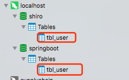
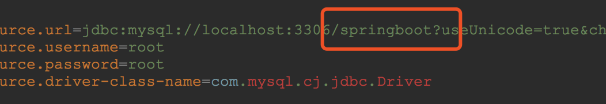
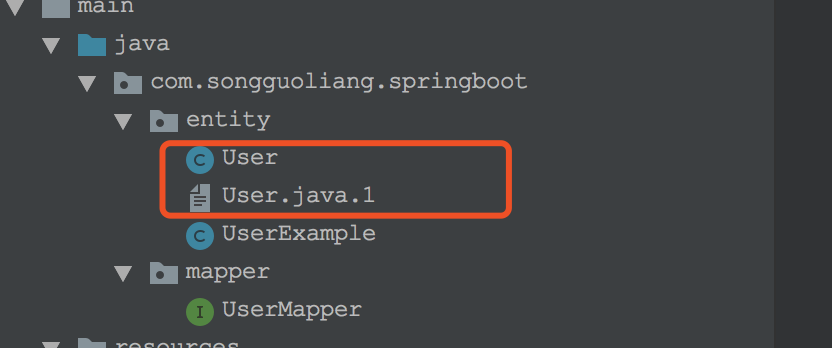
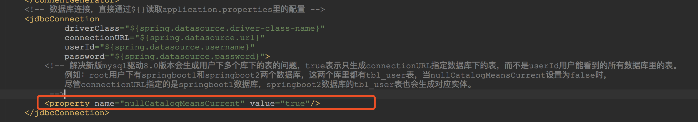

# 解决mybatis generator使用新版mysql驱动8.0版本时会生成用户下多个库里的表的问题

MyBatis Generator的使用介绍请参照：[Spring Boot教程(十五)：Spring Boot集成mybatis generator自动生成代码插件](https://blog.csdn.net/gnail_oug/article/details/80404870)

# 一、问题描述

当使用mysql驱动8.0新版本时，如果jdbcConnection的userId属性指定的用户下有多个数据库，并且每个数据库里都有tbl_user表，那么生成实体时默认会把这几个库里的tbl_user表都生成实体。如下图，root用户下有shiro和springboot两个数据库，里面都有tbl_user表，尽管在jdbc连接里指定了springboot，shiro数据库里的`tbl_user`表还是会被生成实体，`overwrite`为`false`时会出现后缀为`.1`、`.2`结尾的实体。

# 二、解决方法

解决方法非常简单，只需将jdbcConnection的nullCatalogMeansCurrent属性设置为true即可。如下图：

参考资料：http://www.mybatis.org/generator/usage/mysql.html

    

源码： 
[github](https://github.com/itinypocket/spring-boot-study/tree/master/spring-boot-mybatis-generator-mysql) 
[码云](https://gitee.com/itinypocket/spring-boot-study/tree/master/spring-boot-mybatis-generator-mysql)

    

