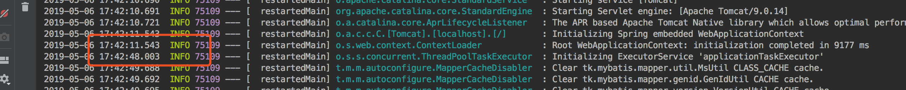
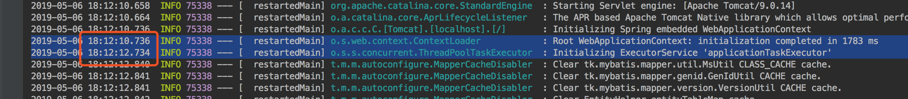
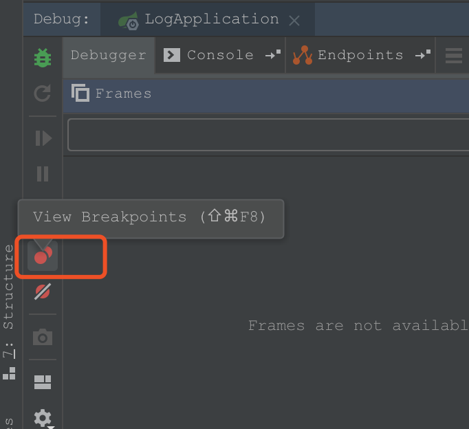
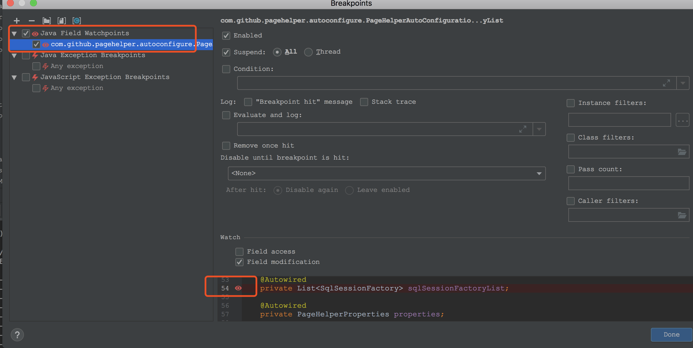

# idea使用debug模式启动非常慢

# 一、问题描述

环境：macOS High Sierra 版本10.13.6
idea:2019.1

最近在使用idea的debug模式启动springboot项目时，在`Root WebApplicationContext: initialization completed in 2532 ms`之后会卡着一段时间才输出`Initializing ExecutorService 'applicationTaskExecutor'`，以前是没有卡的，而且使用普通模式启动也不会在这里卡一段时间。

如下图：
debug模式启动：



普通模式启动：



# 二、解决方法

网上查出来的大多都是说修改hosts文件，不过我的改了也不适用。

```
127.0.0.1		localhost		<你的hostname>.local
::1				localhost		<你的hostname>.local
```

你的hostname可以通过`hostname`命令查看：

```
$ hostname
```

后来发现，之前在调试代码时不注意给属性加了断点，**去掉idea的Breakpoints里的java field watchpoints**就不卡了，如下：

点击debug窗口左侧的两个小红点打开`Breakpoints`对话框，不勾选或移除`Java Field WatchPoints`，然后再用debug模式启动正常了。



 
我遇到的这个问题是由于断点的原因，你的可能并非如此，上面这两种改hosts和去掉断点的方式仅供参考。

