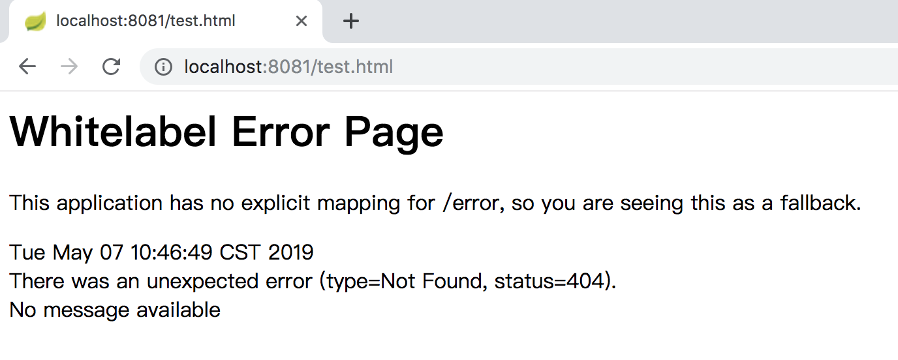
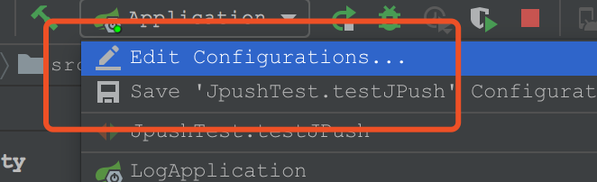
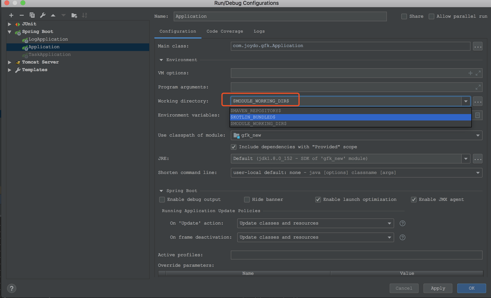
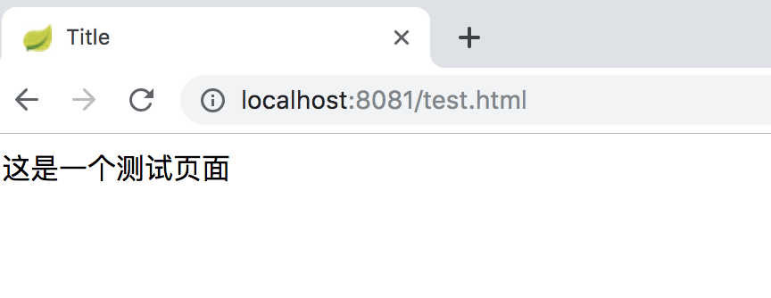

# idea通过main方法启动springboot项目找不到页面

# 一、问题描述

idea:2019.1
springboot:v2.1.2.RELEASE
OS:macOS High Sierra 10.13.6

通过在idea里配置的Tomcat启动能访问到页面，而直接通过main方法启动，控制台没有报错，正常启动，但访问不到页面，后台action能正常访问。如下：

# 二、参考解决方法

点击main方法启动类的Edit Configurations按钮打开`Run/Debug Configurations`对话框，左侧点击对应的启动类，右侧`Configutation`里的`Enviroment`，点击Working directory后面的下拉框会有几个选项，选择`$MODULE_WORKING_DIR$`选项，点击OK保存修改。如下图：

然后重新启动即可，访问页面如下图：

