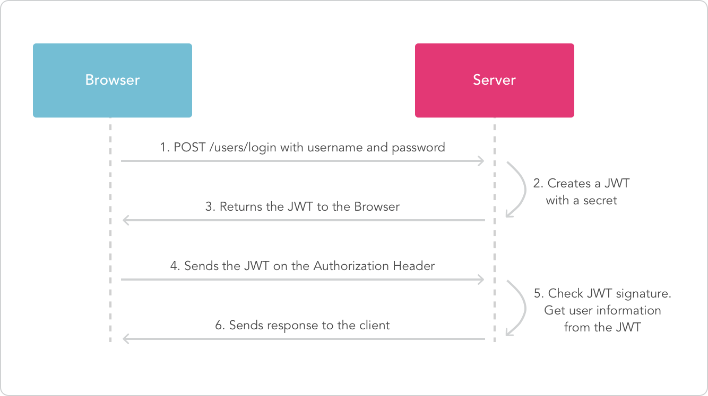
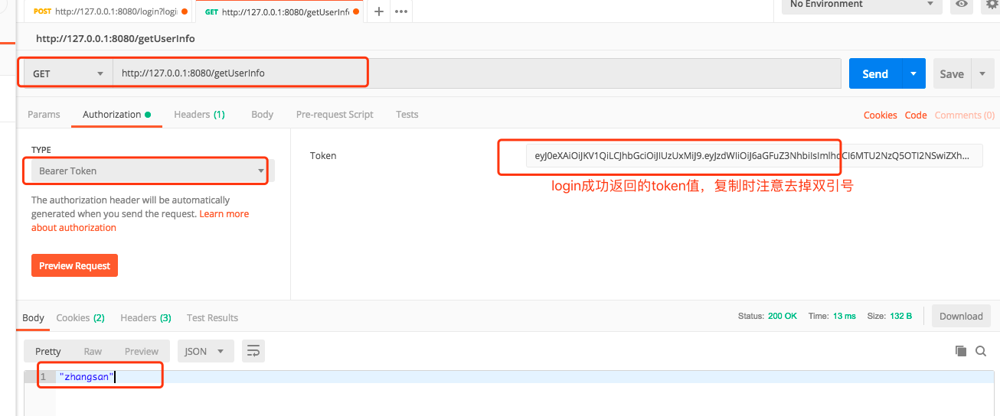

# Spring Boot教程(二十二)：Spring Boot集成JWT

本例代码是在[Spring Boot教程(十一)：Spring Boot集成fastjson](springboot_012.md)基础上修改，修改内容主要包括：

1. pom.xml文件里依赖版本进行了升级
1. 去掉了jsp集成

注：不需要参考第十一讲源码，直接查看本文底部源码即可。

# 一、简介

JSON Web Token（JWT）是为了在网络应用环境间传递声明而执行的一种基于JSON的开放标准（(RFC 7519)，它定义了一种紧凑（Compact）且自包含（Self-contained）的方式，用于在各方之间以JSON对象安全传输信息。 这些信息可以通过数字签名进行验证和信任。 可以使用秘密（使用HMAC算法）或使用RSA的公钥/私钥对对JWT进行签名。JWT的声明一般被用来在身份提供者和服务提供者间传递被认证的用户身份信息，以便于从资源服务器获取资源，也可以增加一些额外的其它业务逻辑所必须的声明信息，该token也可直接被用于认证，也可被加密。是目前最流行的跨域认证解决方案。

# 二、jwt使用流程简述




浏览器发请求时，在请求头里加入Authorization，并加上Bearer标注：
```
// Authorization: Bearer <token>
getToken('api/user/1', {
  headers: {
    'Authorization': 'Bearer ' + token
  }
})
```

# 三、集成JWT

1、添加依赖

```$xslt
<!-- jwt -->
<dependency>
    <groupId>io.jsonwebtoken</groupId>
    <artifactId>jjwt</artifactId>
    <version>0.9.1</version>
</dependency>
```

2、在application.properties里添加配置参数

```
# jwt
jwt.secret=12345
jwt.expire=60
```

3、创建Jwt配置

```java
package com.songguoliang.springboot.configuration;

import io.jsonwebtoken.Claims;
import io.jsonwebtoken.Jwts;
import io.jsonwebtoken.SignatureAlgorithm;
import org.slf4j.Logger;
import org.slf4j.LoggerFactory;
import org.springframework.beans.factory.annotation.Value;
import org.springframework.context.annotation.Configuration;
import org.springframework.util.StringUtils;

import java.util.Date;

/**
 * @author itinypocket
 * @date 2019-09-03 12:56
 */
@Configuration
public class JwtToken {
	private static Logger logger = LoggerFactory.getLogger(JwtToken.class);
	/**
	 * 秘钥
	 */
	@Value("${jwt.secret}")
	private String secret;

	/**
	 * 过期时间(秒)
	 */
	@Value("${jwt.expire}")
	private long expire;


	/**
	 * 生成jwt token
	 */
	public String generateToken(String loginName) {
		Date nowDate = new Date();
		Date expireDate = new Date(nowDate.getTime() + expire * 1000);
		return Jwts.builder()
				.setHeaderParam("typ", "JWT")
				.setSubject(loginName)
				.setIssuedAt(nowDate)
				.setExpiration(expireDate)
				.signWith(SignatureAlgorithm.HS512, secret)
				.compact();
	}

	public Claims getClaimByToken(String token) {
		if (StringUtils.isEmpty(token)) {
			return null;
		}

		String[] header = token.split("Bearer");
		token = header[1];
		try {
			return Jwts.parser()
					.setSigningKey(secret)
					.parseClaimsJws(token)
					.getBody();
		} catch (Exception e) {
			logger.debug("validate is token error ", e);
			return null;
		}
	}

	/**
	 * token是否过期
	 *
	 * @return true：过期
	 */
	public static boolean isTokenExpired(Date expiration) {
		return expiration.before(new Date());
	}
}


```

4、创建测试控制类

```java
package com.songguoliang.springboot.controller;

import com.songguoliang.springboot.configuration.JwtToken;
import io.jsonwebtoken.Claims;
import org.springframework.beans.factory.annotation.Autowired;
import org.springframework.web.bind.annotation.GetMapping;
import org.springframework.web.bind.annotation.PostMapping;
import org.springframework.web.bind.annotation.RequestHeader;
import org.springframework.web.bind.annotation.RestController;

import javax.security.sasl.AuthenticationException;
import java.util.Arrays;
import java.util.List;

/**
 * @author itinypocket
 * @date 2019-09-03 12:59
 */
@RestController
public class JwtController {
	@Autowired
	private JwtToken jwtToken;

	@PostMapping("/login")
	public String login(String loginName, String password) {
		// 1. 根据登录名从数据库查询用户,验证用户名和密码，为了简单演示jwt，这里假设验证通过
		// Todo
		// 2. 验证成功生成token，并返回
		String token = jwtToken.generateToken(loginName);
		return token;
	}

	@GetMapping("/getUserInfo")
	public String getUserInfo(@RequestHeader("Authorization") String authHeader) throws AuthenticationException {
		// 黑名单token
		List<String> blacklistToken = Arrays.asList("禁止访问的token");
		Claims claims = jwtToken.getClaimByToken(authHeader);
		if (claims == null || JwtToken.isTokenExpired(claims.getExpiration()) || blacklistToken.contains(authHeader)) {
			throw new AuthenticationException("token 不可用");
		}

		String userId = claims.getSubject();
		// 根据用户id获取接口数据返回接口
		return userId;
	}
}

```

5、启动服务，使用postman工具进行测试，post方式访问登录url进行登录认证，获取token，如下图：


6、通过token访问项目其他接口，如下：




<br><br><br><br>

源码： 
[github](https://github.com/itinypocket/spring-boot-study/tree/master/spring-boot-jwt) 
[码云](https://gitee.com/itinypocket/spring-boot-study/tree/master/spring-boot-jwt)


