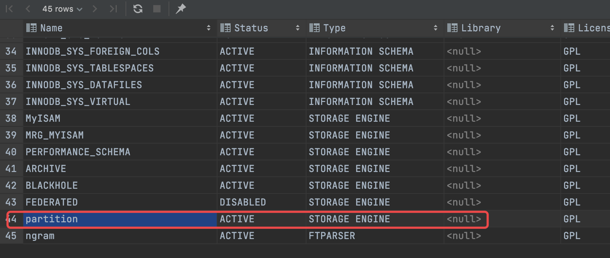
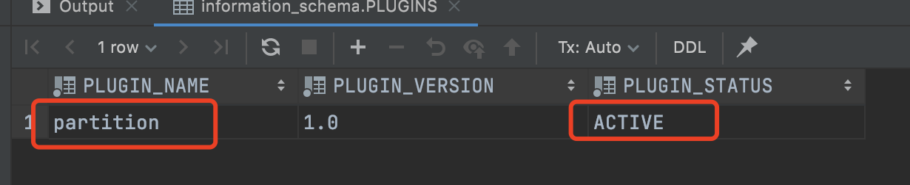

# MySQL 5.7 表分区技术(一)：分区简介


# 一、什么是分区

分区就是通过设置一定的逻辑，跨文件系统分配单个表的多个部分，但是就访问数据库而言，逻辑上还是只有一个表。简单的说，分区就是MySQL服务器将一个表的数据按一定规则分成N部分分别存放，但对程序访问数据库表读写数据而言，还是一个表。打个比方，你有一个书架，上面有5层，你可以将你的100本书分成几类，每类放在不同的层上。假如某天你想看《颈椎病康复指南》这本书了，就要去书架上查找(相当于程序访问数据库服务器的表)，由你事先已经将数分类分开存放在不同的层上了，那你只需要在特定的一层或几层上查找即可而无需关注其他不相关的层(相当于服务器接收到查询请求后读取对应的分区获取数据)。


# 二、为什么要对表进行分区

通过前面找书的例子，你会发现你能更快的从书架上找到你想要的书。没错，这就是分区的优点之一，能更快的查找到需要的数据。

试想一下，你现在才是从100本中找书，假如让你从一百万本书中找，并且这一百万本书都堆在一起，此时的你是不是要崩溃。这也就是为什么图书馆分不同的楼层、不同的房间、不同的数据(相当于不同的服务器硬盘、分区等)，而且还给书都编了编号(相当于索引)。

为了改善大表的可伸缩性、可管理性及提高数据库效率，MySQL也引入了分区技术。MySQL从5.1版本开始支持分区功能。

分区的优点：

- 与单个磁盘或文件系统分区相比，分区功能使在同一个表中存储更多的数据。
- 通过删除仅包含该数据的分区(或多个分区)，可以很容易地从分区表中删除失去其用途的那些数据。相反，在某些情况下，通过添加一个或多个分区来专门存储该数据，可以极大地促进添加新数据的过程。
- 一些查询可以得到极大的优化。在扫描操作中，如果MySQL的优化器知道哪个分区中才包含特定查询中的数据，它就能直接去扫描那些分区的数据，而不用浪费很多时间扫描不需要的地方了，即自动排除任何不需要的分区。这种排除不匹配分区(以及它们包含的任何行)的能力成为分区修剪。
- 通过跨多个磁盘甚至服务器来分散数据查询，来获得更大的查询吞吐量。
- MySQL还支持显示分区选择，如`select * from t partition (p0,p1) where c<5`，该查询只会在分区p0、p1上查找而忽略其他任何分区，当您已经知道要检查的一个或多个分区时，这种指定分区的方式可以大大加快查询速度。


# 三、基本分区类型

MySQL基本分区类型包括4种，如下：

- `RANGE`分区：定义一些区间规则，将属于一个给定区间的数据存放一起，放同一个分区里。需要注意的是这些区间不能重叠，比如一个数据如果能匹配到两个分区，那MySQL服务器就不知道要将数据放入哪个分区了。同样如果一个数据没有匹配到任何一个分区，MySQL服务器同样不知道要怎么存放数据了。
- `LIST`分区：类似于按`RANGE`分区，区别在于`LIST`分区是基于列值匹配一个离散值集中的某个值来进行选择。也就是说`RANGE`分区每个分区是一个范围，比如年龄小于30岁的放一个分区，年龄大于30岁的放一个分区。而`LIST`分区是指定的值，比如上海市、浙江省的数据放一个分区，北京市、天津市放一个分区。`LIST`分区是每个分区知道要存放哪些值的数据，适用于字典值之类的。
- `HASH`分区：基于用户定义的表达式的返回值来进行选择的分区，该表达式对将要插入到表中的这些行的列值进行计算。是对要存放的数据进行哈希计算，决定存放到哪个分区。
- `KEY`分区：类似于`HASH`分区，只是只提供了一个或多个要评估的列，并且MySQL服务器提供了自己的散列函数。这些列可以包含非整数值，因为MySQL提供的散列函数保证整数结果，而不管列数据类型如何。`LINEAR KEY`也可以使用此类型的扩展名。


# 四、变体分区类型

- `RANGE COLUMNS`分区：`RANGE`分区演变而来，支持使用多个列来定义分区范围。
- `LIST COLUMNS`分区：`LIST`分区演变而来，能够使用整数类型以外的类型的列进行分区，以及使用多个列作为分区键。
- `LINEAR HASH`分区：`HASH`分区演变而来，不同之处在于`LINEAR HASH`分区使用线性二次幂算法，而常规`HASH`分区使用散列函数值的模数。
- `LINEAR KEY`分区：与`LINEAR HASH`分区类似，使用线性二次幂算法。
- 子分区：也称为复合分区，是对分区表中每个分区的进一步划分。


# 五、查看数据库服务器是否支持分区

- 方式1：直接通过`show plugins`命令查看，看是否包含名称为`partiton`且状态为`ACTIVE`的数据，有就表示支持分区。

```mysql
# 查看数据库是否支持分区
show plugins
```



- 方式2：通过查询`information_schema.PLUGINS`表数据。

```mysql
select PLUGIN_NAME,PLUGIN_VERSION,PLUGIN_STATUS 
from information_schema.PLUGINS 
where PLUGIN_TYPE='STORAGE ENGINE' and PLUGIN_NAME='partition';
```




# 六、分区的一些其他事项

- 分区名**不区分**大小写。

- 分区使您能够根据设置的规则将表的内容分布在文件系统中，实际上，**表的不同部分是作为单独的表存储在不同的位置**。用户设置数据划分规则称为**分区函数**，在mysql中可以是模数、对一组范围或值列表的简单匹配、内部散列函数或线性散列函数等。

- 表的每个唯一键(包括主键)的部分或全部必须包含在分区表达式中，如下面这种不能分区，因为键`pk`和`uk`没有共同的列，所以没有可用于分区表达式的列。在这种情况下，可能的解决方法主要有3中：

  - 将`name`列添加到表的主键
  - 将`id`列添加到`uk`
  - 或者完全删除唯一键

  ```mysql
  CREATE TABLE tnp (
      id INT NOT NULL AUTO_INCREMENT,
      ref BIGINT NOT NULL,
      name VARCHAR(255),
      PRIMARY KEY pk (id),
      UNIQUE KEY uk (name)
  );
  ```

- 数据库分区的一个非常常见的用途是按日期进行分区隔离数据。按`KEY`分区时，可以使用`DATE`、`TIME`或者`DATETIME`列作为分区列，而无需对列值进行任何修改。如：

  ```mysql
  CREATE TABLE members (
      firstname VARCHAR(25) NOT NULL,
      lastname VARCHAR(25) NOT NULL,
      username VARCHAR(16) NOT NULL,
      email VARCHAR(35),
      joined DATE NOT NULL
  )
  PARTITION BY KEY(joined)
  PARTITIONS 6;
  ```

  按其他分区类型分区时，需要一个分区表达式来生成一个`整数值`或`null`，如果想使用`RANGE`、`LIST`、`HASH`方式基于日期进行分区，可以简单地操作`DATE`、`TIME`、或`DATETIME`列，并返回一个`整数值`或`null`。如：

  ```mysql
  CREATE TABLE members (
      firstname VARCHAR(25) NOT NULL,
      lastname VARCHAR(25) NOT NULL,
      username VARCHAR(16) NOT NULL,
      email VARCHAR(35),
      joined DATE NOT NULL
  )
  PARTITION BY RANGE( YEAR(joined) ) (
      PARTITION p0 VALUES LESS THAN (1960),
      PARTITION p1 VALUES LESS THAN (1970),
      PARTITION p2 VALUES LESS THAN (1980),
      PARTITION p3 VALUES LESS THAN (1990),
      PARTITION p4 VALUES LESS THAN MAXVALUE
  );
  ```

- `INFORMATION_SCHEMA`数据库中的`PARTITIONS`表提供有关分区和分区表的信息。
- MySQL分区对`TO_DAYS()`、`YEAR()`、`TO_SECONDS()`函数进行了优化，当然，你也可以使用其他日期和时间函数返回一个**整数或null**，如`WEEKDAY()`、`DAYOFYEAR()`或`MONTH()`等。
- 在 MySQL 5.7 中，**同一个分区表**的所有分区必须使用**相同**的存储引擎；例如，同一个表，您不能同时`MyISAM`用于一个分区和`InnoDB`另一个分区。但是，同一 MySQL 服务器甚至同一数据库中的不同分区表(即不同的表)可以使用不同的存储引擎。
- 分区适用于一个表的所有数据和索引，不能只对数据进行分区而不对索引进行分区，反之亦然，也不能只对表的一部分进行分区。
- 水平分区：一个表的不同行分配给不同的物理分区。MySQL 5.7 不支持垂直分区，即将表的不同列分配给不同的物理分区。
- Oracle提供的MySQL 5.7社区二进制文件包括分区支持，如果你想从源代码编译MySQL5.7，要启用分区，必须使用`-DWITH_PARTITION_STORAGE_ENGINE`选项配置进行构建。如果构建的二进制文件包括分区支持，则安装后自动开启分区功能，无需通过`my.cnf`配置参数等方式开启。如果想要禁用分区支持，可以使用`--skip-partition`参数启动MySQL服务器。


