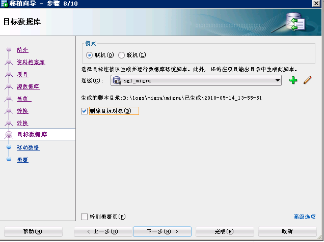

# 使用Oracle SQL Developer迁移sql server至Oracle数据库

Oracle SQL Developer是Oracle官方出品的数据库管理工具。官方下载地址:[Oracle SQL Developer](http://www.oracle.com/technetwork/cn/developer-tools/sql-developer/downloads/index.html)，官方入门：
[官方入门](http://www.oracle.com/technetwork/cn/topics/omwb-getstarted-092755-zhs.html#repo)

本文介绍使用Oracle SQL Developer迁移sql server至Oracle数据库，步骤如下：

# 一、配置第三方连接

要使用 JDBC 访问数据库，必须使用 JDBC 驱动程序。默认情况下，Oracle SQL Developer是不包含sqlserver的数据库连接的。可从 Database 供应商（通常免费提供 JDBC 驱动程序下载）获取该驱动程序。

jTDS 驱动程序可从 http://jtds.sourceforge.net/ 获得。使用版本 1.2（可从 [http://sourceforge.net/project/showfiles.php?group_id=33291](http://sourceforge.net/project/showfiles.php?group_id=33291) 下载）
或者直接在maven仓库下载：[JTDS](http://mvnrepository.com/artifact/net.sourceforge.jtds/jtds)

1、打开Oracle SQL Developer，选择`工具-->首选项-->数据库-->第三方 JDBC 驱动程序`，如下：


2、选择添加刚下载的jtds驱动文件：


现在我们再打开添加连接界面，就可以看到`SQLServer`和`Sybase`两个tab页了。


# 二、添加sqlserver数据库连接

点绿色加号添加我们要移植的sqlserver数据库连接：


# 三、创建移植信息库

Oracle SQL Developer迁移数据库，需要一个数据库模式来存储它为移植过程收集和转换的元数据。该信息库包含所需的 37 个表、8 个视图以及主键和索引，还包括触发器和 pl/sql 代码。建议为此配置一个专用数据库模式（尽管这不是必需的）。

要在新模式中为元数据构建信息库，用户需要以下角色和系统特权：

```
RESOURCE
CREATE SESSION
CREATE VIEW
```

1、通过命令行或plsql客户端使用管理员登录oracle，创建迁移用户(为了防止迁移过程中出现权限问题，我们直接赋予DBA权限)：

```
create user sgl_migra identified by sgl_migra;
grant dba to sgl_migra;
```

2、在Oracle SQL Developer里点击绿色加号新增连接


连接用户是我们刚创建的`sgl_migra`用户：


3、右键创建的`sgl_migra`连接，点击`移植资料档案库-->关联移植资料档案库`:


这个可能要一两分钟:


# 四、开始移植

1、右键sqlserver连接里我们要移植的数据库,点击移植到`Oracle...`打开移植向导界面


向导界面如下：


2、点击下一步，进入资料档案库设置界面，选择我们步骤二创建的移植信息库`sgl_migra`,由于我们是新建的`sgl_migra`，截断勾不勾都行。


3、点击下一步设置输出目录


4、点击下一步设置源数据库，选择我们创建的sqlserver连接


5、点击下一步设置转换的数据库


6、设置转换规则，一般默认即可


7、选择要转换的对象


8、设置目标数据库



9、设置移动数据配置


10、概要显示


11、点击完成开始转换


12、移植完成后，Oracle SQL Developer会自动创建一个与sqlserver数据库同名的用户，如我们这里的是`myproject`，密码和用户名相同，我们用`myproject/myproject`在plsql里登录，查询用户表数据可以看到转换后的数据(而且对于在oracle不能使用的表名`user`改成了`user_`)。

