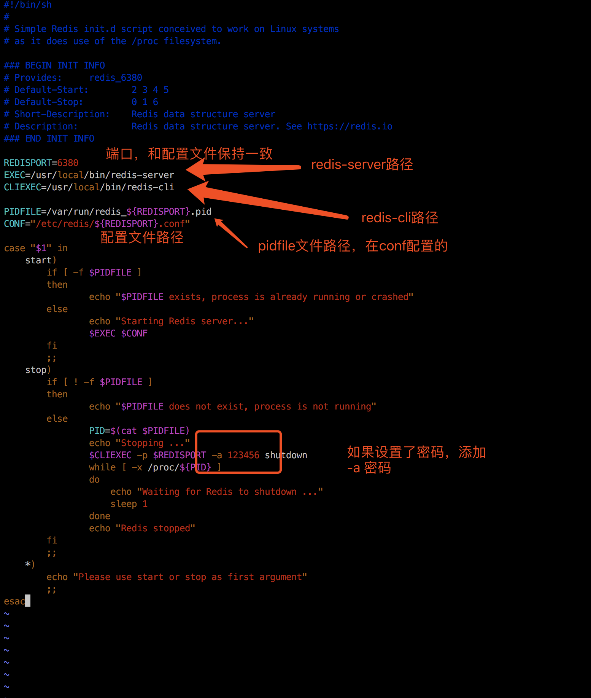

# CentOS7编译安装Redis5及修改端口、设置开机启动

本文内容包括：

- 采用默认路径安装redis 
- 设置redis服务后台运行 
- 设置redis服务开机启动 
- 修改redis端口
- 允许远程登录及设置认证密码


# 环境

系统：CentOS7
Redis:5.0.5

获取最新版本redis：https://redis.io/download，下载Stable版本，当前最新版本5.0.5


# 安装步骤

1、下载redis安装包

```

[root@localhost ~]# cd /usr/local/
[root@localhost local]# wget http://download.redis.io/releases/redis-5.0.5.tar.gz


```

2、解压redis-5.0.5.tar.gz

```

[root@localhost local]# tar -xzf redis-5.0.5.tar.gz


```

3、进入解压的redis目录，通过`make`命令进行编译

```

[root@localhost local]# cd redis-5.0.5/
[root@localhost redis-5.0.5]# make


```

会显示以下信息：

```

    CC lolwut5.o
    LINK redis-server
    INSTALL redis-sentinel
    CC redis-cli.o
    LINK redis-cli
    CC redis-benchmark.o
    LINK redis-benchmark
    INSTALL redis-check-rdb
    INSTALL redis-check-aof

Hint: It's a good idea to run 'make test' ;)

make[1]: 离开目录“/usr/local/redis-5.0.5/src”
[root@localhost redis-5.0.5]#

```

4、执行`make test`验证编译是否成功，很不巧，我的编译错误了，根据错误提示是tcl的问题，所有我要安装一下tcl，你需要根据你的验证结果来处理，直到验证结果提示成功。

```

[root@localhost redis-5.0.5]# make test
cd src && make test
make[1]: 进入目录“/usr/local/redis-5.0.5/src”
    CC Makefile.dep
make[1]: 离开目录“/usr/local/redis-5.0.5/src”
make[1]: 进入目录“/usr/local/redis-5.0.5/src”
You need tcl 8.5 or newer in order to run the Redis test
make[1]: *** [test] 错误 1
make[1]: 离开目录“/usr/local/redis-5.0.5/src”
make: *** [test] 错误 2
[root@localhost redis-5.0.5]#


###### 我的情况是需要安装tcl，所以运行下面命令安装tcl，你需要根据你的结果信息来处理

[root@localhost redis-5.0.5]# yum install -y tcl
......
Running transaction
  正在安装    : 1:tcl-8.5.13-8.el7.x86_64                                                                                                         1/1
  验证中      : 1:tcl-8.5.13-8.el7.x86_64                                                                                                         1/1

已安装:
  tcl.x86_64 1:8.5.13-8.el7

完毕！
[root@localhost redis-5.0.5]#


###### tcl安装完成后重新运行make test


```


5、当make test显示以下结果时，表示编译成功


6、运行make install命令，将命令安装到/usr/local/bin目录

```

[root@localhost redis-5.0.5]# make install
cd src && make install
make[1]: 进入目录“/usr/local/redis-5.0.5/src”

Hint: It's a good idea to run 'make test' ;)

    INSTALL install
    INSTALL install
    INSTALL install
    INSTALL install
    INSTALL install
make[1]: 离开目录“/usr/local/redis-5.0.5/src”
[root@localhost redis-5.0.5]#


```

7、启动服务器

```

[root@localhost redis-5.0.5]# redis-server

```

界面显示如下：


8、另开一个命令窗口，进行测试，可以看到通过redis-cli命令连接redis之后，输入`ping`，redis会为我们返回`PONG`

```

[root@localhost ~]# redis-cli
127.0.0.1:6379> ping
PONG
127.0.0.1:6379>


```

9、停止服务，退出redis-cli，直接在系统命令行下输入`redis-cli shutdown`，前面启动服务的窗口会输出如下图信息：

```

[root@localhost ~]# redis-cli
127.0.0.1:6379> ping
PONG
127.0.0.1:6379> exit
[root@localhost ~]# redis-cli shutdown
[root@localhost ~]#


```


# 设置redis

1、复制redis配置文件，将redis目录的redis.conf复制到/etc/redis目录下，以备使用

```

[root@localhost redis-5.0.5]# cd /etc/
[root@localhost etc]# mkdir redis
[root@localhost etc]# cd redis/
[root@localhost redis]# cp /usr/local/redis-5.0.5/redis.conf /etc/redis/redis.conf


```

1、设置可以远程登录，编辑/etc/redis/redis.conf配置文件，注释掉`bind 127.0.0.1`，如下图：


2、修改默认端口6379，编辑/etc/redis/redis.conf配置文件，找到`port 6379`这一行，修改端口为6380或注释掉添加一行`port 6380`，如下图：


同时修改`pidfile`，将其改为`pidfile /var/run/redis_6380.pid`,修改目的是为了文件名上的端口和实际端口保持一致，方便通过服务方式启动、停止，如后面设置开机启动


3、设置redis服务后台运行，编辑/etc/redis/redis.conf配置文件，将`daemonize`设置为yes，如下图


4、设置访问密码，编辑/etc/redis/redis.conf配置文件，去掉`requirepass`行的注释或添加一行，如下图


注意：由于redis性能非常好，为防止暴力破解，密码需要配置的一大长串足够复杂的字符串，不考虑人是否能记住

5、启动redis并指定配置文件为我们刚才修改的/etc/redis/redis.conf配置文件，服务启动后就不像前面那样输出redis图形信息的内容了。

```

[root@localhost redis]# redis-server /etc/redis/redis.conf
23266:C 05 Jul 2019 13:32:46.618 # oO0OoO0OoO0Oo Redis is starting oO0OoO0OoO0Oo
23266:C 05 Jul 2019 13:32:46.618 # Redis version=5.0.5, bits=64, commit=00000000, modified=0, pid=23266, just started
23266:C 05 Jul 2019 13:32:46.618 # Configuration loaded
[root@localhost redis]#

```


6、测试

``` sh

[root@localhost redis]# redis-cli
Could not connect to Redis at 127.0.0.1:6379: Connection refused
not connected> exit
[root@localhost redis]# redis-cli -p 6380
127.0.0.1:6380>
127.0.0.1:6380> ping
(error) NOAUTH Authentication required.
127.0.0.1:6380> auth 123456
OK
127.0.0.1:6380> ping
PONG
127.0.0.1:6380>

```


由于开启了远程访问，所以在其他电脑上也可以访问，通过`-h`指定ip，`-p`指定端口：

``` sh

[iypocket@smac src] ./redis-cli -p 6380 -h 192.168.16.125
192.168.16.125:6380> ping
(error) NOAUTH Authentication required.
192.168.16.125:6380> auth 123456
OK
192.168.16.125:6380> ping
PONG
192.168.16.125:6380>

```

7、停止服务


# 设置redis开机启动

1、复制开机启动脚本，在redis目录的utils包下，有一个redis_init_script文件，我们复制到/etc/init.d/目录下，并将文件名改为redis。

``` sh

[root@localhost redis]# cp /usr/local/redis-5.0.5/utils/redis_init_script /etc/init.d/redis

```

2、(非必须)修改`/etc/redis/redis.conf`文件名为`/etc/redis/6380.conf`，此修改非必须，不修改的话可以在步骤3指定配置文件路径

```
[root@localhost ~]# mv /etc/redis/redis.conf /etc/redis/6380.conf

```

3、编辑/etc/init.d/redis启动脚本，脚本说明如下：

``` sh

#!/bin/sh
#
# Simple Redis init.d script conceived to work on Linux systems
# as it does use of the /proc filesystem.

### BEGIN INIT INFO
# Provides:     redis_6379
# Default-Start:        2 3 4 5
# Default-Stop:         0 1 6
# Short-Description:    Redis data structure server
# Description:          Redis data structure server. See https://redis.io
### END INIT INFO

# 端口号，设置为在配置文件里设置的端口号
REDISPORT=6380
# redis-server路径，由于我们是make install默认的路径，无需修改
EXEC=/usr/local/bin/redis-server
# redis-cli路径
CLIEXEC=/usr/local/bin/redis-cli

PIDFILE=/var/run/redis_${REDISPORT}.pid
# redis配置文件路径，默认/etc/redis/端口号.conf，所以我们步骤2修改了配置文件的名字，不要步骤2可以直接修改这里路径
CONF="/etc/redis/${REDISPORT}.conf"

case "$1" in
    start)
        if [ -f $PIDFILE ]
        then
                echo "$PIDFILE exists, process is already running or crashed"
        else
                echo "Starting Redis server..."
                $EXEC $CONF
        fi
        ;;
    stop)
        if [ ! -f $PIDFILE ]
        then
                echo "$PIDFILE does not exist, process is not running"
        else
                PID=$(cat $PIDFILE)
                echo "Stopping ..."
                # 因为设置了密码，所以此处增加 -a 密码
                $CLIEXEC -p $REDISPORT -a 123456 shutdown
                while [ -x /proc/${PID} ]
                do
                    echo "Waiting for Redis to shutdown ..."
                    sleep 1
                done
                echo "Redis stopped"
        fi
        ;;
    *)
        echo "Please use start or stop as first argument"
        ;;
esac


```




4、测试启动脚本,启动服务`systemctl start redis`,停止服务`systemctl stop redis`

```

[root@localhost ~]# systemctl start redis
[root@localhost ~]# systemctl stop redis

```

5、设置开机启动

```

[root@localhost ~]# chkconfig --add redis

```

6、重启系统，redis服务即随系统启动。

```
[root@localhost init.d]# reboot

```


